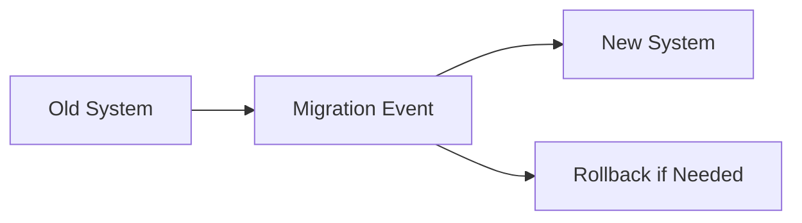
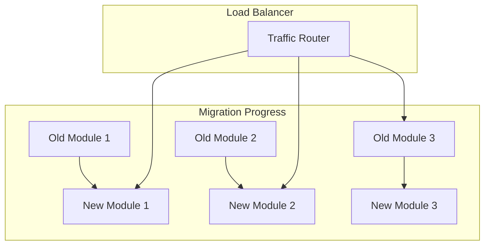
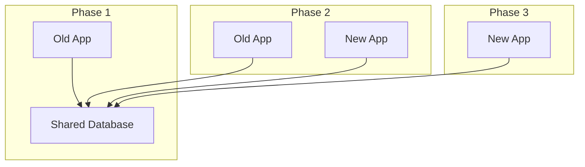

# Technology Stack Migration Guide

**Target Audience**: Development Teams, Tech Leads, Engineering Managers  
**Last Updated**: 2025-06-10 by System  
**Template Type**: Framework Migration Planning

# Framework Migration Planning Guide

This guide provides a systematic approach to migrating between technology stacks while minimizing risk and maintaining business continuity.

## Migration Types

### 1. Language/Runtime Migration
- **Java 8 → Java 17+**: Modern Java features and performance
- **Node.js 14 → Node.js 18+**: LTS upgrades and security patches
- **.NET Framework → .NET 8**: Modern .NET ecosystem
- **Python 2.7 → Python 3.11+**: End-of-life language migration

### 2. Framework Migration
- **Spring Boot 2.x → Spring Boot 3.x**: Major framework upgrade
- **React Class Components → Hooks**: Modern React patterns
- **ASP.NET Core 6 → ASP.NET Core 8**: Framework version upgrade
- **Flutter 2.x → Flutter 3.x**: Mobile framework upgrade

### 3. Architecture Migration
- **Monolith → Microservices**: Architectural pattern change
- **REST → GraphQL**: API paradigm shift
- **Traditional → Serverless**: Deployment model change
- **On-premises → Cloud**: Infrastructure migration

## Migration Planning Framework

### Phase 1: Assessment and Planning (2-4 weeks)

#### Current State Analysis
```markdown
## Current Technology Assessment

### Technology Stack
- **Language/Runtime**: [Current version and dependencies]
- **Framework**: [Framework version and extensions]
- **Dependencies**: [Key libraries and their versions]
- **Tools**: [Build tools, testing frameworks, CI/CD]

### Codebase Analysis
- **Lines of Code**: [Estimated LOC]
- **Number of Services/Modules**: [Breakdown by type]
- **Technical Debt**: [Known issues and workarounds]
- **Test Coverage**: [Current test coverage percentage]

### Business Impact
- **Active Users**: [Number of active users]
- **Traffic Volume**: [Request volume and patterns]
- **Revenue Impact**: [Financial implications of downtime]
- **Compliance Requirements**: [Regulatory considerations]
```

#### Target State Definition
```markdown
## Target Technology Assessment

### New Technology Stack
- **Language/Runtime**: [Target version and rationale]
- **Framework**: [New framework and benefits]
- **Dependencies**: [New libraries and compatibility]
- **Tools**: [Updated toolchain]

### Expected Benefits
- **Performance**: [Expected improvements]
- **Security**: [Security enhancements]
- **Developer Experience**: [Productivity gains]
- **Maintenance**: [Long-term maintainability]

### Migration Constraints
- **Timeline**: [Business deadlines and constraints]
- **Resources**: [Team capacity and skills]
- **Budget**: [Financial limitations]
- **Risk Tolerance**: [Acceptable risk levels]
```

#### Risk Assessment Matrix
| Risk Category | Probability | Impact | Mitigation Strategy |
|---------------|-------------|---------|-------------------|
| **Breaking Changes** | High | High | Comprehensive testing, feature flags |
| **Performance Regression** | Medium | High | Load testing, gradual rollout |
| **Security Vulnerabilities** | Low | High | Security audits, penetration testing |
| **Team Learning Curve** | High | Medium | Training, pair programming |
| **Timeline Overrun** | Medium | Medium | Buffer time, phased approach |

### Phase 2: Preparation (2-6 weeks)

#### Team Preparation
- [ ] **Skill Assessment**: Evaluate team expertise in target technology
- [ ] **Training Plan**: Identify training needs and resources
- [ ] **Knowledge Transfer**: Document current system architecture
- [ ] **Tool Setup**: Prepare development environments for new stack

#### Technical Preparation
- [ ] **Proof of Concept**: Build small prototype with new technology
- [ ] **Migration Tools**: Identify or build automated migration tools
- [ ] **Testing Strategy**: Develop comprehensive testing approach
- [ ] **Rollback Plan**: Prepare contingency plans for failure scenarios

#### Infrastructure Preparation
- [ ] **Environment Setup**: Prepare staging environments for new stack
- [ ] **CI/CD Updates**: Modify build and deployment pipelines
- [ ] **Monitoring**: Set up monitoring for new technology stack
- [ ] **Security Review**: Conduct security assessment of new stack

### Phase 3: Implementation (4-16 weeks)

#### Migration Strategies

**1. Big Bang Migration**


**Pros**: Fast, clean cut, no hybrid complexity  
**Cons**: High risk, potential for extended downtime  
**Best For**: Small applications, non-critical systems

**2. Strangler Fig Pattern**


**Pros**: Gradual migration, lower risk, continuous delivery  
**Cons**: Longer timeline, temporary complexity  
**Best For**: Large applications, critical systems

**3. Database-First Migration**


**Pros**: Data consistency, gradual application migration  
**Cons**: Database becomes bottleneck, schema constraints  
**Best For**: Data-heavy applications, shared databases

#### Migration Execution Checklist

**Pre-Migration:**
- [ ] Backup all data and configurations
- [ ] Notify stakeholders of migration timeline
- [ ] Prepare rollback procedures
- [ ] Set up monitoring and alerting
- [ ] Conduct final testing in staging environment

**During Migration:**
- [ ] Follow documented migration steps
- [ ] Monitor system performance and errors
- [ ] Communicate progress to stakeholders
- [ ] Document any deviations from plan
- [ ] Be prepared to execute rollback if necessary

**Post-Migration:**
- [ ] Verify all functionality works correctly
- [ ] Check performance metrics against baseline
- [ ] Validate data integrity and consistency
- [ ] Update documentation and runbooks
- [ ] Conduct post-migration retrospective

### Phase 4: Validation and Optimization (2-4 weeks)

#### Functional Validation
```bash
# Example validation script
#!/bin/bash

echo "Starting post-migration validation..."

# Health check
echo "Checking application health..."
curl -f http://app.example.com/health || exit 1

# Performance test
echo "Running performance tests..."
ab -n 1000 -c 10 http://app.example.com/api/users || exit 1

# Data validation
echo "Validating data integrity..."
./scripts/validate-data.sh || exit 1

# Security scan
echo "Running security scan..."
./scripts/security-scan.sh || exit 1

echo "✅ All validation checks passed!"
```

#### Performance Optimization
- [ ] **Baseline Comparison**: Compare performance metrics before/after
- [ ] **Bottleneck Identification**: Identify and resolve performance issues
- [ ] **Configuration Tuning**: Optimize framework and runtime settings
- [ ] **Monitoring Setup**: Establish ongoing performance monitoring

#### Team Training and Documentation
- [ ] **Knowledge Transfer**: Train team on new technology stack
- [ ] **Documentation Updates**: Update all technical documentation
- [ ] **Best Practices**: Establish coding standards for new stack
- [ ] **Troubleshooting Guides**: Create guides for common issues

## Technology-Specific Migration Guides

### Spring Boot 2.x → 3.x Migration

#### Key Changes
- **Java Version**: Minimum Java 17 required
- **Configuration**: New configuration properties format
- **Security**: Updated Spring Security 6.x
- **Dependencies**: Updated third-party libraries

#### Migration Steps
```bash
# 1. Update Java version
# Update pom.xml or build.gradle
<java.version>17</java.version>

# 2. Update Spring Boot version
<spring-boot.version>3.2.0</spring-boot.version>

# 3. Update dependencies
./mvnw dependency:resolve
./mvnw clean compile

# 4. Fix breaking changes
# Review and update deprecated APIs
# Update configuration properties
# Update security configuration
```

#### Common Issues and Solutions
| Issue | Solution |
|-------|----------|
| **javax → jakarta** | Update all javax imports to jakarta |
| **Configuration Properties** | Update property names in application.yml |
| **Security Config** | Update WebSecurityConfigurerAdapter usage |
| **Actuator Changes** | Update actuator endpoint configurations |

### React Class → Hooks Migration

#### Migration Strategy
```javascript
// Before: Class Component
class UserProfile extends React.Component {
  constructor(props) {
    super(props);
    this.state = { user: null, loading: true };
  }
  
  componentDidMount() {
    this.fetchUser();
  }
  
  fetchUser = async () => {
    const user = await api.getUser(this.props.userId);
    this.setState({ user, loading: false });
  };
  
  render() {
    const { user, loading } = this.state;
    return loading ? <Loading /> : <UserCard user={user} />;
  }
}

// After: Functional Component with Hooks
function UserProfile({ userId }) {
  const [user, setUser] = useState(null);
  const [loading, setLoading] = useState(true);
  
  useEffect(() => {
    async function fetchUser() {
      const userData = await api.getUser(userId);
      setUser(userData);
      setLoading(false);
    }
    
    fetchUser();
  }, [userId]);
  
  return loading ? <Loading /> : <UserCard user={user} />;
}
```

#### Migration Checklist
- [ ] Convert class components to functional components
- [ ] Replace state with useState hooks
- [ ] Replace lifecycle methods with useEffect
- [ ] Update prop types and default props
- [ ] Test all component functionality

### .NET Framework → .NET 8 Migration

#### Compatibility Assessment
```csharp
// Use .NET Portability Analyzer
dotnet tool install -g Microsoft.DotNet.ApiPort.GlobalTool
ApiPort analyze -f net8.0 -r HTML YourAssembly.dll
```

#### Migration Steps
1. **Create new .NET 8 project**
2. **Copy source files**
3. **Update package references**
4. **Fix breaking changes**
5. **Update configuration**
6. **Test thoroughly**

## Common Migration Patterns

### Database Migration Strategies

#### Schema Evolution
```sql
-- Version-based schema migrations
-- V1__Initial_schema.sql
CREATE TABLE users (
    id SERIAL PRIMARY KEY,
    username VARCHAR(50) NOT NULL,
    email VARCHAR(100) NOT NULL
);

-- V2__Add_user_profile.sql
ALTER TABLE users ADD COLUMN first_name VARCHAR(50);
ALTER TABLE users ADD COLUMN last_name VARCHAR(50);
```

#### Data Migration
```python
# Example data migration script
import pandas as pd
from sqlalchemy import create_engine

def migrate_user_data():
    # Read from old database
    old_engine = create_engine('postgresql://old_db_url')
    users_df = pd.read_sql('SELECT * FROM legacy_users', old_engine)
    
    # Transform data
    users_df['full_name'] = users_df['first_name'] + ' ' + users_df['last_name']
    users_df = users_df.drop(['legacy_field'], axis=1)
    
    # Write to new database
    new_engine = create_engine('postgresql://new_db_url')
    users_df.to_sql('users', new_engine, if_exists='append', index=False)
    
    print(f"Migrated {len(users_df)} users successfully")

if __name__ == "__main__":
    migrate_user_data()
```

### API Versioning During Migration

#### Parallel API Versions
```yaml
# API Gateway configuration
routes:
  - path: /api/v1/users
    backend: legacy-user-service
  - path: /api/v2/users
    backend: new-user-service
    
# Gradual traffic shifting
traffic_split:
  v1: 80%  # Legacy API
  v2: 20%  # New API
```

## Success Metrics and KPIs

### Technical Metrics
| Metric | Baseline | Target | Post-Migration |
|--------|----------|--------|----------------|
| **Response Time** | 500ms | <200ms | ___ |
| **Error Rate** | 2% | <1% | ___ |
| **CPU Usage** | 70% | <50% | ___ |
| **Memory Usage** | 80% | <60% | ___ |
| **Build Time** | 10 min | <5 min | ___ |

### Business Metrics
| Metric | Baseline | Target | Post-Migration |
|--------|----------|--------|----------------|
| **User Satisfaction** | 3.5/5 | >4.0/5 | ___ |
| **Support Tickets** | 50/week | <30/week | ___ |
| **Feature Velocity** | 2 features/sprint | >3 features/sprint | ___ |
| **Time to Market** | 4 weeks | <3 weeks | ___ |

### Quality Metrics
| Metric | Baseline | Target | Post-Migration |
|--------|----------|--------|----------------|
| **Test Coverage** | 60% | >80% | ___ |
| **Code Quality Score** | 6/10 | >8/10 | ___ |
| **Security Score** | 7/10 | >9/10 | ___ |
| **Documentation Coverage** | 40% | >90% | ___ |

## Risk Management

### Risk Mitigation Strategies

#### Technical Risks
- **Data Loss**: Comprehensive backups and data validation
- **Performance Degradation**: Load testing and gradual rollout
- **Integration Failures**: Contract testing and service mocks
- **Security Vulnerabilities**: Security audits and pen testing

#### Business Risks
- **User Disruption**: Communication plan and user training
- **Revenue Loss**: Rollback procedures and SLA monitoring
- **Compliance Issues**: Legal review and audit trails
- **Team Productivity**: Training programs and documentation

#### Operational Risks
- **Deployment Failures**: Blue-green deployments and automated rollback
- **Monitoring Gaps**: Comprehensive monitoring and alerting
- **Support Issues**: Updated runbooks and team training
- **Knowledge Loss**: Documentation and knowledge transfer

### Contingency Planning

#### Rollback Procedures
```bash
#!/bin/bash
# Emergency rollback script

echo "Initiating emergency rollback..."

# 1. Switch traffic back to old system
kubectl patch service app-service -p '{"spec":{"selector":{"version":"v1"}}}'

# 2. Scale down new deployment
kubectl scale deployment app-v2 --replicas=0

# 3. Restore database if needed
./scripts/restore-database.sh backup-pre-migration.sql

# 4. Notify stakeholders
./scripts/send-notification.sh "Migration rollback completed"

echo "Rollback completed successfully"
```

## Communication Plan

### Stakeholder Communication

#### Pre-Migration
- **Timeline**: 4 weeks before migration
- **Audience**: All stakeholders
- **Content**: Migration plan, timeline, expected benefits
- **Channel**: Email, team meetings, documentation

#### During Migration
- **Timeline**: Real-time updates
- **Audience**: Technical teams, management
- **Content**: Progress updates, issues, timeline adjustments
- **Channel**: Slack, status page, email updates

#### Post-Migration
- **Timeline**: 1 week after migration
- **Audience**: All stakeholders
- **Content**: Results, lessons learned, next steps
- **Channel**: Report, presentation, team retrospective

### Communication Templates

#### Pre-Migration Announcement
```markdown
Subject: Technology Migration: [System Name] - [Date]

Dear Team,

We will be migrating [System Name] from [Old Technology] to [New Technology] on [Date].

**Timeline:**
- Start: [Date/Time]
- Expected Completion: [Date/Time]
- Rollback Window: [Time Period]

**Expected Impact:**
- System Downtime: [Duration]
- Feature Changes: [List]
- Performance Improvements: [List]

**What You Need to Do:**
- [Action Item 1]
- [Action Item 2]

**Support:**
- Technical Issues: #tech-support
- Questions: migration-team@company.com

Best regards,
Migration Team
```

## Post-Migration Activities

### Immediate (First Week)
- [ ] Monitor system performance and stability
- [ ] Address any critical issues discovered
- [ ] Validate all functionality works as expected
- [ ] Update monitoring and alerting thresholds
- [ ] Communicate success to stakeholders

### Short-term (First Month)
- [ ] Conduct detailed performance analysis
- [ ] Optimize configurations based on real usage
- [ ] Complete team training on new technology
- [ ] Update all documentation and procedures
- [ ] Plan for next phase improvements

### Long-term (First Quarter)
- [ ] Conduct comprehensive retrospective
- [ ] Document lessons learned and best practices
- [ ] Plan future migrations based on experience
- [ ] Establish maintenance procedures for new stack
- [ ] Measure and report on success metrics

---

**Guide Owner**: [@tech-lead]  
**Last Updated**: 2025-06-10  
**Next Review**: After each major migration
