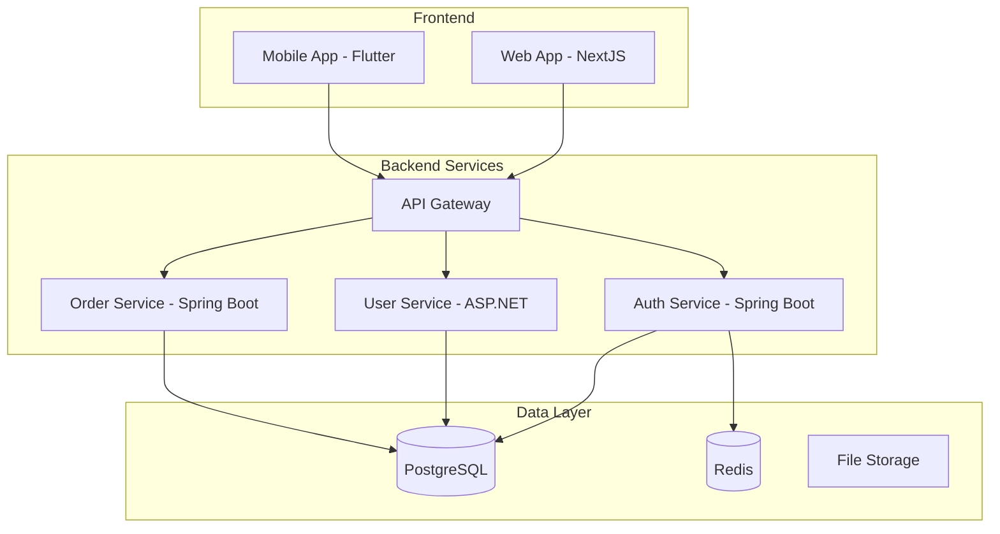

# Quick Start Guide for New Developers

**Target Audience**: New Team Members, Junior Developers  
**Last Updated**: 2025-06-10 by System  
**Estimated Time**: 2-3 hours

# New Developer Onboarding Guide

Welcome to the engineering team! This guide will help you get up and running with our development environment and practices.

## 📋 Pre-requisites

### Required Accounts
- [ ] **GitHub/Azure DevOps Account**: Request access from [@hr-team]
- [ ] **Company Email**: Set up MFA and email client
- [ ] **Slack/Teams**: Join relevant channels
- [ ] **VPN Access**: Install and configure company VPN
- [ ] **Cloud Access**: Request Azure/AWS console access

### Required Software
- [ ] **IDE**: Install recommended IDE for your stack
  - Java: IntelliJ IDEA or Eclipse
  - .NET: Visual Studio or VS Code
  - JavaScript/TypeScript: VS Code
  - Flutter: VS Code with Flutter extension
- [ ] **Git**: Install and configure Git
- [ ] **Docker**: Install Docker Desktop
- [ ] **Node.js**: Install LTS version (if applicable)
- [ ] **Package Managers**: npm, yarn, Maven, NuGet (as needed)

## 🚀 Environment Setup

### 1. Development Environment (30 minutes)

#### Git Configuration
```bash
# Configure Git with your information
git config --global user.name "Your Name"
git config --global user.email "your.email@company.com"

# Set up SSH keys for GitHub
ssh-keygen -t ed25519 -C "your.email@company.com"
cat ~/.ssh/id_ed25519.pub
# Add the public key to your GitHub account
```

#### IDE Setup
```bash
# Clone the main project repository
git clone git@github.com:company/main-project.git
cd main-project

# Install recommended extensions (VS Code)
code --install-extension ms-vscode.vscode-typescript-next
code --install-extension esbenp.prettier-vscode
code --install-extension ms-python.python
# (Add more extensions based on your stack)
```

#### Docker Setup
```bash
# Verify Docker installation
docker --version
docker-compose --version

# Start local development services
docker-compose up -d postgres redis
```

### 2. Project Setup (45 minutes)

#### Choose Your Technology Track

**Spring Boot Developers:**
```bash
# Install Java 17+
java -version

# Install Maven
mvn -version

# Set up the project
cd spring-boot-project
cp .env.example .env
# Edit .env with your local settings

# Start the application
./mvnw spring-boot:run
```

**ASP.NET Core Developers:**
```bash
# Install .NET 8+
dotnet --version

# Set up the project
cd aspnet-project
cp appsettings.example.json appsettings.Development.json
# Edit appsettings with your local settings

# Restore packages and run
dotnet restore
dotnet run
```

**NextJS Developers:**
```bash
# Install Node.js 18+
node --version
npm --version

# Set up the project
cd nextjs-project
cp .env.example .env.local
# Edit .env.local with your local settings

# Install dependencies and start
npm install
npm run dev
```

**Flutter Developers:**
```bash
# Install Flutter
flutter --version

# Set up the project
cd flutter-project
flutter pub get

# Run on preferred platform
flutter run
# or for web: flutter run -d chrome
```

### 3. Verification (15 minutes)

#### Application Health Check
```bash
# Check if application is running
curl http://localhost:3000/health
# or the appropriate port for your application

# Expected response
{
  "status": "healthy",
  "timestamp": "2025-06-10T12:00:00Z"
}
```

#### Run Tests
```bash
# Run unit tests for your stack
npm test           # Node.js/NextJS
mvn test          # Java/Maven
dotnet test       # .NET
flutter test      # Flutter
```

## 📚 Understanding Our Architecture

### 1. System Overview (30 minutes)

#### High-Level Architecture


#### Your Service Context
Read the specific documentation for your assigned service:
- **Authentication Service**: [Link to auth service docs]
- **User Management**: [Link to user service docs]
- **Order Processing**: [Link to order service docs]
- **Frontend Application**: [Link to frontend docs]

### 2. Data Flow Understanding (20 minutes)

#### Typical Request Flow
1. **Frontend** sends request to API Gateway
2. **API Gateway** validates and routes request
3. **Service** processes business logic
4. **Database** stores/retrieves data
5. **Response** flows back through the same path

#### Authentication Flow
1. User logs in through frontend
2. Auth service validates credentials
3. JWT token issued and cached
4. Subsequent requests use token
5. Services validate token with auth service

## 🔧 Development Workflow

### 1. Daily Development Process (20 minutes)

#### Morning Routine
```bash
# 1. Pull latest changes
git checkout develop
git pull origin develop

# 2. Create feature branch
git checkout -b feature/TICKET-123-add-user-validation

# 3. Start development services
docker-compose up -d

# 4. Start your application
npm run dev  # or appropriate command
```

#### Making Changes
```bash
# 1. Make your code changes
# 2. Run tests frequently
npm test

# 3. Check code quality
npm run lint
npm run format

# 4. Commit using conventional commits
git add .
git commit -m "feat(auth): add email validation for user registration"
```

#### End of Day
```bash
# 1. Push your work
git push origin feature/TICKET-123-add-user-validation

# 2. Stop services
docker-compose down

# 3. Create PR if feature is complete
# Use the appropriate PR template
```

### 2. Code Review Process (15 minutes)

#### Before Creating PR
- [ ] All tests pass locally
- [ ] Code follows style guidelines
- [ ] Documentation updated
- [ ] No console.log or debug code left

#### PR Creation
1. Use appropriate PR template for your stack
2. Fill out all required sections
3. Add reviewers (minimum 2)
4. Link to relevant tickets
5. Add appropriate labels

#### Responding to Reviews
- Address all feedback professionally
- Ask questions if feedback is unclear
- Update code and push changes
- Re-request review when ready

## 🧪 Testing Practices

### 1. Testing Strategy (25 minutes)

#### Test Types
```
Testing Pyramid:
    /\
   /  \     E2E Tests (Few, Slow, Expensive)
  /____\
 /      \   Integration Tests (Some, Medium)
/__________\ Unit Tests (Many, Fast, Cheap)
```

#### Unit Testing
```javascript
// Example unit test (Jest/JavaScript)
describe('UserValidator', () => {
  test('should validate email format', () => {
    const validator = new UserValidator();
    expect(validator.isValidEmail('test@example.com')).toBe(true);
    expect(validator.isValidEmail('invalid-email')).toBe(false);
  });
});
```

```java
// Example unit test (JUnit/Java)
@Test
public void shouldValidateEmailFormat() {
    UserValidator validator = new UserValidator();
    assertTrue(validator.isValidEmail("test@example.com"));
    assertFalse(validator.isValidEmail("invalid-email"));
}
```

#### Integration Testing
- Test API endpoints
- Test database interactions
- Test external service integrations
- Use test containers when possible

### 2. Quality Standards (10 minutes)

#### Code Coverage
- **Minimum**: 80% for new code
- **Target**: 90% for critical components
- **Exclusions**: Configuration files, DTOs, test utilities

#### Performance Standards
- **API Response Time**: < 200ms average
- **Database Queries**: < 100ms for simple queries
- **Memory Usage**: Monitor for leaks
- **Bundle Size**: < 1MB for frontend chunks

## 🔍 Debugging and Troubleshooting

### 1. Common Issues (20 minutes)

#### Application Won't Start
```bash
# Check if ports are in use
netstat -an | grep :3000
lsof -i :3000

# Check Docker services
docker-compose ps
docker-compose logs

# Clear caches
npm cache clean --force  # Node.js
mvn clean                # Maven
dotnet clean             # .NET
```

#### Database Connection Issues
```bash
# Check database container
docker-compose logs postgres

# Test database connection
psql -h localhost -U username -d database_name

# Check environment variables
echo $DATABASE_URL
```

#### Build Failures
```bash
# Clear build artifacts
rm -rf node_modules && npm install  # Node.js
mvn clean compile                   # Maven
dotnet clean && dotnet restore      # .NET

# Check for dependency conflicts
npm ls                              # Node.js
mvn dependency:tree                 # Maven
```

### 2. Getting Help (10 minutes)

#### Help Channels
1. **Documentation**: Check project README and wiki
2. **Team Chat**: #team-[your-team] on Slack
3. **Pair Programming**: Ask a senior developer
4. **Office Hours**: Tech leads available 2-4 PM daily
5. **GitHub Issues**: Create issue for bugs or questions

#### Escalation Process
1. **Level 1**: Try to solve it yourself (15 minutes)
2. **Level 2**: Ask a team member (30 minutes)
3. **Level 3**: Ask tech lead (1 hour)
4. **Level 4**: Escalate to engineering manager

## 📖 Essential Reading

### 1. Team Practices
- [ ] [Code Quality Standards](../practices/code-quality/overview.md)
- [ ] [Version Control Guidelines](../practices/version-control.md)
- [ ] [Testing Best Practices](../practices/testing/overview.md)
- [ ] [Documentation Standards](../practices/documentation/overview.md)

### 2. Technology-Specific Guides
- [ ] [Spring Boot Guidelines](../technology-stacks/spring-boot.md)
- [ ] [ASP.NET Core Guidelines](../technology-stacks/aspnet-core.md)
- [ ] [NextJS Guidelines](../technology-stacks/nextjs.md)
- [ ] [Flutter Guidelines](../technology-stacks/flutter.md)

### 3. Process Documentation
- [ ] [CI/CD Pipeline Overview](../practices/ci-cd/overview.md)
- [ ] [Release Management Process](../practices/release-management/overview.md)
- [ ] [Task Management Workflow](../practices/task-management/overview.md)

## ✅ Completion Checklist

### Week 1: Environment Setup
- [ ] Development environment configured
- [ ] First application running locally
- [ ] Git workflow understood
- [ ] Basic debugging skills acquired
- [ ] Team communication channels joined

### Week 2: First Contribution
- [ ] First ticket assigned and completed
- [ ] Pull request created and merged
- [ ] Code review process experienced
- [ ] Testing practices applied
- [ ] Documentation contribution made

### Week 3: Team Integration
- [ ] Team practices mastered
- [ ] Independent problem-solving demonstrated
- [ ] Mentoring newer team members
- [ ] Process improvement suggestions made
- [ ] Technical knowledge sharing completed

## 🎯 Success Metrics

### Technical Competency
- [ ] Can set up development environment independently
- [ ] Can create and deploy simple features
- [ ] Understands team coding standards
- [ ] Can write appropriate tests
- [ ] Can debug common issues

### Team Integration
- [ ] Actively participates in team meetings
- [ ] Provides helpful code reviews
- [ ] Asks questions when needed
- [ ] Shares knowledge with team
- [ ] Contributes to process improvements

## 📞 Key Contacts

### Technical Support
- **Tech Lead**: [@tech-lead] - Architecture and technical decisions
- **DevOps Lead**: [@devops-lead] - Infrastructure and deployment
- **QA Lead**: [@qa-lead] - Testing and quality assurance
- **Senior Developer**: [@senior-dev] - Code reviews and mentoring

### Administrative
- **Engineering Manager**: [@eng-manager] - Team management and career growth
- **HR Representative**: [@hr-rep] - Administrative and policy questions
- **IT Support**: [@it-support] - Computer and access issues

---

**Guide Owner**: [@tech-lead]  
**Last Updated**: 2025-06-10  
**Next Review**: Monthly  
**Feedback**: Submit suggestions via GitHub issue or Slack #onboarding-feedback
