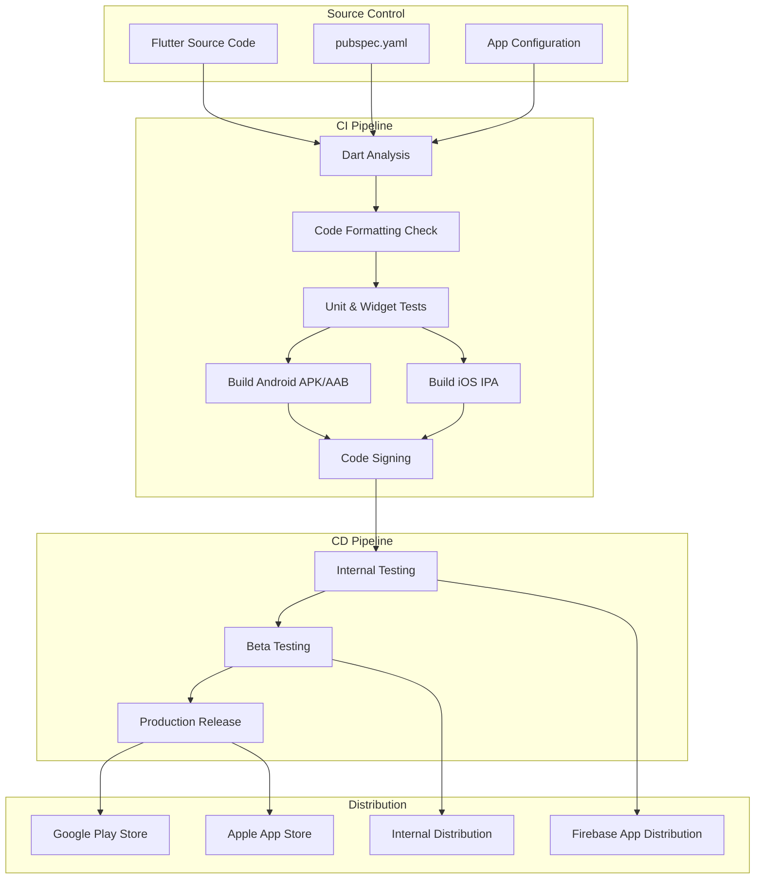
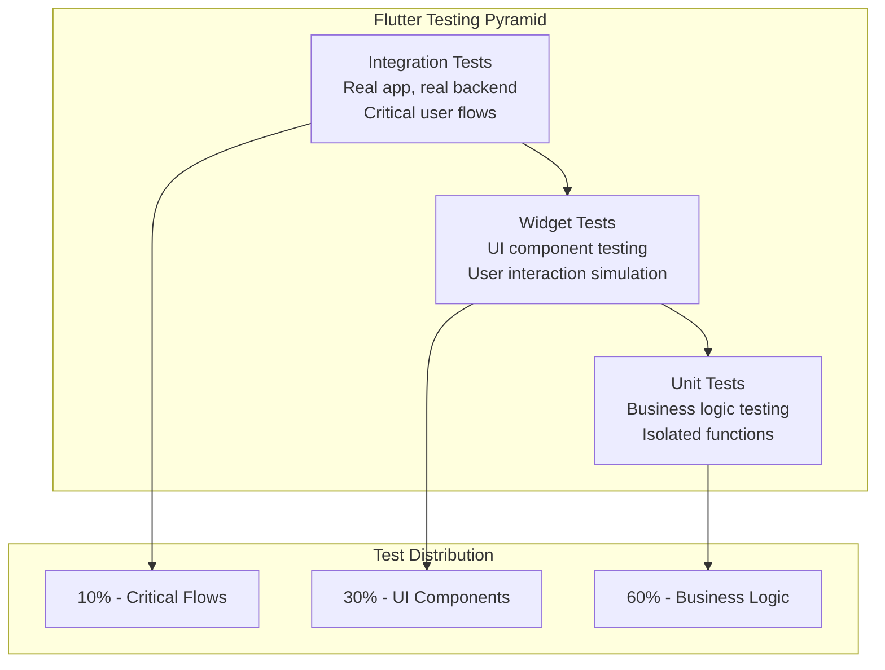

# Flutter CI/CD Standards

**Target Audience**: Flutter Developers, Mobile Development Team, DevOps Engineers  
**Last Updated**: 2025-06-10 by @parseen254

## Overview

Comprehensive CI/CD standards for Flutter applications including build automation, testing, and distribution across iOS and Android platforms using Azure DevOps and Flutter-specific tooling.

## Flutter CI/CD Architecture

### Flutter Build Pipeline Overview



### Current State Assessment

| Aspect | Current Status | Target Status | Priority |
|--------|----------------|---------------|----------|
| **Build Automation** | L2 - Intermediate | L3 - Advanced | High |
| **Test Automation** | L1 - Basic | L3 - Advanced | High |
| **Code Signing** | Manual process | Automated | High |
| **Distribution** | Manual uploads | Automated | Medium |
| **Build Time** | 25 minutes | <10 minutes | High |
| **Platform Coverage** | Android only | iOS + Android | High |

## Pipeline Configuration

### Azure DevOps Pipeline Template

```yaml
# flutter-ci-cd-pipeline.yml
trigger:
  branches:
    include:
      - main
      - develop
      - release/*
  paths:
    include:
      - mobile/flutter-app/**

pr:
  branches:
    include:
      - main
      - develop
  paths:
    include:
      - mobile/flutter-app/**

variables:
  - group: flutter-mobile-secrets
  - name: FLUTTER_VERSION
    value: '3.19.0'
  - name: DART_VERSION
    value: '3.3.0'

stages:
- stage: Validate
  displayName: 'Code Validation'
  jobs:
  - job: DartAnalysis
    displayName: 'Dart Analysis & Formatting'
    pool:
      vmImage: 'ubuntu-latest'
    steps:
    - task: FlutterInstall@0
      inputs:
        mode: 'auto'
        channel: 'stable'
        version: 'custom'
        customVersion: $(FLUTTER_VERSION)
    
    - script: |
        cd mobile/flutter-app
        flutter pub get
        flutter analyze --fatal-infos
      displayName: 'Run Dart Analysis'
    
    - script: |
        cd mobile/flutter-app
        dart format --set-exit-if-changed .
      displayName: 'Check Code Formatting'
    
    - script: |
        cd mobile/flutter-app
        flutter pub deps check
      displayName: 'Check Dependencies'

- stage: Test
  displayName: 'Automated Testing'
  dependsOn: Validate
  jobs:
  - job: UnitTests
    displayName: 'Unit & Widget Tests'
    pool:
      vmImage: 'ubuntu-latest'
    steps:
    - task: FlutterInstall@0
      inputs:
        mode: 'auto'
        channel: 'stable'
        version: 'custom'
        customVersion: $(FLUTTER_VERSION)
    
    - script: |
        cd mobile/flutter-app
        flutter pub get
        flutter test --coverage --reporter=json > test-results.json
      displayName: 'Run Tests with Coverage'
    
    - task: PublishTestResults@2
      inputs:
        testResultsFormat: 'JUnit'
        testResultsFiles: 'mobile/flutter-app/test-results.json'
        testRunTitle: 'Flutter Unit Tests'
    
    - task: PublishCodeCoverageResults@1
      inputs:
        codeCoverageTool: 'Cobertura'
        summaryFileLocation: 'mobile/flutter-app/coverage/lcov.info'

- stage: Build
  displayName: 'Build Applications'
  dependsOn: Test
  jobs:
  - job: BuildAndroid
    displayName: 'Build Android'
    pool:
      vmImage: 'ubuntu-latest'
    steps:
    - task: FlutterInstall@0
      inputs:
        mode: 'auto'
        channel: 'stable'
        version: 'custom'
        customVersion: $(FLUTTER_VERSION)
    
    - task: JavaToolInstaller@0
      inputs:
        versionSpec: '11'
        jdkArchitectureOption: 'x64'
        jdkSourceOption: 'PreInstalled'
    
    - script: |
        cd mobile/flutter-app
        flutter pub get
        flutter build apk --release --build-number=$(Build.BuildNumber)
        flutter build appbundle --release --build-number=$(Build.BuildNumber)
      displayName: 'Build Android APK and AAB'
    
    - task: AndroidSigning@3
      inputs:
        apkFiles: 'mobile/flutter-app/build/app/outputs/flutter-apk/*.apk'
        apksign: true
        apksignerKeystoreFile: 'android-keystore.jks'
        apksignerKeystorePassword: '$(ANDROID_KEYSTORE_PASSWORD)'
        apksignerKeystoreAlias: '$(ANDROID_KEY_ALIAS)'
        apksignerKeyPassword: '$(ANDROID_KEY_PASSWORD)'
    
    - task: PublishBuildArtifacts@1
      inputs:
        pathToPublish: 'mobile/flutter-app/build/app/outputs'
        artifactName: 'android-artifacts'

  - job: BuildIOS
    displayName: 'Build iOS'
    pool:
      vmImage: 'macOS-latest'
    steps:
    - task: FlutterInstall@0
      inputs:
        mode: 'auto'
        channel: 'stable'
        version: 'custom'
        customVersion: $(FLUTTER_VERSION)
    
    - script: |
        cd mobile/flutter-app
        flutter pub get
        flutter build ios --release --no-codesign --build-number=$(Build.BuildNumber)
      displayName: 'Build iOS (No Code Sign)'
    
    - task: InstallAppleCertificate@2
      inputs:
        certSecureFile: 'ios-distribution-cert.p12'
        certPwd: '$(IOS_CERT_PASSWORD)'
        keychain: 'temp'
    
    - task: InstallAppleProvisioningProfile@1
      inputs:
        provisioningProfileLocation: 'secureFiles'
        provProfileSecureFile: 'ios-distribution-profile.mobileprovision'
    
    - task: Xcode@5
      inputs:
        actions: 'archive'
        configuration: 'Release'
        sdk: 'iphoneos'
        xcWorkspacePath: 'mobile/flutter-app/ios/Runner.xcworkspace'
        scheme: 'Runner'
        archivePath: '$(Build.ArtifactStagingDirectory)/Runner.xcarchive'
        exportPath: '$(Build.ArtifactStagingDirectory)'
        exportOptions: 'plist'
        exportOptionsPlist: 'mobile/flutter-app/ios/ExportOptions.plist'
    
    - task: PublishBuildArtifacts@1
      inputs:
        pathToPublish: '$(Build.ArtifactStagingDirectory)'
        artifactName: 'ios-artifacts'

- stage: DeployDev
  displayName: 'Deploy to Development'
  dependsOn: Build
  condition: and(succeeded(), eq(variables['Build.SourceBranch'], 'refs/heads/develop'))
  jobs:
  - deployment: DeployToFirebase
    displayName: 'Deploy to Firebase App Distribution'
    environment: 'flutter-dev'
    strategy:
      runOnce:
        deploy:
          steps:
          - task: FirebaseAppDistribution@1
            inputs:
              serviceEndpoint: 'Firebase-Connection'
              appId: '$(FIREBASE_APP_ID_ANDROID)'
              artifactType: 'apk'
              artifactPath: '$(Pipeline.Workspace)/android-artifacts/flutter-apk/app-release.apk'
              releaseNotes: 'Development build $(Build.BuildNumber)'
              groups: 'internal-testers'

- stage: DeployStaging
  displayName: 'Deploy to Staging'
  dependsOn: Build
  condition: and(succeeded(), eq(variables['Build.SourceBranch'], 'refs/heads/main'))
  jobs:
  - deployment: DeployToTestFlight
    displayName: 'Deploy to TestFlight and Play Console Internal Testing'
    environment: 'flutter-staging'
    strategy:
      runOnce:
        deploy:
          steps:
          - task: AppStoreRelease@1
            inputs:
              serviceEndpoint: 'App-Store-Connect'
              applicationIdentifier: '$(IOS_BUNDLE_ID)'
              appSpecificPassword: '$(APP_SPECIFIC_PASSWORD)'
              ipaPath: '$(Pipeline.Workspace)/ios-artifacts/Runner.ipa'
              shouldSkipWaitingForProcessing: true
              shouldSkipSubmission: true
          
          - task: GooglePlayRelease@4
            inputs:
              serviceEndpoint: 'Google-Play-Console'
              applicationId: '$(ANDROID_PACKAGE_NAME)'
              action: 'SingleBundle'
              bundleFile: '$(Pipeline.Workspace)/android-artifacts/bundle/app-release.aab'
              track: 'internal'

- stage: DeployProduction
  displayName: 'Deploy to Production'
  dependsOn: DeployStaging
  condition: and(succeeded(), eq(variables['Build.SourceBranch'], 'refs/heads/main'))
  jobs:
  - deployment: DeployToStores
    displayName: 'Deploy to App Stores'
    environment: 'flutter-production'
    strategy:
      runOnce:
        deploy:
          steps:
          - task: AppStoreRelease@1
            inputs:
              serviceEndpoint: 'App-Store-Connect'
              applicationIdentifier: '$(IOS_BUNDLE_ID)'
              appSpecificPassword: '$(APP_SPECIFIC_PASSWORD)'
              ipaPath: '$(Pipeline.Workspace)/ios-artifacts/Runner.ipa'
              shouldSkipWaitingForProcessing: false
              shouldSkipSubmission: false
              shouldAutoRelease: false
          
          - task: GooglePlayRelease@4
            inputs:
              serviceEndpoint: 'Google-Play-Console'
              applicationId: '$(ANDROID_PACKAGE_NAME)'
              action: 'SingleBundle'
              bundleFile: '$(Pipeline.Workspace)/android-artifacts/bundle/app-release.aab'
              track: 'production'
              userFraction: '0.1'  # Staged rollout
```

## Build Optimization

### Current Challenges and Solutions

| Challenge | Current Impact | Solution | Expected Improvement |
|-----------|----------------|----------|---------------------|
| **Long Build Times** | 25 minutes average | Caching + Build splitting | <10 minutes |
| **iOS Build Complexity** | Manual signing | Automated code signing | 80% time reduction |
| **Dependency Management** | Frequent pub get failures | Dependency caching | 90% cache hit rate |
| **Large App Size** | 50MB+ APK | Code splitting + optimization | <30MB APK |

### Performance Optimization Strategies

#### Build Caching Configuration

```yaml
# Enhanced caching for Flutter builds
- task: Cache@2
  displayName: 'Cache Flutter SDK'
  inputs:
    key: 'flutter | "$(Agent.OS)" | $(FLUTTER_VERSION)'
    restoreKeys: |
      flutter | "$(Agent.OS)"
      flutter
    path: $(FLUTTER_ROOT)

- task: Cache@2
  displayName: 'Cache Pub Dependencies'
  inputs:
    key: 'pub | "$(Agent.OS)" | pubspec.lock'
    restoreKeys: |
      pub | "$(Agent.OS)"
      pub
    path: ~/.pub-cache

- task: Cache@2
  displayName: 'Cache Gradle Dependencies'
  inputs:
    key: 'gradle | "$(Agent.OS)" | android/gradle/wrapper/gradle-wrapper.properties'
    restoreKeys: |
      gradle | "$(Agent.OS)"
      gradle
    path: ~/.gradle/caches
```

#### Build Splitting Strategy

```yaml
# Parallel build jobs for better performance
jobs:
- job: BuildAndroidDebug
  displayName: 'Build Android Debug'
  condition: eq(variables['Build.Reason'], 'PullRequest')
  steps:
    - script: flutter build apk --debug
      displayName: 'Quick Debug Build'

- job: BuildAndroidRelease
  displayName: 'Build Android Release'
  condition: ne(variables['Build.Reason'], 'PullRequest')
  steps:
    - script: flutter build apk --release --split-per-abi
      displayName: 'Optimized Release Build'

- job: BuildIOSSimulator
  displayName: 'Build iOS Simulator'
  condition: eq(variables['Build.Reason'], 'PullRequest')
  pool:
    vmImage: 'macOS-latest'
  steps:
    - script: flutter build ios --simulator
      displayName: 'iOS Simulator Build'
```

## Testing Standards

### Flutter Test Categories



### Test Configuration Standards

#### Unit Test Standards

```dart
// test/unit/services/payment_service_test.dart
import 'package:flutter_test/flutter_test.dart';
import 'package:mockito/mockito.dart';
import 'package:mockito/annotations.dart';

import 'package:app/services/payment_service.dart';
import 'package:app/repositories/payment_repository.dart';
import 'payment_service_test.mocks.dart';

@GenerateMocks([PaymentRepository])
void main() {
  group('PaymentService', () {
    late PaymentService paymentService;
    late MockPaymentRepository mockRepository;

    setUp(() {
      mockRepository = MockPaymentRepository();
      paymentService = PaymentService(mockRepository);
    });

    group('processPayment', () {
      test('should return success when payment is valid', () async {
        // Arrange
        const paymentData = PaymentData(amount: 100.0, currency: 'USD');
        when(mockRepository.processPayment(paymentData))
            .thenAnswer((_) async => PaymentResult.success());

        // Act
        final result = await paymentService.processPayment(paymentData);

        // Assert
        expect(result.isSuccess, true);
        verify(mockRepository.processPayment(paymentData)).called(1);
      });

      test('should handle network errors gracefully', () async {
        // Arrange
        const paymentData = PaymentData(amount: 100.0, currency: 'USD');
        when(mockRepository.processPayment(paymentData))
            .thenThrow(NetworkException('Connection failed'));

        // Act & Assert
        expect(
          () => paymentService.processPayment(paymentData),
          throwsA(isA<PaymentException>()),
        );
      });
    });
  });
}
```

#### Widget Test Standards

```dart
// test/widget/screens/payment_screen_test.dart
import 'package:flutter/material.dart';
import 'package:flutter_test/flutter_test.dart';
import 'package:provider/provider.dart';

import 'package:app/screens/payment_screen.dart';
import 'package:app/providers/payment_provider.dart';

void main() {
  group('PaymentScreen Widget Tests', () {
    late PaymentProvider paymentProvider;

    setUp(() {
      paymentProvider = PaymentProvider();
    });

    Widget createTestWidget() {
      return MaterialApp(
        home: ChangeNotifierProvider<PaymentProvider>(
          create: (_) => paymentProvider,
          child: const PaymentScreen(),
        ),
      );
    }

    testWidgets('should display payment form with required fields', (tester) async {
      // Arrange & Act
      await tester.pumpWidget(createTestWidget());

      // Assert
      expect(find.byType(TextField), findsNWidgets(3)); // Amount, Card, CVV
      expect(find.text('Process Payment'), findsOneWidget);
      expect(find.byType(ElevatedButton), findsOneWidget);
    });

    testWidgets('should show error when amount is invalid', (tester) async {
      // Arrange
      await tester.pumpWidget(createTestWidget());

      // Act
      await tester.enterText(find.byKey(const Key('amount_field')), '-100');
      await tester.tap(find.byType(ElevatedButton));
      await tester.pump();

      // Assert
      expect(find.text('Amount must be positive'), findsOneWidget);
    });

    testWidgets('should show loading indicator during payment processing', (tester) async {
      // Arrange
      await tester.pumpWidget(createTestWidget());
      await tester.enterText(find.byKey(const Key('amount_field')), '100');

      // Act
      await tester.tap(find.byType(ElevatedButton));
      await tester.pump(); // Trigger rebuild but don't wait for completion

      // Assert
      expect(find.byType(CircularProgressIndicator), findsOneWidget);
    });
  });
}
```

#### Integration Test Standards

```dart
// integration_test/payment_flow_test.dart
import 'package:flutter/material.dart';
import 'package:flutter_test/flutter_test.dart';
import 'package:integration_test/integration_test.dart';

import 'package:app/main.dart' as app;

void main() {
  IntegrationTestWidgetsFlutterBinding.ensureInitialized();

  group('Payment Flow Integration Tests', () {
    testWidgets('complete payment flow should work end-to-end', (tester) async {
      // Arrange
      app.main();
      await tester.pumpAndSettle();

      // Navigate to payment screen
      await tester.tap(find.text('Make Payment'));
      await tester.pumpAndSettle();

      // Fill payment form
      await tester.enterText(find.byKey(const Key('amount_field')), '50.00');
      await tester.enterText(find.byKey(const Key('card_field')), '4111111111111111');
      await tester.enterText(find.byKey(const Key('cvv_field')), '123');

      // Submit payment
      await tester.tap(find.text('Process Payment'));
      await tester.pumpAndSettle(const Duration(seconds: 3));

      // Verify success
      expect(find.text('Payment Successful'), findsOneWidget);
      expect(find.text('Transaction ID:'), findsOneWidget);
    });
  });
}
```

## Code Signing and Distribution

### iOS Code Signing Setup

```yaml
# iOS Code Signing Variables (Azure DevOps Variable Groups)
ios-signing-secrets:
  IOS_CERT_PASSWORD: '$(ios-cert-password)'
  IOS_PROVISIONING_PROFILE: '$(ios-provisioning-profile)'
  APP_SPECIFIC_PASSWORD: '$(app-specific-password)'
  IOS_BUNDLE_ID: 'com.company.appname'
  APPLE_ID: '$(apple-developer-id)'
  TEAM_ID: '$(apple-team-id)'
```

### Android Code Signing Setup

```yaml
# Android Code Signing Variables
android-signing-secrets:
  ANDROID_KEYSTORE_PASSWORD: '$(android-keystore-password)'
  ANDROID_KEY_ALIAS: '$(android-key-alias)'
  ANDROID_KEY_PASSWORD: '$(android-key-password)'
  ANDROID_PACKAGE_NAME: 'com.company.appname'
```

### Distribution Strategy

#### Environment-Based Distribution

| Environment | Android Distribution | iOS Distribution | Audience |
|-------------|---------------------|------------------|----------|
| **Development** | Firebase App Distribution | Firebase App Distribution | Internal developers |
| **Staging** | Play Console Internal Testing | TestFlight Internal Testing | QA team, stakeholders |
| **Production** | Google Play Store (Staged rollout) | App Store (Phased release) | End users |

#### Rollout Strategy

```yaml
# Production rollout configuration
production_rollout:
  android:
    initial_rollout: 10%  # Start with 10% of users
    rollout_stages:
      - percentage: 25%
        wait_hours: 24
      - percentage: 50%
        wait_hours: 48
      - percentage: 100%
        wait_hours: 72
    
  ios:
    phased_release: true
    release_over_days: 7
    automatic_rollout: false  # Manual control
```

## Performance Monitoring

### Key Performance Metrics

| Metric | Target | Current | Measurement |
|--------|--------|---------|-------------|
| **App Start Time** | <2 seconds | 3.2 seconds | Firebase Performance |
| **Build Time** | <10 minutes | 25 minutes | Azure DevOps Analytics |
| **App Size (Android)** | <30MB | 45MB | Play Console |
| **App Size (iOS)** | <25MB | 40MB | App Store Connect |
| **Crash-free Sessions** | >99.5% | 98.1% | Firebase Crashlytics |

### Performance Optimization Tasks

#### Immediate Improvements (Week 1-2)
- [ ] Implement build caching for Flutter SDK and dependencies
- [ ] Set up parallel build jobs for Android and iOS
- [ ] Configure code signing automation
- [ ] Implement basic app size optimization

#### Medium-term Improvements (Week 3-4)
- [ ] Set up advanced app bundle optimization
- [ ] Implement dynamic feature delivery
- [ ] Configure automated testing for performance regressions
- [ ] Set up comprehensive monitoring and alerting

#### Long-term Improvements (Week 5-8)
- [ ] Implement AI-powered build optimization
- [ ] Set up predictive failure detection
- [ ] Configure advanced performance monitoring
- [ ] Implement automated rollback based on performance metrics

## Security Integration

### Security Scanning Pipeline

```yaml
# Security scanning for Flutter apps
- stage: SecurityScan
  displayName: 'Security Analysis'
  jobs:
  - job: StaticAnalysis
    displayName: 'Static Security Analysis'
    steps:
    - script: |
        cd mobile/flutter-app
        flutter pub deps check --dev-deps
        dart pub global activate pana
        pana --json
      displayName: 'Dependency Vulnerability Scan'
    
    - script: |
        cd mobile/flutter-app
        # Check for hardcoded secrets
        grep -r "api.key\|password\|secret" lib/ --exclude-dir=generated || true
      displayName: 'Secret Detection'
    
    - task: SonarQubePrepare@4
      inputs:
        SonarQube: 'SonarQube-Connection'
        scannerMode: 'CLI'
        configMode: 'manual'
        cliProjectKey: 'flutter-mobile-app'
        cliSources: 'mobile/flutter-app/lib'
    
    - task: SonarQubeAnalyze@4
    - task: SonarQubePublish@4
```

### Security Best Practices Checklist

#### Code Security
- [ ] No hardcoded API keys or secrets in source code
- [ ] Proper certificate pinning implementation
- [ ] Input validation on all user inputs
- [ ] Secure storage for sensitive data
- [ ] Proper authentication token handling

#### Build Security
- [ ] Code signing certificates securely stored
- [ ] Dependency vulnerability scanning enabled
- [ ] Build artifacts scanned for malware
- [ ] Secure CI/CD pipeline configuration
- [ ] Regular security updates for build tools

## Getting Started

### For New Flutter Projects

1. **Copy the Pipeline Template**
   ```bash
   # Copy the flutter-ci-cd-pipeline.yml to your project
   cp templates/ci-cd/flutter-pipeline.yml .azure-pipelines/flutter-ci-cd.yml
   ```

2. **Configure Variable Groups**
   - Set up `flutter-mobile-secrets` variable group in Azure DevOps
   - Add iOS and Android signing certificates to secure files
   - Configure Firebase and App Store Connect service connections

3. **Set up Testing Framework**
   ```bash
   cd your-flutter-project
   flutter pub add --dev flutter_test mockito build_runner
   flutter pub add --dev integration_test
   flutter pub get
   ```

4. **Configure Quality Gates**
   - Set minimum test coverage to 80%
   - Enable automated Dart analysis
   - Configure SonarQube integration

### For Existing Flutter Projects

1. **Assess Current Pipeline Maturity**
   - Use our [Flutter pipeline assessment checklist](../../templates/ci-cd/flutter-assessment.md)
   - Identify optimization opportunities
   - Plan migration timeline

2. **Implement Gradual Migration**
   - Start with automated testing and analysis
   - Add build optimization and caching
   - Implement automated distribution
   - Set up comprehensive monitoring

3. **Performance Optimization**
   - Implement build caching strategies
   - Configure parallel job execution
   - Optimize app size and startup time
   - Set up performance regression testing

## Support and Resources

### Flutter-Specific Resources
- **[Flutter DevOps Best Practices](../../resources/flutter/devops-guide.md)** - Comprehensive Flutter CI/CD guide
- **[Mobile App Performance Guide](../../resources/mobile/performance-optimization.md)** - App optimization techniques
- **[Flutter Testing Masterclass](../../resources/testing/flutter-testing.md)** - Advanced testing strategies

### Communication Channels
- **Slack Communities**:
  - `#flutter-ci-cd` - Flutter-specific pipeline discussions
  - `#mobile-devops` - Cross-platform mobile DevOps
  - `#app-store-automation` - Distribution and release automation
- **Office Hours**: Thursdays 2-3 PM UTC with Mobile DevOps Team
- **Flutter Reviews**: Bi-weekly Flutter project reviews and optimizations

### External Resources
- [Flutter CI/CD Documentation](https://docs.flutter.dev/deployment)
- [Firebase App Distribution](https://firebase.google.com/docs/app-distribution)
- [Apple Developer Documentation](https://developer.apple.com/documentation/)
- [Google Play Developer Guide](https://developer.android.com/guide)

---

**Next Steps:**
1. Copy and customize the pipeline template for your Flutter project
2. Set up automated testing and code quality gates
3. Configure code signing and distribution automation
4. Implement performance monitoring and optimization
5. Join the Flutter CI/CD community for ongoing support

**Questions or Feedback?** Contact @parseen254 or post in #flutter-ci-cd
