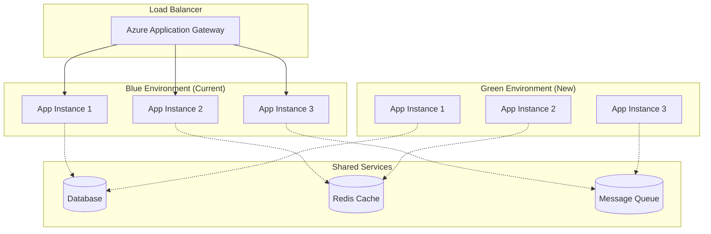
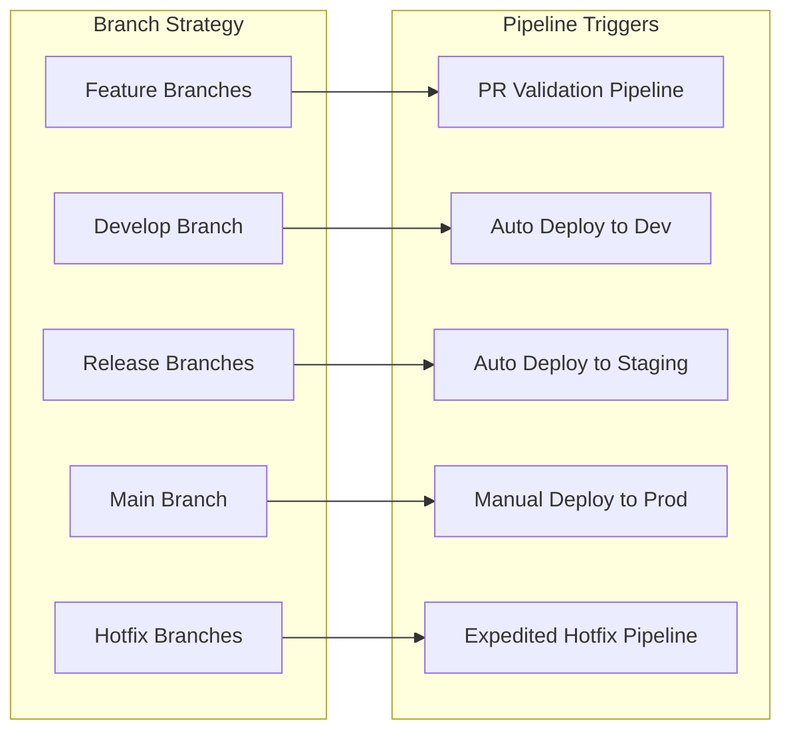
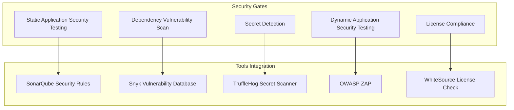

# CI/CD Pipeline Practices Overview

**Target Audience**: All Engineers, DevOps Team, Release Engineers  
**Last Updated**: 2025-06-10 07:03:59 UTC by @parseen254

## Overview

Comprehensive CI/CD standards and practices for automated build, test, and deployment workflows across all technology stacks using Azure DevOps and supporting tools.

## Quick Navigation

### By Technology Stack
- [🍃 Spring Boot CI/CD](spring-boot.md) - Java build and deployment pipelines
- [⚡ ASP.NET Core CI/CD](aspnet.md) - .NET deployment automation
- [⚛️ NextJS CI/CD](nextjs.md) - Frontend build and deployment
- [📱 Flutter CI/CD](flutter.md) - Mobile app build and distribution
- [🔄 Laravel CI/CD](laravel.md) - Legacy pipeline and migration strategy

### By Pipeline Stage
- [🔨 Build Automation](stages/build.md) - Compilation, packaging, dependency management
- [🧪 Test Automation](stages/testing.md) - Unit, integration, and E2E test execution
- [🔍 Code Quality Gates](stages/quality-gates.md) - Static analysis, security scans, coverage
- [📦 Artifact Management](stages/artifacts.md) - Package versioning, storage, distribution
- [🚀 Deployment Automation](stages/deployment.md) - Environment promotion, rollback strategies

### By Environment
- [🛠️ Development Environment](environments/development.md) - Dev workflow and automation
- [🧪 Staging Environment](environments/staging.md) - Pre-production validation
- [🌟 Production Environment](environments/production.md) - Live deployment procedures
- [🔧 Environment Management](environments/management.md) - Infrastructure as Code, configuration

### By Role
- [👨‍💻 Developer CI/CD Guide](roles/developers.md) - Daily workflow integration
- [🏗️ DevOps Pipeline Management](roles/devops.md) - Pipeline design and maintenance
- [🚢 Release Engineering](roles/release-engineers.md) - Release orchestration and coordination

## CI/CD Philosophy

### Deployment Pipeline Strategy

```mermaid
graph LR
    subgraph "Source Control"
        CODE[Source Code]
        PR[Pull Request]
    end
    
    subgraph "CI Pipeline"
        BUILD[Build & Package]
        TEST[Automated Testing]
        SCAN[Security & Quality Scans]
        ARTIFACT[Artifact Storage]
    end
    
    subgraph "CD Pipeline"
        DEV[Deploy to Dev]
        STAGE[Deploy to Staging]
        PROD[Deploy to Production]
    end
    
    subgraph "Monitoring"
        HEALTH[Health Checks]
        METRICS[Performance Metrics]
        ALERTS[Automated Alerts]
    end
    
    CODE --> PR
    PR --> BUILD
    BUILD --> TEST
    TEST --> SCAN
    SCAN --> ARTIFACT
    ARTIFACT --> DEV
    DEV --> STAGE
    STAGE --> PROD
    PROD --> HEALTH
    HEALTH --> METRICS
    METRICS --> ALERTS
```



### Core Principles

1. **Automation First**: Automate all repeatable processes
2. **Fast Feedback**: Provide quick feedback on code changes
3. **Fail Fast**: Catch issues early in the pipeline
4. **Infrastructure as Code**: Version control all infrastructure definitions
5. **Zero-Downtime Deployments**: Deploy without service interruption
6. **Rollback Ready**: Always have a quick rollback strategy
7. **Security Built-In**: Integrate security scanning throughout the pipeline
8. **Observability**: Monitor and measure pipeline performance

## Current State Assessment

### Pipeline Maturity by Stack

| Stack | Current Maturity | Deployment Frequency | Build Time | Test Coverage Integration |
|-------|------------------|---------------------|------------|---------------------------|
| **Spring Boot** | L3 - Advanced | 2-3x daily | 8 minutes | ✅ Coverage gates enabled |
| **ASP.NET Core** | L3 - Advanced | 2-3x daily | 6 minutes | ✅ Coverage gates enabled |
| **NextJS** | L2 - Intermediate | 1x daily | 12 minutes | ⚠️ Partial coverage integration |
| **Flutter** | L2 - Intermediate | Weekly releases | 25 minutes | ⚠️ Limited automation |
| **Laravel** | L1 - Basic | Manual deployments | N/A | ❌ Manual testing |

### Current Challenges

- **Inconsistent Pipeline Standards**: Different approaches across technology stacks
- **Long Build Times**: Some pipelines take >20 minutes, slowing developer feedback
- **Manual Release Steps**: Several manual approval gates create deployment bottlenecks
- **Limited Rollback Testing**: Rollback procedures not regularly tested
- **Environment Drift**: Configuration differences between environments cause issues
- **Security Integration**: Security scans not consistently integrated across all pipelines

### Success Areas

- **Azure DevOps Integration**: Centralized pipeline management and monitoring
- **Automated Testing**: Good unit and integration test automation for backend services
- **Infrastructure Automation**: Terraform-managed infrastructure deployment
- **Monitoring Integration**: Deployment success monitoring and health checks

## CI/CD Standards

### Pipeline Requirements

#### Universal Pipeline Stages

Every deployment pipeline must include these stages:

```yaml
# Standard Pipeline Stages
stages:
  - name: validate
    displayName: 'Code Validation'
    jobs:
      - lint
      - security_scan
      - dependency_check
      
  - name: build
    displayName: 'Build & Package'
    jobs:
      - compile
      - package
      - artifact_upload
      
  - name: test
    displayName: 'Automated Testing'
    jobs:
      - unit_tests
      - integration_tests
      - coverage_check
      
  - name: quality_gates
    displayName: 'Quality Gates'
    jobs:
      - sonar_analysis
      - security_scan
      - performance_test
      
  - name: deploy_dev
    displayName: 'Deploy to Development'
    jobs:
      - deploy
      - smoke_tests
      - health_check
      
  - name: deploy_staging
    displayName: 'Deploy to Staging'
    condition: and(succeeded(), eq(variables['Build.SourceBranch'], 'refs/heads/main'))
    jobs:
      - deploy
      - integration_tests
      - user_acceptance_tests
      
  - name: deploy_production
    displayName: 'Deploy to Production'
    condition: and(succeeded(), eq(variables['Build.SourceBranch'], 'refs/heads/main'))
    jobs:
      - manual_approval
      - blue_green_deployment
      - health_validation
      - rollback_preparation
```

#### Quality Gates

| Gate | Criteria | Action on Failure |
|------|----------|-------------------|
| **Unit Test Coverage** | >80% line coverage | Block deployment |
| **Security Scan** | No critical vulnerabilities | Block deployment |
| **Code Quality** | SonarQube Quality Gate passed | Block deployment |
| **Integration Tests** | 100% pass rate | Block deployment |
| **Performance Tests** | Response time within SLA | Warning, manual review |
| **Smoke Tests** | All critical endpoints healthy | Auto-rollback |

### Deployment Strategies

#### Blue-Green Deployment (Recommended for Production)



**Process:**
1. Deploy new version to Green environment
2. Run health checks and smoke tests on Green
3. Gradually shift traffic from Blue to Green (10%, 50%, 100%)
4. Monitor metrics during traffic shift
5. Keep Blue environment for quick rollback (24-48 hours)

#### Rolling Deployment (For Development/Staging)

```yaml
# Rolling Deployment Configuration
deployment:
  strategy:
    type: RollingUpdate
    maxUnavailable: 25%
    maxSurge: 25%
  healthCheck:
    initialDelaySeconds: 30
    periodSeconds: 10
    timeoutSeconds: 5
    successThreshold: 1
    failureThreshold: 3
```

### Branch Strategy and Pipeline Triggers

#### GitFlow Integration



#### Pipeline Trigger Rules

| Branch Pattern | Trigger | Target Environment | Approval Required |
|----------------|---------|-------------------|-------------------|
| `feature/*` | PR creation/update | PR validation only | Peer review |
| `develop` | Push/merge | Development | Automatic |
| `release/*` | Push/merge | Staging | Automatic |
| `main` | Push/merge | Production | Manual approval |
| `hotfix/*` | Push/merge | All environments | Expedited approval |

## Build Standards

### Build Performance Targets

| Technology Stack | Target Build Time | Current Average | Optimization Status |
|------------------|-------------------|-----------------|-------------------|
| **Spring Boot** | <5 minutes | 8 minutes | 🟡 Optimization in progress |
| **ASP.NET Core** | <4 minutes | 6 minutes | 🟡 Optimization in progress |
| **NextJS** | <3 minutes | 12 minutes | 🔴 Requires optimization |
| **Flutter** | <10 minutes | 25 minutes | 🔴 Requires optimization |

### Build Optimization Strategies

#### Caching Strategy
```yaml
# Azure DevOps Cache Configuration
- task: Cache@2
  displayName: 'Cache npm dependencies'
  inputs:
    key: 'npm | "$(Agent.OS)" | package-lock.json'
    restoreKeys: |
      npm | "$(Agent.OS)"
      npm
    path: $(npm_config_cache)

- task: Cache@2
  displayName: 'Cache Maven dependencies'
  inputs:
    key: 'maven | "$(Agent.OS)" | **/pom.xml'
    restoreKeys: |
      maven | "$(Agent.OS)"
      maven
    path: $(MAVEN_CACHE_FOLDER)
```

#### Parallel Build Jobs
```yaml
# Parallel Test Execution
jobs:
- job: UnitTests
  displayName: 'Unit Tests'
  pool:
    vmImage: 'ubuntu-latest'
  strategy:
    parallel: 4
  steps:
    - script: npm run test:unit:parallel
    
- job: IntegrationTests
  displayName: 'Integration Tests'
  pool:
    vmImage: 'ubuntu-latest'
  dependsOn: []
  steps:
    - script: npm run test:integration
```

## Security Integration

### Security Scanning Pipeline



### Security Quality Gates

| Security Check | Tool | Threshold | Action on Failure |
|----------------|------|-----------|-------------------|
| **Critical Vulnerabilities** | Snyk | 0 critical | Block deployment |
| **High Vulnerabilities** | Snyk | <3 high | Manual review required |
| **Security Hotspots** | SonarQube | All resolved | Block deployment |
| **Secrets in Code** | TruffleHog | 0 secrets | Block deployment |
| **License Violations** | WhiteSource | No violations | Block deployment |

## Implementation Roadmap

### Phase 1: Standardization (Weeks 1-2) ✅ In Progress
- [x] Document CI/CD standards and requirements
- [ ] Audit current pipeline configurations across all stacks
- [ ] Standardize pipeline templates in Azure DevOps
- [ ] Implement consistent quality gates
- [ ] Set up centralized artifact storage

### Phase 2: Optimization (Weeks 3-4)
- [ ] Implement build caching strategies
- [ ] Optimize slow-running test suites
- [ ] Parallelize build and test jobs
- [ ] Implement incremental build strategies
- [ ] Set up pipeline performance monitoring

### Phase 3: Advanced Automation (Weeks 5-6)
- [ ] Implement blue-green deployment for production
- [ ] Set up automated rollback mechanisms
- [ ] Integrate chaos engineering in pipelines
- [ ] Implement canary deployment strategies
- [ ] Set up automated performance testing

### Phase 4: Intelligence & Analytics (Weeks 7-8)
- [ ] Implement pipeline analytics and insights
- [ ] Set up predictive failure detection
- [ ] Implement smart test selection
- [ ] Set up deployment success prediction
- [ ] Create pipeline optimization recommendations

## Metrics & Success Criteria

### Pipeline Performance Metrics

| Metric | Current Baseline | 3-Month Target | 6-Month Target |
|--------|------------------|----------------|----------------|
| **Deployment Frequency** | 1x daily | 3x daily | 5x daily |
| **Lead Time** | 4.2 hours | 2 hours | 1 hour |
| **MTTR** | 45 minutes | 20 minutes | 10 minutes |
| **Change Failure Rate** | 8% | 5% | 2% |
| **Build Success Rate** | 92% | 96% | 98% |

### Quality Metrics

| Quality Gate | Current Pass Rate | Target | Measurement |
|--------------|------------------|---------|-------------|
| **Unit Test Coverage** | 78% average | >80% all projects | SonarQube reports |
| **Security Scan Pass** | 85% | 95% | Security tool dashboards |
| **Code Quality Gate** | 82% | 90% | SonarQube quality gates |
| **Integration Test Pass** | 94% | 98% | Test result analytics |

### Business Impact Metrics

| Metric | Current | Target | Business Value |
|--------|---------|--------|----------------|
| **Time to Market** | 2 weeks | 3 days | Faster feature delivery |
| **Deployment Confidence** | 3.2/5 | 4.5/5 | Reduced deployment anxiety |
| **Developer Productivity** | 65% feature work | 80% feature work | Less time on deployment issues |
| **Customer Impact Reduction** | 15 minutes MTTR | 5 minutes MTTR | Improved customer experience |

## Pipeline Templates

### Quick Start Templates

Choose your technology stack to get started with our standardized pipeline templates:

- **[Spring Boot Pipeline Template](../../templates/ci-cd/spring-boot-pipeline.yml)** - Complete Java CI/CD setup
- **[ASP.NET Core Pipeline Template](../../templates/ci-cd/aspnet-pipeline.yml)** - .NET deployment automation
- **[NextJS Pipeline Template](../../templates/ci-cd/nextjs-pipeline.yml)** - Frontend build and deployment
- **[Flutter Pipeline Template](../../templates/ci-cd/flutter-pipeline.yml)** - Mobile app CI/CD
- **[Multi-Stack Pipeline Template](../../templates/ci-cd/multi-stack-pipeline.yml)** - Monorepo with multiple technologies

### Custom Configuration

- **[Quality Gates Configuration](../../templates/ci-cd/quality-gates.yml)** - Standardized quality checks
- **[Security Scanning Setup](../../templates/ci-cd/security-scanning.yml)** - Integrated security testing
- **[Deployment Strategies](../../templates/ci-cd/deployment-strategies/)** - Blue-green, canary, rolling deployments
- **[Environment Configuration](../../templates/ci-cd/environments/)** - Development, staging, production setup

## Getting Started

### For New Projects
1. **Choose your stack-specific guide** from the navigation above
2. **Copy the appropriate pipeline template** from our template library
3. **Configure quality gates** according to your project requirements
4. **Set up environment-specific configurations** 
5. **Test the pipeline** with a sample deployment

### For Existing Projects
1. **Assess current pipeline maturity** using our [assessment checklist](../../templates/ci-cd/maturity-assessment.md)
2. **Identify optimization opportunities** focusing on build time and quality gates
3. **Migrate incrementally** using our [migration guides](migration/)
4. **Implement monitoring** for pipeline performance tracking
5. **Join the CI/CD community** for ongoing support

### For DevOps Engineers
1. **Review infrastructure requirements** for each technology stack
2. **Set up shared pipeline templates** and quality gates
3. **Configure monitoring and alerting** for pipeline health
4. **Implement security scanning integration**
5. **Create documentation** for team-specific customizations

## Support & Community

### Training & Resources
- **[CI/CD Workshop Series](../../resources/training/ci-cd/)** - Hands-on pipeline development
- **[Azure DevOps Best Practices](../../resources/tutorials/azure-devops/)** - Platform-specific guidance
- **[Pipeline Optimization Guide](../../resources/best-practices/pipeline-optimization.md)** - Performance tuning
- **[Security Integration Handbook](../../resources/security/ci-cd-security.md)** - Secure pipeline practices

### Communication Channels
- **Slack Communities**:
  - `#ci-cd-help` - General pipeline questions and troubleshooting
  - `#azure-devops` - Platform-specific discussions
  - `#deployment-automation` - Deployment strategy discussions
  - `#pipeline-optimization` - Performance and efficiency improvements
- **Office Hours**: Tuesdays 3-4 PM UTC with DevOps Team
- **Pipeline Reviews**: Weekly review sessions for complex deployments

### External Resources
- [Azure DevOps Documentation](https://docs.microsoft.com/en-us/azure/devops/)
- [DORA State of DevOps Report](https://cloud.google.com/devops/state-of-devops/)
- [GitLab CI/CD Best Practices](https://docs.gitlab.com/ee/ci/pipelines/)

---

**Next Steps:**
1. Choose your technology stack guide from navigation above
2. Complete the pipeline maturity assessment for your projects
3. Implement quick wins identified in the assessment
4. Set up monitoring for your pipelines
5. Join our CI/CD community for ongoing collaboration

**Questions or Feedback?** Contact @parseen254 or post in #ci-cd-help