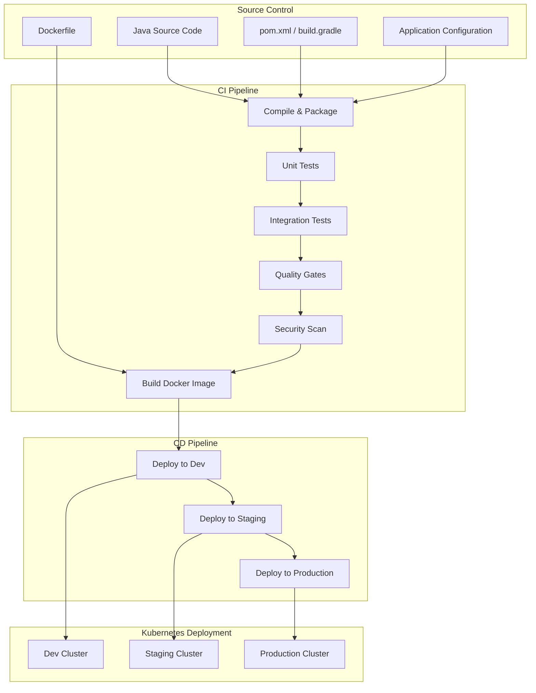
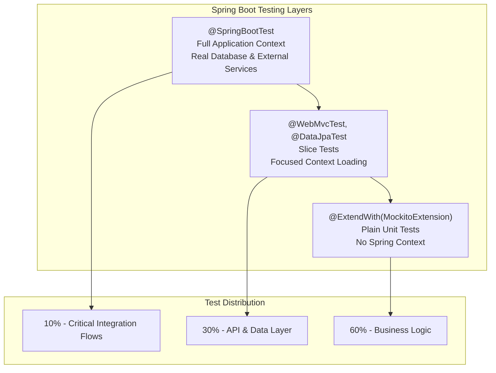

# Spring Boot CI/CD Standards

**Target Audience**: Java Developers, Spring Boot Engineers, DevOps Team  
**Last Updated**: 2025-06-10 by @parseen254

## Overview

Comprehensive CI/CD standards for Spring Boot applications including microservices, API Gateway, and monolithic applications using Azure DevOps, Maven/Gradle, and containerization with Docker and Kubernetes.

## Spring Boot CI/CD Architecture

### Spring Boot Deployment Pipeline Overview



### Current State Assessment

| Aspect | Current Status | Target Status | Priority |
|--------|----------------|---------------|----------|
| **Build Automation** | L3 - Advanced | L3 - Advanced | Maintain |
| **Test Automation** | L3 - Advanced | L3 - Advanced | Maintain |
| **Containerization** | L2 - Intermediate | L3 - Advanced | High |
| **Kubernetes Deployment** | L2 - Intermediate | L3 - Advanced | High |
| **Build Time** | 8 minutes | <5 minutes | Medium |
| **Deployment Frequency** | 2-3x daily | 5x daily | Medium |

## Pipeline Configuration

### Azure DevOps Pipeline Template

```yaml
# spring-boot-ci-cd-pipeline.yml
trigger:
  branches:
    include:
      - main
      - develop
      - release/*
  paths:
    include:
      - backend/spring-boot-app/**

pr:
  branches:
    include:
      - main
      - develop
  paths:
    include:
      - backend/spring-boot-app/**

variables:
  - group: spring-boot-secrets
  - name: MAVEN_VERSION
    value: '3.9.4'
  - name: JAVA_VERSION
    value: '17'
  - name: DOCKER_REGISTRY
    value: 'companyregistry.azurecr.io'
  - name: IMAGE_NAME
    value: 'spring-boot-app'

stages:
- stage: Build
  displayName: 'Build & Test'
  jobs:
  - job: MavenBuild
    displayName: 'Maven Build and Test'
    pool:
      vmImage: 'ubuntu-latest'
    steps:
    - task: JavaToolInstaller@0
      inputs:
        versionSpec: $(JAVA_VERSION)
        jdkArchitectureOption: 'x64'
        jdkSourceOption: 'PreInstalled'
    
    - task: Cache@2
      displayName: 'Cache Maven Dependencies'
      inputs:
        key: 'maven | "$(Agent.OS)" | backend/spring-boot-app/pom.xml'
        restoreKeys: |
          maven | "$(Agent.OS)"
          maven
        path: ~/.m2/repository
    
    - script: |
        cd backend/spring-boot-app
        mvn clean compile -B -Dmaven.test.skip=true
      displayName: 'Maven Compile'
    
    - script: |
        cd backend/spring-boot-app
        mvn test -B -Dmaven.test.failure.ignore=true
      displayName: 'Run Unit Tests'
    
    - task: PublishTestResults@2
      inputs:
        testResultsFormat: 'JUnit'
        testResultsFiles: 'backend/spring-boot-app/target/surefire-reports/*.xml'
        testRunTitle: 'Spring Boot Unit Tests'
    
    - script: |
        cd backend/spring-boot-app
        mvn jacoco:report
      displayName: 'Generate Code Coverage Report'
    
    - task: PublishCodeCoverageResults@1
      inputs:
        codeCoverageTool: 'JaCoCo'
        summaryFileLocation: 'backend/spring-boot-app/target/site/jacoco/jacoco.xml'
        reportDirectory: 'backend/spring-boot-app/target/site/jacoco'
    
    - script: |
        cd backend/spring-boot-app
        mvn package -B -DskipTests
      displayName: 'Maven Package'
    
    - task: PublishBuildArtifacts@1
      inputs:
        pathToPublish: 'backend/spring-boot-app/target'
        artifactName: 'spring-boot-artifacts'

- stage: IntegrationTest
  displayName: 'Integration Testing'
  dependsOn: Build
  jobs:
  - job: IntegrationTests
    displayName: 'Integration Tests with TestContainers'
    pool:
      vmImage: 'ubuntu-latest'
    services:
      postgres:
        image: postgres:15
        env:
          POSTGRES_DB: testdb
          POSTGRES_USER: testuser
          POSTGRES_PASSWORD: testpass
        ports:
          - 5432:5432
    steps:
    - task: JavaToolInstaller@0
      inputs:
        versionSpec: $(JAVA_VERSION)
        jdkArchitectureOption: 'x64'
        jdkSourceOption: 'PreInstalled'
    
    - task: Cache@2
      displayName: 'Cache Maven Dependencies'
      inputs:
        key: 'maven | "$(Agent.OS)" | backend/spring-boot-app/pom.xml'
        restoreKeys: |
          maven | "$(Agent.OS)"
          maven
        path: ~/.m2/repository
    
    - script: |
        cd backend/spring-boot-app
        mvn verify -Pintegration-tests -B
      displayName: 'Run Integration Tests'
      env:
        TESTCONTAINERS_RYUK_DISABLED: true
    
    - task: PublishTestResults@2
      inputs:
        testResultsFormat: 'JUnit'
        testResultsFiles: 'backend/spring-boot-app/target/failsafe-reports/*.xml'
        testRunTitle: 'Spring Boot Integration Tests'

- stage: QualityGates
  displayName: 'Quality & Security Gates'
  dependsOn: IntegrationTest
  jobs:
  - job: SonarAnalysis
    displayName: 'SonarQube Analysis'
    pool:
      vmImage: 'ubuntu-latest'
    steps:
    - task: JavaToolInstaller@0
      inputs:
        versionSpec: $(JAVA_VERSION)
        jdkArchitectureOption: 'x64'
        jdkSourceOption: 'PreInstalled'
    
    - task: SonarQubePrepare@4
      inputs:
        SonarQube: 'SonarQube-Connection'
        scannerMode: 'other'
        extraProperties: |
          sonar.projectKey=spring-boot-app
          sonar.sources=backend/spring-boot-app/src/main/java
          sonar.tests=backend/spring-boot-app/src/test/java
          sonar.java.binaries=backend/spring-boot-app/target/classes
          sonar.coverage.jacoco.xmlReportPaths=backend/spring-boot-app/target/site/jacoco/jacoco.xml
    
    - script: |
        cd backend/spring-boot-app
        mvn sonar:sonar -B
      displayName: 'Run SonarQube Analysis'
    
    - task: SonarQubePublish@4
      inputs:
        pollingTimeoutSec: '300'
  
  - job: SecurityScan
    displayName: 'Security Scanning'
    pool:
      vmImage: 'ubuntu-latest'
    steps:
    - task: JavaToolInstaller@0
      inputs:
        versionSpec: $(JAVA_VERSION)
        jdkArchitectureOption: 'x64'
        jdkSourceOption: 'PreInstalled'
    
    - script: |
        cd backend/spring-boot-app
        mvn org.owasp:dependency-check-maven:check
      displayName: 'OWASP Dependency Check'
    
    - task: PublishBuildArtifacts@1
      inputs:
        pathToPublish: 'backend/spring-boot-app/target/dependency-check-report.html'
        artifactName: 'security-report'
    
    - script: |
        # Install and run Snyk
        npm install -g snyk
        cd backend/spring-boot-app
        snyk test --severity-threshold=high
      displayName: 'Snyk Vulnerability Scan'
      env:
        SNYK_TOKEN: $(SNYK_TOKEN)

- stage: ContainerBuild
  displayName: 'Container Build & Push'
  dependsOn: QualityGates
  jobs:
  - job: DockerBuild
    displayName: 'Build and Push Docker Image'
    pool:
      vmImage: 'ubuntu-latest'
    steps:
    - task: DownloadBuildArtifacts@0
      inputs:
        buildType: 'current'
        downloadType: 'single'
        artifactName: 'spring-boot-artifacts'
        downloadPath: '$(System.ArtifactsDirectory)'
    
    - task: Docker@2
      displayName: 'Build Docker Image'
      inputs:
        containerRegistry: 'Azure-Container-Registry'
        repository: $(IMAGE_NAME)
        command: 'build'
        Dockerfile: 'backend/spring-boot-app/Dockerfile'
        buildContext: '.'
        tags: |
          $(Build.BuildNumber)
          latest
        arguments: '--build-arg JAR_FILE=$(System.ArtifactsDirectory)/spring-boot-artifacts/*.jar'
    
    - task: Docker@2
      displayName: 'Push Docker Image'
      inputs:
        containerRegistry: 'Azure-Container-Registry'
        repository: $(IMAGE_NAME)
        command: 'push'
        tags: |
          $(Build.BuildNumber)
          latest
    
    - script: |
        # Container security scanning with Trivy
        wget -qO - https://aquasecurity.github.io/trivy-repo/deb/public.key | sudo apt-key add -
        echo "deb https://aquasecurity.github.io/trivy-repo/deb $(lsb_release -sc) main" | sudo tee -a /etc/apt/sources.list.d/trivy.list
        sudo apt-get update
        sudo apt-get install trivy
        trivy image --exit-code 1 --severity HIGH,CRITICAL $(DOCKER_REGISTRY)/$(IMAGE_NAME):$(Build.BuildNumber)
      displayName: 'Container Security Scan'

- stage: DeployDev
  displayName: 'Deploy to Development'
  dependsOn: ContainerBuild
  condition: and(succeeded(), eq(variables['Build.SourceBranch'], 'refs/heads/develop'))
  jobs:
  - deployment: DeployToK8sDev
    displayName: 'Deploy to Kubernetes Dev'
    environment: 'spring-boot-dev'
    strategy:
      runOnce:
        deploy:
          steps:
          - task: KubernetesManifest@0
            inputs:
              action: 'deploy'
              kubernetesServiceConnection: 'k8s-dev-cluster'
              namespace: 'dev'
              manifests: |
                backend/spring-boot-app/k8s/deployment.yaml
                backend/spring-boot-app/k8s/service.yaml
                backend/spring-boot-app/k8s/ingress.yaml
              containers: '$(DOCKER_REGISTRY)/$(IMAGE_NAME):$(Build.BuildNumber)'
          
          - script: |
              # Health check
              kubectl wait --for=condition=ready pod -l app=spring-boot-app -n dev --timeout=300s
              kubectl get pods -n dev -l app=spring-boot-app
            displayName: 'Health Check'

- stage: DeployStaging
  displayName: 'Deploy to Staging'
  dependsOn: ContainerBuild
  condition: and(succeeded(), eq(variables['Build.SourceBranch'], 'refs/heads/main'))
  jobs:
  - deployment: DeployToK8sStaging
    displayName: 'Deploy to Kubernetes Staging'
    environment: 'spring-boot-staging'
    strategy:
      runOnce:
        deploy:
          steps:
          - task: KubernetesManifest@0
            inputs:
              action: 'deploy'
              kubernetesServiceConnection: 'k8s-staging-cluster'
              namespace: 'staging'
              manifests: |
                backend/spring-boot-app/k8s/deployment.yaml
                backend/spring-boot-app/k8s/service.yaml
                backend/spring-boot-app/k8s/ingress.yaml
              containers: '$(DOCKER_REGISTRY)/$(IMAGE_NAME):$(Build.BuildNumber)'
          
          - script: |
              # Comprehensive health check
              kubectl wait --for=condition=ready pod -l app=spring-boot-app -n staging --timeout=300s
              
              # Run smoke tests
              APP_URL=$(kubectl get ingress spring-boot-app -n staging -o jsonpath='{.spec.rules[0].host}')
              curl -f http://$APP_URL/actuator/health || exit 1
              curl -f http://$APP_URL/actuator/info || exit 1
            displayName: 'Health Check and Smoke Tests'

- stage: DeployProduction
  displayName: 'Deploy to Production'
  dependsOn: DeployStaging
  condition: and(succeeded(), eq(variables['Build.SourceBranch'], 'refs/heads/main'))
  jobs:
  - deployment: DeployToK8sProduction
    displayName: 'Deploy to Kubernetes Production'
    environment: 'spring-boot-production'
    strategy:
      canary:
        increments: [25, 50, 100]
        preDeploy:
          steps:
          - script: echo "Pre-deployment validation"
        deploy:
          steps:
          - task: KubernetesManifest@0
            inputs:
              action: 'deploy'
              kubernetesServiceConnection: 'k8s-prod-cluster'
              namespace: 'production'
              manifests: |
                backend/spring-boot-app/k8s/deployment.yaml
                backend/spring-boot-app/k8s/service.yaml
                backend/spring-boot-app/k8s/ingress.yaml
              containers: '$(DOCKER_REGISTRY)/$(IMAGE_NAME):$(Build.BuildNumber)'
              strategy: 'canary'
              percentage: $(strategy.increment)
        postDeploy:
          steps:
          - script: |
              # Monitor deployment metrics
              kubectl wait --for=condition=ready pod -l app=spring-boot-app -n production --timeout=600s
              
              # Validate application health
              APP_URL=$(kubectl get ingress spring-boot-app -n production -o jsonpath='{.spec.rules[0].host}')
              
              # Check multiple health endpoints
              for i in {1..10}; do
                curl -f http://$APP_URL/actuator/health && break
                sleep 30
              done
              
              # Performance validation
              ab -n 100 -c 10 http://$APP_URL/api/health-check
            displayName: 'Post-Deployment Validation'
        on:
          failure:
            steps:
            - script: |
                echo "Deployment failed, initiating rollback"
                kubectl rollout undo deployment/spring-boot-app -n production
              displayName: 'Automatic Rollback'
          success:
            steps:
            - script: echo "Deployment successful"
```

## Build Optimization

### Current Challenges and Solutions

| Challenge | Current Impact | Solution | Expected Improvement |
|-----------|----------------|----------|---------------------|
| **Maven Dependency Resolution** | 2-3 minutes | Advanced caching + local repository | <30 seconds |
| **Test Execution Time** | 4-5 minutes | Parallel execution + test categories | <2 minutes |
| **Docker Image Size** | 150MB+ | Multi-stage builds + JRE optimization | <80MB |
| **Startup Time** | 45 seconds | Application optimization + health checks | <20 seconds |

### Performance Optimization Strategies

#### Multi-Stage Dockerfile

```dockerfile
# Dockerfile for Spring Boot application
FROM maven:3.9.4-openjdk-17-slim AS build
WORKDIR /app
COPY pom.xml .
COPY src ./src

# Download dependencies first (for better caching)
RUN mvn dependency:go-offline -B

# Build application
RUN mvn clean package -B -DskipTests

FROM eclipse-temurin:17-jre-alpine AS runtime
WORKDIR /app

# Create non-root user
RUN addgroup -g 1001 appgroup && adduser -u 1001 -G appgroup -s /bin/sh -D appuser

# Copy JAR from build stage
COPY --from=build /app/target/*.jar app.jar

# Install curl for health checks
RUN apk add --no-cache curl

# Change ownership and switch to non-root user
RUN chown appuser:appgroup app.jar
USER appuser

# Health check
HEALTHCHECK --interval=30s --timeout=10s --start-period=60s --retries=3 \
  CMD curl -f http://localhost:8080/actuator/health || exit 1

EXPOSE 8080
ENTRYPOINT ["java", "-jar", "app.jar"]

# JVM optimization for containers
ENV JAVA_OPTS="-XX:+UseContainerSupport -XX:MaxRAMPercentage=75.0 -XX:+UseG1GC"
```

#### Maven Performance Configuration

```xml
<!-- pom.xml performance optimizations -->
<properties>
    <maven.compiler.source>17</maven.compiler.source>
    <maven.compiler.target>17</maven.compiler.target>
    <maven.test.parallel>all</maven.test.parallel>
    <maven.test.forkcount>4</maven.test.forkcount>
    <maven.test.reuseforks>true</maven.test.reuseforks>
</properties>

<build>
    <plugins>
        <!-- Surefire plugin for unit tests -->
        <plugin>
            <groupId>org.apache.maven.plugins</groupId>
            <artifactId>maven-surefire-plugin</artifactId>
            <version>3.0.0</version>
            <configuration>
                <parallel>all</parallel>
                <useUnlimitedThreads>true</useUnlimitedThreads>
                <forkCount>4</forkCount>
                <reuseForks>true</reuseForks>
            </configuration>
        </plugin>
        
        <!-- Failsafe plugin for integration tests -->
        <plugin>
            <groupId>org.apache.maven.plugins</groupId>
            <artifactId>maven-failsafe-plugin</artifactId>
            <version>3.0.0</version>
            <configuration>
                <parallel>classes</parallel>
                <threadCount>2</threadCount>
            </configuration>
        </plugin>
        
        <!-- JaCoCo for code coverage -->
        <plugin>
            <groupId>org.jacoco</groupId>
            <artifactId>jacoco-maven-plugin</artifactId>
            <version>0.8.8</version>
            <executions>
                <execution>
                    <goals>
                        <goal>prepare-agent</goal>
                    </goals>
                </execution>
                <execution>
                    <id>report</id>
                    <phase>test</phase>
                    <goals>
                        <goal>report</goal>
                    </goals>
                </execution>
            </executions>
        </plugin>
    </plugins>
</build>
```

#### Advanced Caching Strategy

```yaml
# Enhanced caching configuration
- task: Cache@2
  displayName: 'Cache Maven Local Repository'
  inputs:
    key: 'maven | "$(Agent.OS)" | backend/spring-boot-app/pom.xml'
    restoreKeys: |
      maven | "$(Agent.OS)"
      maven
    path: ~/.m2/repository

- task: Cache@2
  displayName: 'Cache Maven Wrapper'
  inputs:
    key: 'maven-wrapper | "$(Agent.OS)" | backend/spring-boot-app/.mvn/wrapper/maven-wrapper.properties'
    path: ~/.m2/wrapper

- task: Cache@2
  displayName: 'Cache Docker Layers'
  inputs:
    key: 'docker | "$(Agent.OS)" | backend/spring-boot-app/Dockerfile'
    path: /tmp/.buildx-cache
```

## Testing Standards

### Spring Boot Test Categories



### Test Configuration Standards

#### Unit Test Example

```java
// src/test/java/com/company/service/PaymentServiceTest.java
@ExtendWith(MockitoExtension.class)
class PaymentServiceTest {

    @Mock
    private PaymentRepository paymentRepository;
    
    @Mock
    private NotificationService notificationService;
    
    @InjectMocks
    private PaymentService paymentService;

    @Test
    @DisplayName("Should process payment successfully when all validations pass")
    void shouldProcessPaymentSuccessfully() {
        // Arrange
        PaymentRequest request = PaymentRequest.builder()
            .amount(new BigDecimal("100.00"))
            .currency("USD")
            .customerId("customer123")
            .build();
        
        Payment savedPayment = Payment.builder()
            .id("payment123")
            .status(PaymentStatus.COMPLETED)
            .build();
        
        when(paymentRepository.save(any(Payment.class))).thenReturn(savedPayment);
        
        // Act
        PaymentResponse response = paymentService.processPayment(request);
        
        // Assert
        assertThat(response.getStatus()).isEqualTo(PaymentStatus.COMPLETED);
        assertThat(response.getPaymentId()).isEqualTo("payment123");
        
        verify(paymentRepository).save(argThat(payment ->
            payment.getAmount().equals(new BigDecimal("100.00")) &&
            payment.getCurrency().equals("USD")
        ));
        verify(notificationService).sendPaymentConfirmation("customer123", "payment123");
    }

    @Test
    @DisplayName("Should throw exception when payment amount is negative")
    void shouldThrowExceptionForNegativeAmount() {
        // Arrange
        PaymentRequest request = PaymentRequest.builder()
            .amount(new BigDecimal("-50.00"))
            .currency("USD")
            .customerId("customer123")
            .build();
        
        // Act & Assert
        assertThatThrownBy(() -> paymentService.processPayment(request))
            .isInstanceOf(InvalidPaymentException.class)
            .hasMessage("Payment amount must be positive");
        
        verifyNoInteractions(paymentRepository, notificationService);
    }
}
```

#### Integration Test with TestContainers

```java
// src/test/java/com/company/integration/PaymentIntegrationTest.java
@SpringBootTest(webEnvironment = SpringBootTest.WebEnvironment.RANDOM_PORT)
@Testcontainers
class PaymentIntegrationTest {

    @Container
    static PostgreSQLContainer<?> postgres = new PostgreSQLContainer<>("postgres:15")
        .withDatabaseName("testdb")
        .withUsername("testuser")
        .withPassword("testpass");

    @Container
    static WireMockContainer wiremock = new WireMockContainer("wiremock/wiremock:2.35.0")
        .withMappingFromResource("payment-gateway-stubs.json");

    @Autowired
    private TestRestTemplate restTemplate;

    @Autowired
    private PaymentRepository paymentRepository;

    @DynamicPropertySource
    static void configureProperties(DynamicPropertyRegistry registry) {
        registry.add("spring.datasource.url", postgres::getJdbcUrl);
        registry.add("spring.datasource.username", postgres::getUsername);
        registry.add("spring.datasource.password", postgres::getPassword);
        registry.add("payment.gateway.url", 
            () -> "http://localhost:" + wiremock.getMappedPort(8080));
    }

    @Test
    @DisplayName("Should process payment end-to-end successfully")
    void shouldProcessPaymentEndToEnd() {
        // Arrange
        PaymentRequest request = PaymentRequest.builder()
            .amount(new BigDecimal("100.00"))
            .currency("USD")
            .customerId("customer123")
            .build();

        // Act
        ResponseEntity<PaymentResponse> response = restTemplate.postForEntity(
            "/api/v1/payments", request, PaymentResponse.class);

        // Assert
        assertThat(response.getStatusCode()).isEqualTo(HttpStatus.CREATED);
        assertThat(response.getBody().getStatus()).isEqualTo(PaymentStatus.COMPLETED);

        // Verify database state
        Optional<Payment> savedPayment = paymentRepository.findById(response.getBody().getPaymentId());
        assertThat(savedPayment).isPresent();
        assertThat(savedPayment.get().getAmount()).isEqualTo(new BigDecimal("100.00"));
    }
}
```

#### Web Layer Test

```java
// src/test/java/com/company/controller/PaymentControllerTest.java
@WebMvcTest(PaymentController.class)
class PaymentControllerTest {

    @Autowired
    private MockMvc mockMvc;

    @MockBean
    private PaymentService paymentService;

    @Test
    @DisplayName("Should return 201 when payment is created successfully")
    void shouldReturn201WhenPaymentCreated() throws Exception {
        // Arrange
        PaymentRequest request = PaymentRequest.builder()
            .amount(new BigDecimal("100.00"))
            .currency("USD")
            .customerId("customer123")
            .build();

        PaymentResponse response = PaymentResponse.builder()
            .paymentId("payment123")
            .status(PaymentStatus.COMPLETED)
            .build();

        when(paymentService.processPayment(any(PaymentRequest.class)))
            .thenReturn(response);

        // Act & Assert
        mockMvc.perform(post("/api/v1/payments")
                .contentType(MediaType.APPLICATION_JSON)
                .content(objectMapper.writeValueAsString(request)))
            .andExpect(status().isCreated())
            .andExpect(jsonPath("$.paymentId").value("payment123"))
            .andExpect(jsonPath("$.status").value("COMPLETED"))
            .andDo(document("create-payment",
                requestFields(
                    fieldWithPath("amount").description("Payment amount"),
                    fieldWithPath("currency").description("Payment currency"),
                    fieldWithPath("customerId").description("Customer identifier")
                ),
                responseFields(
                    fieldWithPath("paymentId").description("Generated payment ID"),
                    fieldWithPath("status").description("Payment status")
                )
            ));
    }
}
```

## Kubernetes Deployment

### Kubernetes Manifest Templates

#### Deployment Configuration

```yaml
# k8s/deployment.yaml
apiVersion: apps/v1
kind: Deployment
metadata:
  name: spring-boot-app
  namespace: production
  labels:
    app: spring-boot-app
    version: v1
spec:
  replicas: 3
  strategy:
    type: RollingUpdate
    rollingUpdate:
      maxUnavailable: 1
      maxSurge: 1
  selector:
    matchLabels:
      app: spring-boot-app
  template:
    metadata:
      labels:
        app: spring-boot-app
        version: v1
    spec:
      containers:
      - name: spring-boot-app
        image: companyregistry.azurecr.io/spring-boot-app:latest
        ports:
        - containerPort: 8080
          name: http
        - containerPort: 8081
          name: management
        env:
        - name: SPRING_PROFILES_ACTIVE
          value: "production"
        - name: JAVA_OPTS
          value: "-XX:+UseContainerSupport -XX:MaxRAMPercentage=75.0"
        resources:
          requests:
            memory: "512Mi"
            cpu: "500m"
          limits:
            memory: "1Gi"
            cpu: "1000m"
        livenessProbe:
          httpGet:
            path: /actuator/health/liveness
            port: 8081
          initialDelaySeconds: 60
          periodSeconds: 30
          timeoutSeconds: 10
          failureThreshold: 3
        readinessProbe:
          httpGet:
            path: /actuator/health/readiness
            port: 8081
          initialDelaySeconds: 30
          periodSeconds: 10
          timeoutSeconds: 5
          failureThreshold: 3
        volumeMounts:
        - name: config-volume
          mountPath: /app/config
        - name: temp-volume
          mountPath: /tmp
      volumes:
      - name: config-volume
        configMap:
          name: spring-boot-config
      - name: temp-volume
        emptyDir: {}
      securityContext:
        runAsNonRoot: true
        runAsUser: 1001
        fsGroup: 1001
```

#### Service Configuration

```yaml
# k8s/service.yaml
apiVersion: v1
kind: Service
metadata:
  name: spring-boot-app
  namespace: production
  labels:
    app: spring-boot-app
spec:
  type: ClusterIP
  ports:
  - port: 80
    targetPort: 8080
    protocol: TCP
    name: http
  - port: 8081
    targetPort: 8081
    protocol: TCP
    name: management
  selector:
    app: spring-boot-app
```

#### Ingress Configuration

```yaml
# k8s/ingress.yaml
apiVersion: networking.k8s.io/v1
kind: Ingress
metadata:
  name: spring-boot-app
  namespace: production
  annotations:
    nginx.ingress.kubernetes.io/rewrite-target: /
    nginx.ingress.kubernetes.io/ssl-redirect: "true"
    cert-manager.io/cluster-issuer: "letsencrypt-prod"
spec:
  tls:
  - hosts:
    - api.company.com
    secretName: spring-boot-app-tls
  rules:
  - host: api.company.com
    http:
      paths:
      - path: /api
        pathType: Prefix
        backend:
          service:
            name: spring-boot-app
            port:
              number: 80
```

### ConfigMap and Secret Management

```yaml
# k8s/configmap.yaml
apiVersion: v1
kind: ConfigMap
metadata:
  name: spring-boot-config
  namespace: production
data:
  application.yaml: |
    server:
      port: 8080
      shutdown: graceful
    
    management:
      server:
        port: 8081
      endpoints:
        web:
          exposure:
            include: health,info,metrics,prometheus
      endpoint:
        health:
          show-details: always
          probes:
            enabled: true
    
    spring:
      lifecycle:
        timeout-per-shutdown-phase: 30s
      datasource:
        hikari:
          maximum-pool-size: 20
          minimum-idle: 5
          connection-timeout: 30000
          idle-timeout: 600000
          max-lifetime: 1800000

---
apiVersion: v1
kind: Secret
metadata:
  name: spring-boot-secrets
  namespace: production
type: Opaque
stringData:
  database-url: "jdbc:postgresql://postgres:5432/appdb"
  database-username: "appuser"
  database-password: "securepassword"
  jwt-secret: "your-jwt-secret-key"
```

## Monitoring and Observability

### Application Health Checks

```java
// src/main/java/com/company/health/CustomHealthIndicator.java
@Component
public class DatabaseHealthIndicator implements HealthIndicator {

    private final DataSource dataSource;

    public DatabaseHealthIndicator(DataSource dataSource) {
        this.dataSource = dataSource;
    }

    @Override
    public Health health() {
        try (Connection connection = dataSource.getConnection()) {
            if (connection.isValid(1)) {
                return Health.up()
                    .withDetail("database", "Available")
                    .withDetail("validationQuery", "SELECT 1")
                    .build();
            }
        } catch (SQLException e) {
            return Health.down()
                .withDetail("database", "Unavailable")
                .withDetail("error", e.getMessage())
                .build();
        }
        return Health.down().withDetail("database", "Connection invalid").build();
    }
}
```

### Metrics Configuration

```yaml
# application.yaml - Metrics configuration
management:
  metrics:
    export:
      prometheus:
        enabled: true
    distribution:
      percentiles-histogram:
        http.server.requests: true
      percentiles:
        http.server.requests: 0.5, 0.95, 0.99
    tags:
      application: spring-boot-app
      environment: ${SPRING_PROFILES_ACTIVE:development}
```

### Performance Monitoring

| Metric | Target | Current | Alert Threshold |
|--------|--------|---------|-----------------|
| **Response Time (P95)** | <200ms | 150ms | >500ms |
| **Throughput** | >1000 RPS | 800 RPS | <500 RPS |
| **Error Rate** | <1% | 0.5% | >2% |
| **Memory Usage** | <80% | 65% | >90% |
| **CPU Usage** | <70% | 45% | >85% |

## Security Implementation

### Security Configuration

```java
// src/main/java/com/company/security/SecurityConfig.java
@Configuration
@EnableWebSecurity
@EnableMethodSecurity
public class SecurityConfig {

    @Bean
    public SecurityFilterChain filterChain(HttpSecurity http) throws Exception {
        return http
            .csrf(csrf -> csrf.disable())
            .sessionManagement(session -> 
                session.sessionCreationPolicy(SessionCreationPolicy.STATELESS))
            .authorizeHttpRequests(auth -> auth
                .requestMatchers("/actuator/health/**").permitAll()
                .requestMatchers("/api/public/**").permitAll()
                .requestMatchers("/api/admin/**").hasRole("ADMIN")
                .anyRequest().authenticated())
            .oauth2ResourceServer(oauth2 -> oauth2.jwt(Customizer.withDefaults()))
            .headers(headers -> headers
                .frameOptions().deny()
                .contentTypeOptions(Customizer.withDefaults())
                .httpStrictTransportSecurity(hstsConfig -> hstsConfig
                    .maxAgeInSeconds(31536000)
                    .includeSubdomains(true)))
            .build();
    }

    @Bean
    public CorsConfigurationSource corsConfigurationSource() {
        CorsConfiguration configuration = new CorsConfiguration();
        configuration.setAllowedOriginPatterns(List.of("https://*.company.com"));
        configuration.setAllowedMethods(List.of("GET", "POST", "PUT", "DELETE", "OPTIONS"));
        configuration.setAllowedHeaders(List.of("*"));
        configuration.setAllowCredentials(true);
        
        UrlBasedCorsConfigurationSource source = new UrlBasedCorsConfigurationSource();
        source.registerCorsConfiguration("/api/**", configuration);
        return source;
    }
}
```

### Security Scanning Integration

```yaml
# Security scanning pipeline integration
- script: |
    # OWASP ZAP security scan
    docker run -v $(pwd):/zap/wrk/:rw -t owasp/zap2docker-stable \
      zap-baseline.py -t http://localhost:8080 -J zap-report.json
  displayName: 'OWASP ZAP Security Scan'

- script: |
    # Container image scanning
    trivy image --format json --output image-scan-results.json \
      $(DOCKER_REGISTRY)/$(IMAGE_NAME):$(Build.BuildNumber)
  displayName: 'Container Image Security Scan'
```

## Getting Started

### For New Spring Boot Projects

1. **Copy the Pipeline Template**
   ```bash
   # Copy the spring-boot-ci-cd-pipeline.yml to your project
   cp templates/ci-cd/spring-boot-pipeline.yml .azure-pipelines/spring-boot-ci-cd.yml
   ```

2. **Configure Variable Groups**
   - Set up `spring-boot-secrets` variable group in Azure DevOps
   - Configure container registry service connections
   - Set up Kubernetes cluster connections

3. **Set up Testing Framework**
   ```xml
   <!-- Add to pom.xml -->
   <dependency>
       <groupId>org.springframework.boot</groupId>
       <artifactId>spring-boot-starter-test</artifactId>
       <scope>test</scope>
   </dependency>
   <dependency>
       <groupId>org.testcontainers</groupId>
       <artifactId>postgresql</artifactId>
       <scope>test</scope>
   </dependency>
   ```

4. **Configure Quality Gates**
   - Set minimum test coverage to 80%
   - Enable SonarQube integration
   - Configure security scanning

### For Existing Spring Boot Projects

1. **Assess Current Pipeline Maturity**
   - Use our [Spring Boot pipeline assessment checklist](../../templates/ci-cd/spring-boot-assessment.md)
   - Identify containerization opportunities
   - Plan Kubernetes migration timeline

2. **Implement Gradual Migration**
   - Start with build optimization and caching
   - Add comprehensive testing automation
   - Implement containerization
   - Migrate to Kubernetes deployment

3. **Performance Optimization**
   - Implement multi-stage Docker builds
   - Configure parallel test execution
   - Set up advanced caching strategies
   - Optimize application startup time

## Support and Resources

### Spring Boot-Specific Resources
- **[Spring Boot DevOps Guide](../../resources/spring-boot/devops-best-practices.md)** - Comprehensive Spring Boot CI/CD guide
- **[Kubernetes Deployment Patterns](../../resources/kubernetes/spring-boot-patterns.md)** - Container orchestration best practices
- **[Spring Boot Performance Tuning](../../resources/performance/spring-boot-optimization.md)** - Application optimization techniques

### Communication Channels
- **Slack Communities**:
  - `#spring-boot-ci-cd` - Spring Boot-specific pipeline discussions
  - `#kubernetes-deployments` - Container orchestration and Kubernetes
  - `#java-build-optimization` - Build performance and optimization
- **Office Hours**: Tuesdays 3-4 PM UTC with Java Platform Team
- **Spring Boot Reviews**: Weekly Spring Boot project reviews and optimizations

### External Resources
- [Spring Boot Production Best Practices](https://docs.spring.io/spring-boot/docs/current/reference/html/deployment.html)
- [Kubernetes Spring Boot Guide](https://spring.io/guides/gs/spring-boot-kubernetes/)
- [TestContainers Documentation](https://www.testcontainers.org/)
- [Azure DevOps Java Guide](https://docs.microsoft.com/en-us/azure/devops/pipelines/ecosystems/java)

---

**Next Steps:**
1. Copy and customize the pipeline template for your Spring Boot project
2. Set up comprehensive testing with TestContainers
3. Implement containerization and Kubernetes deployment
4. Configure monitoring and observability
5. Join the Spring Boot CI/CD community for ongoing support

**Questions or Feedback?** Contact @parseen254 or post in #spring-boot-ci-cd
