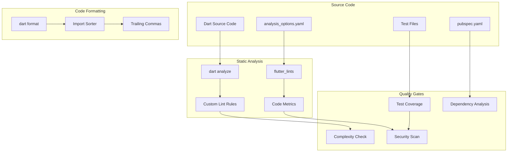

# Flutter Code Quality Standards

**Target Audience**: Flutter Developers, Mobile Development Team, Tech Leads  
**Last Updated**: 2025-06-10 by @parseen254

## Overview

Comprehensive code quality standards for Flutter applications including static analysis, formatting, testing practices, and automated quality enforcement using Dart analysis tools and CI/CD integration.

## Flutter Code Quality Architecture

### Flutter Quality Pipeline Overview



### Current State Assessment

| Aspect | Current Status | Target Status | Priority |
|--------|----------------|---------------|----------|
| **Static Analysis** | L1 - Basic | L3 - Advanced | High |
| **Code Formatting** | L1 - Manual | L3 - Automated | High |
| **Test Coverage** | L1 - Basic | L3 - Comprehensive | High |
| **Dependency Management** | L2 - Intermediate | L3 - Advanced | Medium |
| **Security Analysis** | L1 - None | L2 - Intermediate | Medium |
| **Performance Analysis** | L1 - None | L2 - Intermediate | Low |

## Static Analysis Configuration

### analysis_options.yaml

```yaml
# analysis_options.yaml - Comprehensive Flutter linting configuration
include: package:flutter_lints/flutter.yaml

analyzer:
  exclude:
    - "**/*.g.dart"
    - "**/*.freezed.dart"
    - "**/*.mocks.dart"
    - "**/generated_plugin_registrant.dart"
  
  errors:
    # Treat missing returns as errors
    missing_return: error
    # Treat unused imports as errors
    unused_import: error
    # Treat unused local variables as errors
    unused_local_variable: error
    # Treat dead code as warnings
    dead_code: warning
    # Treat deprecated member use as info
    deprecated_member_use: info
  
  language:
    strict-casts: true
    strict-inference: true
    strict-raw-types: true

linter:
  rules:
    # Error rules
    - avoid_empty_else
    - avoid_print
    - avoid_returning_null_for_future
    - avoid_slow_async_io
    - avoid_types_as_parameter_names
    - cancel_subscriptions
    - close_sinks
    - comment_references
    - control_flow_in_finally
    - empty_statements
    - hash_and_equals
    - invariant_booleans
    - iterable_contains_unrelated_type
    - list_remove_unrelated_type
    - literal_only_boolean_expressions
    - no_adjacent_strings_in_list
    - no_duplicate_case_values
    - prefer_void_to_null
    - test_types_in_equals
    - throw_in_finally
    - unnecessary_statements
    - unrelated_type_equality_checks
    - valid_regexps
    
    # Style rules
    - always_declare_return_types
    - always_put_control_body_on_new_line
    - always_put_required_named_parameters_first
    - always_specify_types
    - annotate_overrides
    - avoid_annotating_with_dynamic
    - avoid_as
    - avoid_bool_literals_in_conditional_expressions
    - avoid_catches_without_on_clauses
    - avoid_catching_errors
    - avoid_double_and_int_checks
    - avoid_field_initializers_in_const_classes
    - avoid_function_literals_in_foreach_calls
    - avoid_implementing_value_types
    - avoid_init_to_null
    - avoid_null_checks_in_equality_operators
    - avoid_positional_boolean_parameters
    - avoid_redundant_argument_values
    - avoid_renaming_method_parameters
    - avoid_return_types_on_setters
    - avoid_returning_null
    - avoid_returning_this
    - avoid_setters_without_getters
    - avoid_single_cascade_in_expression_statements
    - avoid_unnecessary_containers
    - avoid_unused_constructor_parameters
    - avoid_void_async
    - cascade_invocations
    - constant_identifier_names
    - curly_braces_in_flow_control_structures
    - directives_ordering
    - empty_catches
    - empty_constructor_bodies
    - file_names
    - flutter_style_todos
    - implementation_imports
    - join_return_with_assignment
    - leading_newlines_in_multiline_strings
    - library_names
    - library_prefixes
    - lines_longer_than_80_chars
    - missing_whitespace_between_adjacent_strings
    - no_runtimeType_toString
    - non_constant_identifier_names
    - null_closures
    - omit_local_variable_types
    - one_member_abstracts
    - only_throw_errors
    - overridden_fields
    - package_api_docs
    - package_prefixed_library_names
    - parameter_assignments
    - prefer_adjacent_string_concatenation
    - prefer_asserts_in_initializer_lists
    - prefer_collection_literals
    - prefer_conditional_assignment
    - prefer_const_constructors
    - prefer_const_constructors_in_immutables
    - prefer_const_declarations
    - prefer_const_literals_to_create_immutables
    - prefer_constructors_over_static_methods
    - prefer_contains
    - prefer_equal_for_default_values
    - prefer_expression_function_bodies
    - prefer_final_fields
    - prefer_final_in_for_each
    - prefer_final_locals
    - prefer_for_elements_to_map_fromIterable
    - prefer_foreach
    - prefer_function_declarations_over_variables
    - prefer_generic_function_type_aliases
    - prefer_if_elements_to_conditional_expressions
    - prefer_if_null_operators
    - prefer_initializing_formals
    - prefer_inlined_adds
    - prefer_int_literals
    - prefer_interpolation_to_compose_strings
    - prefer_is_empty
    - prefer_is_not_empty
    - prefer_is_not_operator
    - prefer_iterable_whereType
    - prefer_mixin
    - prefer_null_aware_operators
    - prefer_relative_imports
    - prefer_single_quotes
    - prefer_spread_collections
    - prefer_typing_uninitialized_variables
    - provide_deprecation_message
    - recursive_getters
    - slash_for_doc_comments
    - sort_child_properties_last
    - sort_constructors_first
    - sort_unnamed_constructors_first
    - type_annotate_public_apis
    - type_init_formals
    - unawaited_futures
    - unnecessary_await_in_return
    - unnecessary_brace_in_string_interps
    - unnecessary_const
    - unnecessary_getters_setters
    - unnecessary_lambdas
    - unnecessary_new
    - unnecessary_null_aware_assignments
    - unnecessary_null_in_if_null_operators
    - unnecessary_overrides
    - unnecessary_parenthesis
    - unnecessary_raw_strings
    - unnecessary_string_escapes
    - unnecessary_string_interpolations
    - unnecessary_this
    - use_full_hex_values_for_flutter_colors
    - use_function_type_syntax_for_parameters
    - use_rethrow_when_possible
    - use_setters_to_change_properties
    - use_string_buffers
    - use_to_and_as_if_applicable
    - void_checks

# Custom rules for team-specific requirements
custom_lint:
  rules:
    # Require documentation for public APIs
    - always_use_package_imports
    - avoid_dynamic_calls
    - avoid_hardcoded_colors
    - avoid_hardcoded_strings
    - prefer_named_parameters
    - require_trailing_commas
```

### Custom Lint Rules

```dart
// lib/quality/custom_lint_rules.dart
import 'package:analyzer/dart/analysis/results.dart';
import 'package:analyzer/dart/ast/ast.dart';
import 'package:analyzer/dart/ast/visitor.dart';
import 'package:custom_lint_builder/custom_lint_builder.dart';

class AvoidHardcodedColorsRule extends DartLintRule {
  const AvoidHardcodedColorsRule() : super(code: _code);

  static const _code = LintCode(
    name: 'avoid_hardcoded_colors',
    problemMessage: 'Avoid hardcoded colors. Use theme colors instead.',
    correctionMessage: 'Consider using Theme.of(context).colorScheme.* or defining colors in a theme.',
  );

  @override
  void run(
    CustomLintResolver resolver,
    ErrorReporter reporter,
    CustomLintContext context,
  ) {
    context.registry.addInstanceCreationExpression((node) {
      final createdType = node.staticType;
      if (createdType == null) return;

      // Check for Color constructors with hardcoded values
      if (createdType.element?.name == 'Color' &&
          node.argumentList.arguments.isNotEmpty) {
        final firstArg = node.argumentList.arguments.first;
        if (firstArg is IntegerLiteral || 
            (firstArg is PrefixedIdentifier && firstArg.prefix.name == '0x')) {
          reporter.reportErrorForNode(code, node);
        }
      }
    });
  }
}

class RequireTrailingCommasRule extends DartLintRule {
  const RequireTrailingCommasRule() : super(code: _code);

  static const _code = LintCode(
    name: 'require_trailing_commas',
    problemMessage: 'Missing trailing comma in multiline argument list.',
    correctionMessage: 'Add a trailing comma to improve code formatting.',
  );

  @override
  void run(
    CustomLintResolver resolver,
    ErrorReporter reporter,
    CustomLintContext context,
  ) {
    context.registry.addArgumentList((node) {
      if (node.arguments.length > 1) {
        final source = resolver.source.contents.data;
        final nodeText = source.substring(node.offset, node.end);
        
        // Check if arguments span multiple lines
        if (nodeText.contains('\n') && !nodeText.trim().endsWith(',)')) {
          reporter.reportErrorForNode(code, node);
        }
      }
    });
  }
}
```

## Code Formatting Standards

### Dart Formatting Configuration

```yaml
# .dart_tool/dart_format_options.yaml
dart_format:
  line_length: 80
  indent: 2
  fix_doc_comments: true
  set_exit_if_changed: true
```

### Automated Formatting Setup

```bash
#!/bin/bash
# scripts/format_code.sh - Automated code formatting script

echo "🎨 Formatting Dart code..."

# Format all Dart files
dart format . --line-length=80 --set-exit-if-changed

# Sort imports
echo "📦 Sorting imports..."
flutter pub run import_sorter:main

# Fix common issues
echo "🔧 Running dart fix..."
dart fix --apply

# Verify formatting
echo "✅ Verifying code formatting..."
dart format . --output=none --set-exit-if-changed

if [ $? -eq 0 ]; then
    echo "✅ All files are properly formatted!"
else
    echo "❌ Some files need formatting. Run 'dart format .' to fix."
    exit 1
fi
```

### Import Organization

```dart
// Example of properly organized imports
// Dart SDK imports
import 'dart:async';
import 'dart:io';

// Flutter framework imports
import 'package:flutter/material.dart';
import 'package:flutter/services.dart';

// Third-party package imports
import 'package:http/http.dart' as http;
import 'package:provider/provider.dart';
import 'package:shared_preferences/shared_preferences.dart';

// Local imports
import '../models/user.dart';
import '../services/api_service.dart';
import '../utils/constants.dart';
import 'widgets/custom_button.dart';
```

## Code Structure Standards

### File Organization

```
lib/
├── main.dart
├── app/
│   ├── app.dart
│   └── routes/
│       ├── app_routes.dart
│       └── route_generator.dart
├── core/
│   ├── constants/
│   │   ├── api_constants.dart
│   │   ├── app_colors.dart
│   │   └── app_strings.dart
│   ├── errors/
│   │   ├── exceptions.dart
│   │   └── failures.dart
│   ├── network/
│   │   ├── network_info.dart
│   │   └── api_client.dart
│   └── utils/
│       ├── validators.dart
│       └── helpers.dart
├── features/
│   └── authentication/
│       ├── data/
│       │   ├── datasources/
│       │   ├── models/
│       │   └── repositories/
│       ├── domain/
│       │   ├── entities/
│       │   ├── repositories/
│       │   └── usecases/
│       └── presentation/
│           ├── bloc/
│           ├── pages/
│           └── widgets/
└── shared/
    ├── widgets/
    ├── themes/
    └── extensions/
```

### Naming Conventions

#### File and Directory Naming

```dart
// ✅ Good - Use snake_case for files and directories
user_profile_page.dart
api_service.dart
custom_button.dart

// ❌ Bad - Don't use camelCase or PascalCase for files
UserProfilePage.dart
apiService.dart
CustomButton.dart
```

#### Class and Widget Naming

```dart
// ✅ Good - Use PascalCase for classes and widgets
class UserProfilePage extends StatefulWidget {
  const UserProfilePage({super.key});
}

class ApiService {
  // Implementation
}

// ✅ Good - Use descriptive widget names
class CustomElevatedButton extends StatelessWidget {
  // Implementation
}

// ❌ Bad - Avoid generic names
class Button extends StatelessWidget {
  // Implementation
}
```

#### Variable and Method Naming

```dart
// ✅ Good - Use camelCase for variables and methods
String userName = 'John Doe';
int userAge = 25;
bool isUserLoggedIn = false;

Future<void> authenticateUser() async {
  // Implementation
}

void _handleUserLogin() {
  // Private method implementation
}

// ✅ Good - Use descriptive boolean names
bool isLoading = false;
bool hasError = false;
bool canSubmit = true;

// ❌ Bad - Avoid unclear names
bool flag = false;
bool status = true;
```

#### Constants Naming

```dart
// ✅ Good - Use lowerCamelCase for constants
const String apiBaseUrl = 'https://api.example.com';
const int maxRetryAttempts = 3;
const Duration requestTimeout = Duration(seconds: 30);

// ✅ Good - Group related constants in classes
class AppColors {
  static const Color primary = Color(0xFF2196F3);
  static const Color secondary = Color(0xFF03DAC6);
  static const Color error = Color(0xFFB00020);
}

class AppStrings {
  static const String appName = 'My Flutter App';
  static const String loginTitle = 'Welcome Back';
  static const String loginSubtitle = 'Sign in to continue';
}
```

## Widget Development Standards

### Stateless Widget Template

```dart
// lib/shared/widgets/custom_elevated_button.dart
import 'package:flutter/material.dart';

/// A custom elevated button with consistent styling across the app.
/// 
/// This widget provides a standardized button appearance and behavior
/// that follows the app's design system.
class CustomElevatedButton extends StatelessWidget {
  /// Creates a custom elevated button.
  /// 
  /// The [onPressed] and [text] parameters are required.
  /// The [isLoading] parameter defaults to false.
  const CustomElevatedButton({
    required this.onPressed,
    required this.text,
    this.isLoading = false,
    this.variant = ButtonVariant.primary,
    super.key,
  });

  /// Callback function called when the button is pressed.
  final VoidCallback? onPressed;

  /// The text to display on the button.
  final String text;

  /// Whether the button should show a loading indicator.
  final bool isLoading;

  /// The visual variant of the button.
  final ButtonVariant variant;

  @override
  Widget build(BuildContext context) {
    final theme = Theme.of(context);
    
    return SizedBox(
      width: double.infinity,
      height: 48,
      child: ElevatedButton(
        onPressed: isLoading ? null : onPressed,
        style: _getButtonStyle(theme),
        child: isLoading
            ? const SizedBox(
                width: 20,
                height: 20,
                child: CircularProgressIndicator(
                  strokeWidth: 2,
                  valueColor: AlwaysStoppedAnimation<Color>(Colors.white),
                ),
              )
            : Text(
                text,
                style: theme.textTheme.labelLarge?.copyWith(
                  color: _getTextColor(theme),
                  fontWeight: FontWeight.w600,
                ),
              ),
      ),
    );
  }

  ButtonStyle _getButtonStyle(ThemeData theme) {
    switch (variant) {
      case ButtonVariant.primary:
        return ElevatedButton.styleFrom(
          backgroundColor: theme.colorScheme.primary,
          foregroundColor: theme.colorScheme.onPrimary,
          elevation: 2,
          shape: RoundedRectangleBorder(
            borderRadius: BorderRadius.circular(8),
          ),
        );
      case ButtonVariant.secondary:
        return ElevatedButton.styleFrom(
          backgroundColor: theme.colorScheme.secondary,
          foregroundColor: theme.colorScheme.onSecondary,
          elevation: 1,
          shape: RoundedRectangleBorder(
            borderRadius: BorderRadius.circular(8),
          ),
        );
    }
  }

  Color _getTextColor(ThemeData theme) {
    switch (variant) {
      case ButtonVariant.primary:
        return theme.colorScheme.onPrimary;
      case ButtonVariant.secondary:
        return theme.colorScheme.onSecondary;
    }
  }
}

/// Defines the visual variants available for the custom button.
enum ButtonVariant {
  /// Primary button variant with app's primary color.
  primary,
  
  /// Secondary button variant with app's secondary color.
  secondary,
}
```

### Stateful Widget Template

```dart
// lib/features/authentication/presentation/pages/login_page.dart
import 'package:flutter/material.dart';
import 'package:flutter_bloc/flutter_bloc.dart';

import '../../../../core/constants/app_strings.dart';
import '../../../../shared/widgets/custom_elevated_button.dart';
import '../bloc/authentication_bloc.dart';
import '../widgets/login_form.dart';

/// The login page where users can authenticate.
/// 
/// This page handles user authentication through email and password,
/// displays appropriate loading states, and navigates to the main app
/// upon successful authentication.
class LoginPage extends StatefulWidget {
  /// Creates a login page.
  const LoginPage({super.key});

  @override
  State<LoginPage> createState() => _LoginPageState();
}

class _LoginPageState extends State<LoginPage> {
  final _formKey = GlobalKey<FormState>();
  final _emailController = TextEditingController();
  final _passwordController = TextEditingController();
  
  bool _obscurePassword = true;

  @override
  void dispose() {
    _emailController.dispose();
    _passwordController.dispose();
    super.dispose();
  }

  @override
  Widget build(BuildContext context) {
    return Scaffold(
      appBar: AppBar(
        title: const Text(AppStrings.loginTitle),
        centerTitle: true,
      ),
      body: BlocConsumer<AuthenticationBloc, AuthenticationState>(
        listener: _handleAuthenticationState,
        builder: (context, state) {
          return SafeArea(
            child: Padding(
              padding: const EdgeInsets.all(16),
              child: Form(
                key: _formKey,
                child: Column(
                  crossAxisAlignment: CrossAxisAlignment.stretch,
                  children: [
                    const Spacer(),
                    _buildHeader(),
                    const SizedBox(height: 32),
                    _buildLoginForm(),
                    const SizedBox(height: 24),
                    _buildLoginButton(state),
                    const SizedBox(height: 16),
                    _buildForgotPasswordButton(),
                    const Spacer(flex: 2),
                  ],
                ),
              ),
            ),
          );
        },
      ),
    );
  }

  Widget _buildHeader() {
    return Column(
      children: [
        Icon(
          Icons.lock_outline,
          size: 80,
          color: Theme.of(context).colorScheme.primary,
        ),
        const SizedBox(height: 16),
        Text(
          AppStrings.loginTitle,
          style: Theme.of(context).textTheme.headlineMedium?.copyWith(
            fontWeight: FontWeight.bold,
          ),
        ),
        const SizedBox(height: 8),
        Text(
          AppStrings.loginSubtitle,
          style: Theme.of(context).textTheme.bodyLarge?.copyWith(
            color: Colors.grey[600],
          ),
        ),
      ],
    );
  }

  Widget _buildLoginForm() {
    return LoginForm(
      emailController: _emailController,
      passwordController: _passwordController,
      obscurePassword: _obscurePassword,
      onTogglePasswordVisibility: () {
        setState(() {
          _obscurePassword = !_obscurePassword;
        });
      },
    );
  }

  Widget _buildLoginButton(AuthenticationState state) {
    return CustomElevatedButton(
      onPressed: _handleLogin,
      text: AppStrings.loginButton,
      isLoading: state is AuthenticationLoading,
    );
  }

  Widget _buildForgotPasswordButton() {
    return TextButton(
      onPressed: _handleForgotPassword,
      child: Text(
        AppStrings.forgotPassword,
        style: TextStyle(
          color: Theme.of(context).colorScheme.primary,
        ),
      ),
    );
  }

  void _handleLogin() {
    if (_formKey.currentState?.validate() ?? false) {
      context.read<AuthenticationBloc>().add(
        AuthenticationLoginRequested(
          email: _emailController.text.trim(),
          password: _passwordController.text,
        ),
      );
    }
  }

  void _handleForgotPassword() {
    // Navigate to forgot password page
    Navigator.pushNamed(context, '/forgot-password');
  }

  void _handleAuthenticationState(
    BuildContext context,
    AuthenticationState state,
  ) {
    if (state is AuthenticationSuccess) {
      Navigator.pushReplacementNamed(context, '/home');
    } else if (state is AuthenticationFailure) {
      ScaffoldMessenger.of(context).showSnackBar(
        SnackBar(
          content: Text(state.message),
          backgroundColor: Theme.of(context).colorScheme.error,
        ),
      );
    }
  }
}
```

## Testing Standards

### Test File Organization

```
test/
├── unit/
│   ├── core/
│   │   ├── network/
│   │   │   └── api_client_test.dart
│   │   └── utils/
│   │       └── validators_test.dart
│   └── features/
│       └── authentication/
│           ├── data/
│           │   └── repositories/
│           │       └── auth_repository_test.dart
│           ├── domain/
│           │   └── usecases/
│           │       └── login_usecase_test.dart
│           └── presentation/
│               └── bloc/
│                   └── authentication_bloc_test.dart
├── widget/
│   ├── shared/
│   │   └── widgets/
│   │       └── custom_elevated_button_test.dart
│   └── features/
│       └── authentication/
│           └── presentation/
│               └── pages/
│                   └── login_page_test.dart
└── integration/
    └── authentication_flow_test.dart
```

### Unit Test Example

```dart
// test/unit/features/authentication/domain/usecases/login_usecase_test.dart
import 'package:dartz/dartz.dart';
import 'package:flutter_test/flutter_test.dart';
import 'package:mockito/annotations.dart';
import 'package:mockito/mockito.dart';

import '../../../../../lib/core/errors/failures.dart';
import '../../../../../lib/features/authentication/domain/entities/user.dart';
import '../../../../../lib/features/authentication/domain/repositories/auth_repository.dart';
import '../../../../../lib/features/authentication/domain/usecases/login_usecase.dart';

import 'login_usecase_test.mocks.dart';

@GenerateMocks([AuthRepository])
void main() {
  group('LoginUsecase', () {
    late LoginUsecase usecase;
    late MockAuthRepository mockAuthRepository;

    setUp(() {
      mockAuthRepository = MockAuthRepository();
      usecase = LoginUsecase(mockAuthRepository);
    });

    group('call', () {
      const testEmail = 'test@example.com';
      const testPassword = 'password123';
      const testParams = LoginParams(
        email: testEmail,
        password: testPassword,
      );

      const testUser = User(
        id: '1',
        email: testEmail,
        name: 'Test User',
      );

      test('should return User when login is successful', () async {
        // Arrange
        when(mockAuthRepository.login(any, any))
            .thenAnswer((_) async => const Right(testUser));

        // Act
        final result = await usecase(testParams);

        // Assert
        expect(result, const Right(testUser));
        verify(mockAuthRepository.login(testEmail, testPassword)).called(1);
        verifyNoMoreInteractions(mockAuthRepository);
      });

      test('should return ServerFailure when repository throws ServerException',
          () async {
        // Arrange
        when(mockAuthRepository.login(any, any))
            .thenAnswer((_) async => Left(ServerFailure('Server error')));

        // Act
        final result = await usecase(testParams);

        // Assert
        expect(result, Left(ServerFailure('Server error')));
        verify(mockAuthRepository.login(testEmail, testPassword)).called(1);
        verifyNoMoreInteractions(mockAuthRepository);
      });

      test('should return ValidationFailure when email is invalid', () async {
        // Arrange
        const invalidParams = LoginParams(
          email: 'invalid-email',
          password: testPassword,
        );

        // Act
        final result = await usecase(invalidParams);

        // Assert
        expect(result, Left(ValidationFailure('Invalid email format')));
        verifyZeroInteractions(mockAuthRepository);
      });

      test('should return ValidationFailure when password is too short',
          () async {
        // Arrange
        const invalidParams = LoginParams(
          email: testEmail,
          password: '123',
        );

        // Act
        final result = await usecase(invalidParams);

        // Assert
        expect(result, Left(ValidationFailure('Password too short')));
        verifyZeroInteractions(mockAuthRepository);
      });
    });
  });
}
```

### Widget Test Example

```dart
// test/widget/shared/widgets/custom_elevated_button_test.dart
import 'package:flutter/material.dart';
import 'package:flutter_test/flutter_test.dart';

import '../../../lib/shared/widgets/custom_elevated_button.dart';

void main() {
  group('CustomElevatedButton', () {
    testWidgets('should display text when not loading', (tester) async {
      // Arrange
      const buttonText = 'Test Button';
      bool wasPressed = false;

      await tester.pumpWidget(
        MaterialApp(
          home: Scaffold(
            body: CustomElevatedButton(
              onPressed: () => wasPressed = true,
              text: buttonText,
            ),
          ),
        ),
      );

      // Assert
      expect(find.text(buttonText), findsOneWidget);
      expect(find.byType(CircularProgressIndicator), findsNothing);

      // Act
      await tester.tap(find.byType(ElevatedButton));
      await tester.pump();

      // Assert
      expect(wasPressed, isTrue);
    });

    testWidgets('should show loading indicator when isLoading is true',
        (tester) async {
      // Arrange
      const buttonText = 'Test Button';

      await tester.pumpWidget(
        MaterialApp(
          home: Scaffold(
            body: CustomElevatedButton(
              onPressed: () {},
              text: buttonText,
              isLoading: true,
            ),
          ),
        ),
      );

      // Assert
      expect(find.text(buttonText), findsNothing);
      expect(find.byType(CircularProgressIndicator), findsOneWidget);
    });

    testWidgets('should be disabled when onPressed is null', (tester) async {
      // Arrange
      const buttonText = 'Test Button';

      await tester.pumpWidget(
        MaterialApp(
          home: Scaffold(
            body: CustomElevatedButton(
              onPressed: null,
              text: buttonText,
            ),
          ),
        ),
      );

      // Act
      final button = tester.widget<ElevatedButton>(find.byType(ElevatedButton));

      // Assert
      expect(button.onPressed, isNull);
    });

    testWidgets('should apply primary variant styling by default',
        (tester) async {
      // Arrange
      await tester.pumpWidget(
        MaterialApp(
          theme: ThemeData(
            colorScheme: ColorScheme.fromSeed(seedColor: Colors.blue),
          ),
          home: Scaffold(
            body: CustomElevatedButton(
              onPressed: () {},
              text: 'Test Button',
            ),
          ),
        ),
      );

      // Act
      final button = tester.widget<ElevatedButton>(find.byType(ElevatedButton));
      final buttonStyle = button.style;

      // Assert
      expect(buttonStyle, isNotNull);
      // Additional style assertions can be added here
    });

    group('ButtonVariant', () {
      testWidgets('should apply secondary variant styling', (tester) async {
        // Arrange
        await tester.pumpWidget(
          MaterialApp(
            theme: ThemeData(
              colorScheme: ColorScheme.fromSeed(seedColor: Colors.blue),
            ),
            home: Scaffold(
              body: CustomElevatedButton(
                onPressed: () {},
                text: 'Test Button',
                variant: ButtonVariant.secondary,
              ),
            ),
          ),
        );

        // Act
        final button = tester.widget<ElevatedButton>(find.byType(ElevatedButton));

        // Assert
        expect(button.style, isNotNull);
        // Verify secondary variant specific styling
      });
    });
  });
}
```

## Quality Metrics and Enforcement

### Coverage Requirements

```yaml
# test/coverage_requirements.yaml
coverage:
  minimum_coverage: 80
  exclude_files:
    - "**/*.g.dart"
    - "**/*.freezed.dart"
    - "**/*.mocks.dart"
    - "**/main.dart"
  
  by_package:
    core: 90
    features: 85
    shared: 80
  
  by_type:
    unit_tests: 85
    widget_tests: 75
    integration_tests: 60
```

### CI/CD Quality Gates

```yaml
# .github/workflows/flutter_quality.yml
name: Flutter Code Quality

on:
  pull_request:
    branches: [main, develop]
  push:
    branches: [main, develop]

jobs:
  quality_checks:
    name: Code Quality Checks
    runs-on: ubuntu-latest
    
    steps:
    - name: Checkout code
      uses: actions/checkout@v3
    
    - name: Setup Flutter
      uses: subosito/flutter-action@v2
      with:
        flutter-version: '3.19.0'
        channel: 'stable'
    
    - name: Get dependencies
      run: flutter pub get
    
    - name: Verify formatting
      run: dart format --output=none --set-exit-if-changed .
    
    - name: Analyze code
      run: flutter analyze --fatal-infos
    
    - name: Run custom lint
      run: flutter pub run custom_lint
    
    - name: Run tests with coverage
      run: flutter test --coverage
    
    - name: Check coverage threshold
      run: |
        COVERAGE=$(grep -o '"lines":{"pct":[0-9.]*' coverage/lcov.info | grep -o '[0-9.]*' | head -1)
        if (( $(echo "$COVERAGE < 80" | bc -l) )); then
          echo "Coverage $COVERAGE% is below minimum 80%"
          exit 1
        fi
        echo "Coverage: $COVERAGE%"
    
    - name: Upload coverage to Codecov
      uses: codecov/codecov-action@v3
      with:
        file: coverage/lcov.info
```

### Quality Metrics Dashboard

| Metric | Target | Current | Trend | Action Required |
|--------|--------|---------|-------|-----------------|
| **Test Coverage** | >80% | 65% | ⬇️ | Increase test coverage |
| **Static Analysis Issues** | 0 | 23 | ⬇️ | Fix remaining linting issues |
| **Code Duplication** | <5% | 8% | ➡️ | Refactor duplicated code |
| **Cyclomatic Complexity** | <10 avg | 12.3 | ⬇️ | Simplify complex methods |
| **Technical Debt** | <15 hours | 28 hours | ⬇️ | Address code smells |

## Performance and Security

### Performance Analysis

```dart
// lib/core/performance/performance_monitor.dart
import 'package:flutter/foundation.dart';
import 'package:flutter/services.dart';

/// Monitors app performance and reports metrics.
class PerformanceMonitor {
  static const _channel = MethodChannel('performance_monitor');
  
  /// Tracks widget build performance.
  static void trackWidgetBuild(String widgetName, Duration buildTime) {
    if (kDebugMode) {
      if (buildTime.inMilliseconds > 16) {
        debugPrint('⚠️ Slow widget build: $widgetName took ${buildTime.inMilliseconds}ms');
      }
    }
  }
  
  /// Tracks navigation performance.
  static void trackNavigation(String fromRoute, String toRoute, Duration duration) {
    if (kDebugMode) {
      if (duration.inMilliseconds > 300) {
        debugPrint('⚠️ Slow navigation: $fromRoute -> $toRoute took ${duration.inMilliseconds}ms');
      }
    }
  }
  
  /// Reports frame rendering issues.
  static void trackFramePerformance() {
    WidgetsBinding.instance.addTimingsCallback((timings) {
      for (final timing in timings) {
        final buildDuration = timing.buildDuration;
        final rasterDuration = timing.rasterDuration;
        
        if (buildDuration.inMilliseconds > 16 || rasterDuration.inMilliseconds > 16) {
          debugPrint('⚠️ Frame drop detected: build=${buildDuration.inMilliseconds}ms, raster=${rasterDuration.inMilliseconds}ms');
        }
      }
    });
  }
}
```

### Security Best Practices

```dart
// lib/core/security/security_utils.dart
import 'dart:convert';
import 'dart:math';
import 'package:crypto/crypto.dart';

/// Utility class for security-related operations.
class SecurityUtils {
  SecurityUtils._();
  
  /// Securely generates a random string.
  static String generateSecureToken({int length = 32}) {
    const charset = 'abcdefghijklmnopqrstuvwxyzABCDEFGHIJKLMNOPQRSTUVWXYZ0123456789';
    final random = Random.secure();
    
    return List.generate(length, (index) {
      return charset[random.nextInt(charset.length)];
    }).join();
  }
  
  /// Hashes sensitive data before storage.
  static String hashSensitiveData(String data, String salt) {
    final bytes = utf8.encode(data + salt);
    final digest = sha256.convert(bytes);
    return digest.toString();
  }
  
  /// Validates input to prevent injection attacks.
  static bool isValidInput(String input) {
    // Check for potentially dangerous patterns
    final dangerousPatterns = [
      RegExp(r'<script', caseSensitive: false),
      RegExp(r'javascript:', caseSensitive: false),
      RegExp(r'on\w+\s*=', caseSensitive: false),
    ];
    
    return !dangerousPatterns.any((pattern) => pattern.hasMatch(input));
  }
  
  /// Sanitizes user input.
  static String sanitizeInput(String input) {
    return input
        .replaceAll(RegExp(r'<[^>]*>'), '') // Remove HTML tags
        .replaceAll(RegExp(r'[^\w\s@.-]'), '') // Keep only safe characters
        .trim();
  }
}
```

## Getting Started

### For New Flutter Projects

1. **Set up Analysis Configuration**
   ```bash
   # Copy analysis_options.yaml to your project root
   cp templates/flutter/analysis_options.yaml .
   
   # Add dev dependencies
   flutter pub add --dev flutter_lints custom_lint
   flutter pub get
   ```

2. **Configure Formatting**
   ```bash
   # Set up formatting script
   cp templates/flutter/scripts/format_code.sh scripts/
   chmod +x scripts/format_code.sh
   
   # Run initial formatting
   ./scripts/format_code.sh
   ```

3. **Implement Quality Gates**
   ```bash
   # Copy CI/CD configuration
   cp templates/flutter/.github/workflows/flutter_quality.yml .github/workflows/
   
   # Set up pre-commit hooks
   cp templates/flutter/.pre-commit-config.yaml .
   ```

### For Existing Flutter Projects

1. **Assess Current Code Quality**
   ```bash
   # Run analysis to identify issues
   flutter analyze
   
   # Check test coverage
   flutter test --coverage
   genhtml coverage/lcov.info -o coverage/html
   ```

2. **Implement Gradual Improvements**
   - Start with automated formatting
   - Fix critical linting issues
   - Add missing tests to reach coverage targets
   - Implement custom lint rules

3. **Monitor Progress**
   - Set up quality metrics tracking
   - Configure automated quality checks
   - Regular code quality reviews

## Support and Resources

### Flutter-Specific Resources
- **[Flutter Code Quality Guide](../../resources/flutter/code-quality-best-practices.md)** - Comprehensive quality practices
- **[Dart Analysis Deep Dive](../../resources/dart/static-analysis-guide.md)** - Advanced analysis techniques
- **[Flutter Testing Masterclass](../../resources/testing/flutter-testing-advanced.md)** - Testing strategies and patterns

### Communication Channels
- **Slack Communities**:
  - `#flutter-code-quality` - Flutter-specific quality discussions
  - `#dart-analysis` - Static analysis and linting
  - `#flutter-testing` - Testing strategies and best practices
- **Office Hours**: Wednesdays 2-3 PM UTC with Flutter Quality Team
- **Code Review Sessions**: Bi-weekly Flutter code review sessions

### External Resources
- [Effective Dart Style Guide](https://dart.dev/guides/language/effective-dart)
- [Flutter Performance Best Practices](https://docs.flutter.dev/perf/best-practices)
- [Dart Static Analysis Options](https://dart.dev/tools/analysis)

---

**Next Steps:**
1. Set up analysis_options.yaml and linting configuration
2. Implement automated formatting and import organization
3. Add comprehensive test coverage for your Flutter widgets
4. Configure CI/CD quality gates and monitoring
5. Join the Flutter code quality community for ongoing improvement

**Questions or Feedback?** Contact @parseen254 or post in #flutter-code-quality
