# Code Quality & Linting Practices Overview

**Target Audience**: All Engineers, Technical Leads, Code Reviewers  
**Last Updated**: 2025-06-10 07:03:59 UTC by @parseen254

## Overview

Comprehensive code quality standards, linting configurations, and automated code review practices to maintain high code quality, consistency, and maintainability across all technology stacks.

## Quick Navigation

### By Technology Stack
- [🍃 Spring Boot Code Quality](spring-boot.md) - Java code standards and static analysis
- [⚡ ASP.NET Core Code Quality](aspnet.md) - C# coding conventions and analysis tools
- [⚛️ NextJS Code Quality](nextjs.md) - TypeScript/JavaScript linting and formatting
- [📱 Flutter Code Quality](flutter.md) - Dart code analysis and formatting
- [🔄 Laravel Code Quality](laravel.md) - PHP standards and migration guidelines

## Code Quality Philosophy

### Quality Dimensions

```mermaid
graph TB
    subgraph "Code Quality Pillars"
        READABLE["`📖 Readability
        • Clear naming conventions
        • Consistent formatting
        • Meaningful comments
        • Logical structure`"]
        
        MAINTAINABLE["`🔧 Maintainability
        • Low coupling
        • High cohesion
        • SOLID principles
        • Design patterns`"]
        
        RELIABLE["`🛡️ Reliability
        • Error handling
        • Input validation
        • Test coverage
        • Security practices`"]
        
        PERFORMANT["`⚡ Performance
        • Efficient algorithms
        • Resource management
        • Scalability patterns
        • Optimization`"]
    end
    
    subgraph "Quality Assurance"
        STATIC[Static Analysis]
        DYNAMIC[Dynamic Testing]
        REVIEW[Peer Review]
        MONITORING[Runtime Monitoring]
    end
    
    READABLE --> STATIC
    MAINTAINABLE --> REVIEW
    RELIABLE --> DYNAMIC
    PERFORMANT --> MONITORING
```



### Quality Maturity Model

| Level | Characteristics | Automation | Review Process |
|-------|----------------|------------|----------------|
| **L1: Basic** | Manual code reviews, basic formatting | None | Informal reviews |
| **L2: Standardized** | Consistent style guides, linting tools | Basic linting | Structured reviews |
| **L3: Automated** | Automated quality gates, comprehensive analysis | Full automation | Review checklists |
| **L4: Optimized** | AI-assisted reviews, predictive quality | ML-powered | Continuous improvement |

**Current State**: Transitioning from L2 to L3  
**Target State**: Achieve L3 within 3 months, L4 within 12 months

### Targeted Success Areas
- **Code Review Culture**: Strong peer review practices established
- **Security Awareness**: Good security-focused code review practices
- **Documentation**: Well-documented APIs and critical business logic
- **Testing**: Good test coverage in most projects (>80%)

## Code Quality Standards

### Universal Quality Requirements

#### Code Style Standards
- **Consistent Formatting**: Automated code formatting enforced in CI/CD
- **Naming Conventions**: Clear, descriptive names following language conventions
- **File Organization**: Logical project structure and file organization
- **Comment Quality**: Meaningful comments explaining "why" not "what"
- **Code Complexity**: Maximum cyclomatic complexity of 10 per method/function

#### Quality Metrics Targets

| Metric | Target | Measurement Tool |
|--------|--------|------------------|
| **Technical Debt Ratio** | <5% | SonarQube |
| **Code Coverage** | >80% | Coverage tools |
| **Duplication** | <3% | SonarQube |
| **Cyclomatic Complexity** | <10 per method | Static analysis |
| **Maintainability Index** | >70  | Visual Studio/SonarQube |

### Technology-Specific Standards

#### Naming Conventions Summary

| Stack | Classes/Types | Methods/Functions | Variables | Constants |
|-------|---------------|-------------------|-----------|-----------|
| **Java** | PascalCase | camelCase | camelCase | UPPER_SNAKE_CASE |
| **C#** | PascalCase | PascalCase | camelCase | PascalCase |
| **TypeScript** | PascalCase | camelCase | camelCase | UPPER_SNAKE_CASE |
| **Dart** | PascalCase | camelCase | camelCase | lowerCamelCase |

## Static Code Analysis

### Tool Configuration by Stack

#### SonarQube Quality Profiles

```yaml
# Universal SonarQube Quality Profile
sonar:
  quality_profiles:
    reliability:
      - No critical bugs allowed
      - High-severity bugs: max 5
      - Medium-severity bugs: max 20
    
    security:
      - No security hotspots unreviewed
      - No critical vulnerabilities
      - High vulnerabilities: max 2
    
    maintainability:
      - Technical debt ratio: <5%
      - Code smells per KLOC: <10
      - Cognitive complexity: <15
    
    coverage:
      - Line coverage: >80%
      - Branch coverage: >70%
      - New code coverage: >85%
```

#### Technology-Specific Analysis Tools

| Stack | Primary Tool | Secondary Tools | Configuration Files |
|-------|--------------|-----------------|-------------------|
| **Spring Boot** | SonarQube | SpotBugs, Checkstyle | `sonar-project.properties`, `checkstyle.xml` |
| **ASP.NET Core** | SonarQube | StyleCop, FxCop | `.editorconfig`, `stylecop.json` |
| **NextJS** | ESLint + SonarQube | Prettier, TypeScript compiler | `.eslintrc.js`, `prettier.config.js` |
| **Flutter** | Dart Analyzer | Flutter Lints | `analysis_options.yaml` |

### Quality Gate Configuration

```yaml
# Standard Quality Gate (applies to all projects)
quality_gate:
  name: "Engineering Standards Gate"
  conditions:
    - metric: "new_coverage"
      operation: "LESS_THAN"
      threshold: "80"
      error: true
    
    - metric: "new_duplicated_lines_density"
      operation: "GREATER_THAN"
      threshold: "3"
      error: true
    
    - metric: "new_reliability_rating"
      operation: "GREATER_THAN"
      threshold: "1"
      error: true
    
    - metric: "new_security_rating"
      operation: "GREATER_THAN"
      threshold: "1"
      error: true
    
    - metric: "new_maintainability_rating"
      operation: "GREATER_THAN"
      threshold: "1"
      error: true
```

## Code Review Standards

### Review Process


### Review Checklist

#### Functional Review
- [ ] **Logic Correctness**: Does the code do what it's supposed to do?
- [ ] **Edge Cases**: Are error conditions and edge cases handled?
- [ ] **Business Logic**: Does the implementation match requirements?
- [ ] **Integration**: Does it work correctly with existing systems?

#### Code Quality Review
- [ ] **Readability**: Is the code clear and easy to understand?
- [ ] **Maintainability**: Can this code be easily modified in the future?
- [ ] **Performance**: Are there any obvious performance issues?
- [ ] **Security**: Are there any security vulnerabilities?

#### Design Review
- [ ] **Architecture**: Does the code follow established architectural patterns?
- [ ] **SOLID Principles**: Are SOLID principles followed appropriately?
- [ ] **Coupling**: Is coupling between components minimized?
- [ ] **Cohesion**: Are related functions grouped together logically?

### Review Guidelines

#### Constructive Feedback Examples

**Good Feedback:**
```
💡 Consider extracting this logic into a separate method to improve readability:

```typescript
// Current code
if (user.age >= 18 && user.hasValidId && user.isNotBlacklisted && user.hasConsent) {
    // 20 lines of processing
}

// Suggested refactor
if (isEligibleForProcessing(user)) {
    processEligibleUser(user);
}

private isEligibleForProcessing(user: User): boolean {
    return user.age >= 18 && 
           user.hasValidId && 
           user.isNotBlacklisted && 
           user.hasConsent;
}

This makes the main function more readable and the eligibility logic reusable.
```

**Poor Feedback:**
```
❌ This code is bad. Fix it.
```

#### Reviewer Assignment Strategy

| PR Type | Primary Reviewer | Secondary Reviewer | Domain Expert |
|---------|------------------|-------------------|---------------|
| **Bug Fix** | Senior Developer | Team Member | Optional |
| **New Feature** | Team Lead | Senior Developer | Required |
| **Refactoring** | Senior Developer | Original Author | Optional |
| **Security-related** | Security Champion | Team Lead | Required |
| **Performance-critical** | Performance Expert | Senior Developer | Required |


## Quality Metrics and Reporting

### Key Quality Metrics

| Category | Metric | Formula | Target | 
|----------|--------|---------|--------|
| **Maintainability** | Technical Debt Ratio | (Remediation Cost / Development Cost) × 100 | <5% |
| **Reliability** | Bug Density | Bugs / KLOC | <2 |
| **Security** | Security Hotspots | Unreviewed Security Issues | 0 |
| **Duplications** | Code Duplication | Duplicated Lines / Total Lines × 100 | <3% |
| **Complexity** | Cyclomatic Complexity | Average per Method | <10 |

### Quality Dashboard

```markdown
# Bi-Weekly Quality Report Template

## Overall Quality Score: 7.2/10 ⬆️ (+0.3 from last week)

### 🎯 Quality Gate Status
- ✅ Spring Boot API Gateway: PASSED
- ✅ ASP.NET User Service: PASSED  
- ⚠️ NextJS Frontend: WARNING (coverage 78%)
- ❌ Flutter Mobile: FAILED (complexity 15.2)

### 📊 Key Metrics Trends
- **Technical Debt**: 8.2% → 7.9% ⬇️
- **Code Coverage**: 73% → 75% ⬆️
- **Security Issues**: 12 → 8 ⬇️
- **Code Duplication**: 5.1% → 4.8% ⬇️

### 🚀 Top Improvements This Week
1. Reduced cyclomatic complexity in payment processing
2. Fixed 4 security hotspots in authentication module
3. Increased test coverage in user management service

### 🎯 Next Week Focus
1. Address Flutter complexity issues
2. Improve NextJS test coverage to 80%
3. Resolve remaining security hotspots
```

## Tools and Configuration

### Essential Quality Tools

#### SonarQube Setup
```yaml
# sonar-project.properties template
sonar.projectKey=company_project_name
sonar.organization=company-org
sonar.sources=src/main
sonar.tests=src/test
sonar.language=java
sonar.java.binaries=target/classes
sonar.coverage.jacoco.xmlReportPaths=target/site/jacoco/jacoco.xml
sonar.qualitygate.wait=true
```

#### ESLint Configuration (TypeScript/JavaScript)
```javascript
// .eslintrc.js template
module.exports = {
  extends: [
    '@typescript-eslint/recommended',
    'plugin:react/recommended',
    'plugin:security/recommended',
    'prettier'
  ],
  rules: {
    'complexity': ['error', { max: 10 }],
    'max-lines-per-function': ['error', { max: 50 }],
    'max-depth': ['error', { max: 4 }],
    'max-params': ['error', { max: 4 }],
    'no-console': 'error',
    'prefer-const': 'error',
    '@typescript-eslint/explicit-function-return-type': 'error'
  }
};
```

### IDE Integration

#### VS Code Configuration
```json
{
  "editor.formatOnSave": true,
  "editor.codeActionsOnSave": {
    "source.fixAll.eslint": true,
    "source.organizeImports": true
  },
  "sonarlint.connectedMode.project": {
    "connectionId": "company-sonarqube",
    "projectKey": "company_project_name"
  }
}
```

## Getting Started

### For New Projects
1. **Choose your stack-specific quality guide** from navigation above
2. **Set up linting and formatting tools** using our configuration templates
3. **Configure CI/CD quality gates** following our pipeline templates
4. **Establish code review processes** using our review checklists
5. **Set up quality monitoring** with SonarQube integration

### For Existing Projects
1. **Assess current code quality** using our [quality assessment tool](../../templates/quality/assessment.md)
2. **Prioritize improvements** based on business impact and technical debt
3. **Implement quality gates gradually** to avoid disrupting current workflows
4. **Train team members** on new quality standards and tools
5. **Monitor progress** with regular quality reviews

### For Code Reviewers
1. **Review the code review standards** and use our checklists
2. **Set up IDE integrations** for consistent code quality feedback
3. **Practice constructive feedback** techniques
4. **Participate in quality discussions** and continuous improvement
5. **Stay updated** on security and performance best practices

## Support & Resources
### External Resources
- [SonarQube Best Practices](https://docs.sonarqube.org/latest/user-guide/metric-definitions/)
- [Clean Code Handbook](https://clean-code-developer.com/)
- [Google Style Guides](https://google.github.io/styleguide/)

### Submit Feedback
- **GitHub**: Create issue with "ci-cd" label
---
