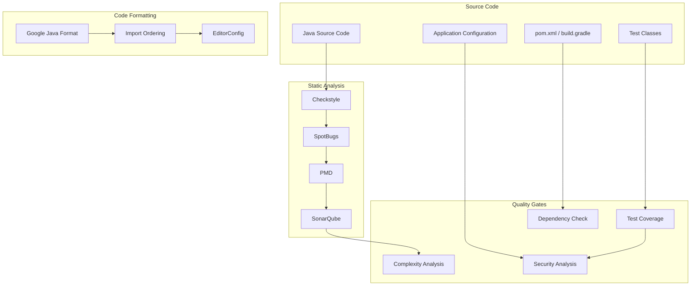

# Spring Boot Code Quality Standards

**Target Audience**: Java Developers, Spring Boot Engineers, Tech Leads  
**Last Updated**: 2025-06-10 by @parseen254

## Overview

Comprehensive code quality standards for Spring Boot applications including static analysis, code formatting, testing practices, and automated quality enforcement using SonarQube, Checkstyle, SpotBugs, and CI/CD integration.

## Spring Boot Code Quality Architecture

### Java Quality Pipeline Overview



### Current State Assessment

| Aspect | Current Status | Target Status | Priority |
|--------|----------------|---------------|----------|
| **Static Analysis** | L2 - Intermediate | L3 - Advanced | High |
| **Code Formatting** | L2 - Partial | L3 - Automated | High |
| **Test Coverage** | L3 - Advanced | L3 - Advanced | Maintain |
| **Dependency Management** | L2 - Intermediate | L3 - Advanced | High |
| **Security Analysis** | L2 - Intermediate | L3 - Advanced | High |
| **Performance Analysis** | L1 - Basic | L2 - Intermediate | Medium |

## Static Analysis Configuration

### Maven Configuration

```xml
<!-- pom.xml - Comprehensive quality plugins configuration -->
<properties>
    <maven.compiler.source>17</maven.compiler.source>
    <maven.compiler.target>17</maven.compiler.target>
    <project.build.sourceEncoding>UTF-8</project.build.sourceEncoding>
    
    <!-- Plugin versions -->
    <checkstyle.version>10.12.4</checkstyle.version>
    <spotbugs.version>4.7.3</spotbugs.version>
    <pmd.version>6.55.0</pmd.version>
    <jacoco.version>0.8.8</jacoco.version>
    <sonar.version>3.9.1.2184</sonar.version>
    
    <!-- Quality thresholds -->
    <sonar.coverage.exclusions>
        **/config/**,
        **/dto/**,
        **/entity/**,
        **/exception/**,
        **/*Application.java
    </sonar.coverage.exclusions>
    <sonar.cpd.exclusions>
        **/dto/**,
        **/entity/**
    </sonar.cpd.exclusions>
</properties>

<build>
    <plugins>
        <!-- Checkstyle Plugin -->
        <plugin>
            <groupId>org.apache.maven.plugins</groupId>
            <artifactId>maven-checkstyle-plugin</artifactId>
            <version>3.3.0</version>
            <configuration>
                <configLocation>checkstyle.xml</configLocation>
                <encoding>UTF-8</encoding>
                <consoleOutput>true</consoleOutput>
                <failsOnError>true</failsOnError>
                <linkXRef>false</linkXRef>
                <excludes>**/generated/**/*</excludes>
            </configuration>
            <dependencies>
                <dependency>
                    <groupId>com.puppycrawl.tools</groupId>
                    <artifactId>checkstyle</artifactId>
                    <version>${checkstyle.version}</version>
                </dependency>
            </dependencies>
            <executions>
                <execution>
                    <id>validate</id>
                    <phase>validate</phase>
                    <goals>
                        <goal>check</goal>
                    </goals>
                </execution>
            </executions>
        </plugin>

        <!-- SpotBugs Plugin -->
        <plugin>
            <groupId>com.github.spotbugs</groupId>
            <artifactId>spotbugs-maven-plugin</artifactId>
            <version>4.7.3.6</version>
            <configuration>
                <effort>Max</effort>
                <threshold>Low</threshold>
                <xmlOutput>true</xmlOutput>
                <excludeFilterFile>spotbugs-exclude.xml</excludeFilterFile>
                <plugins>
                    <plugin>
                        <groupId>com.h3xstream.findsecbugs</groupId>
                        <artifactId>findsecbugs-plugin</artifactId>
                        <version>1.12.0</version>
                    </plugin>
                </plugins>
            </configuration>
            <executions>
                <execution>
                    <goals>
                        <goal>check</goal>
                    </goals>
                </execution>
            </executions>
        </plugin>

        <!-- PMD Plugin -->
        <plugin>
            <groupId>org.apache.maven.plugins</groupId>
            <artifactId>maven-pmd-plugin</artifactId>
            <version>3.21.0</version>
            <configuration>
                <rulesets>
                    <ruleset>pmd-rules.xml</ruleset>
                </rulesets>
                <printFailingErrors>true</printFailingErrors>
                <excludes>
                    <exclude>**/generated/**</exclude>
                </excludes>
            </configuration>
            <executions>
                <execution>
                    <goals>
                        <goal>check</goal>
                    </goals>
                </execution>
            </executions>
        </plugin>

        <!-- JaCoCo Plugin -->
        <plugin>
            <groupId>org.jacoco</groupId>
            <artifactId>jacoco-maven-plugin</artifactId>
            <version>${jacoco.version}</version>
            <configuration>
                <excludes>
                    <exclude>**/config/**</exclude>
                    <exclude>**/dto/**</exclude>
                    <exclude>**/entity/**</exclude>
                    <exclude>**/exception/**</exclude>
                    <exclude>**/*Application.class</exclude>
                </excludes>
            </configuration>
            <executions>
                <execution>
                    <goals>
                        <goal>prepare-agent</goal>
                    </goals>
                </execution>
                <execution>
                    <id>report</id>
                    <phase>test</phase>
                    <goals>
                        <goal>report</goal>
                    </goals>
                </execution>
                <execution>
                    <id>check</id>
                    <goals>
                        <goal>check</goal>
                    </goals>
                    <configuration>
                        <rules>
                            <rule>
                                <element>BUNDLE</element>
                                <limits>
                                    <limit>
                                        <counter>LINE</counter>
                                        <value>COVEREDRATIO</value>
                                        <minimum>0.80</minimum>
                                    </limit>
                                </limits>
                            </rule>
                        </rules>
                    </configuration>
                </execution>
            </executions>
        </plugin>

        <!-- SonarQube Plugin -->
        <plugin>
            <groupId>org.sonarsource.scanner.maven</groupId>
            <artifactId>sonar-maven-plugin</artifactId>
            <version>${sonar.version}</version>
        </plugin>

        <!-- OWASP Dependency Check -->
        <plugin>
            <groupId>org.owasp</groupId>
            <artifactId>dependency-check-maven</artifactId>
            <version>8.4.2</version>
            <configuration>
                <format>ALL</format>
                <suppressionFile>dependency-check-suppressions.xml</suppressionFile>
            </configuration>
            <executions>
                <execution>
                    <goals>
                        <goal>check</goal>
                    </goals>
                </execution>
            </executions>
        </plugin>
    </plugins>
</build>
```

### Checkstyle Configuration

```xml
<!-- checkstyle.xml -->
<?xml version="1.0"?>
<!DOCTYPE module PUBLIC
    "-//Checkstyle//DTD Checkstyle Configuration 1.3//EN"
    "https://checkstyle.org/dtds/configuration_1_3.dtd">

<module name="Checker">
    <property name="charset" value="UTF-8"/>
    <property name="severity" value="error"/>
    <property name="fileExtensions" value="java, properties, xml"/>

    <!-- Suppressions -->
    <module name="SuppressionFilter">
        <property name="file" value="checkstyle-suppressions.xml"/>
        <property name="optional" value="true"/>
    </module>

    <!-- File Tab Character -->
    <module name="FileTabCharacter">
        <property name="eachLine" value="true"/>
    </module>

    <!-- File Length -->
    <module name="FileLength">
        <property name="max" value="2000"/>
    </module>

    <!-- Line Length -->
    <module name="LineLength">
        <property name="fileExtensions" value="java"/>
        <property name="max" value="120"/>
        <property name="ignorePattern" value="^package.*|^import.*|a href|href|http://|https://|ftp://"/>
    </module>

    <module name="TreeWalker">
        <!-- Naming Conventions -->
        <module name="ConstantName"/>
        <module name="LocalFinalVariableName"/>
        <module name="LocalVariableName"/>
        <module name="MemberName"/>
        <module name="MethodName"/>
        <module name="PackageName">
            <property name="format" value="^[a-z]+(\.[a-z][a-z0-9]*)*$"/>
        </module>
        <module name="ParameterName"/>
        <module name="StaticVariableName"/>
        <module name="TypeName"/>

        <!-- Imports -->
        <module name="AvoidStarImport"/>
        <module name="IllegalImport"/>
        <module name="RedundantImport"/>
        <module name="UnusedImports">
            <property name="processJavadoc" value="false"/>
        </module>
        <module name="ImportOrder">
            <property name="groups" value="/^java\./,javax,org,com"/>
            <property name="ordered" value="true"/>
            <property name="separated" value="true"/>
            <property name="option" value="bottom"/>
            <property name="sortStaticImportsAlphabetically" value="true"/>
        </module>

        <!-- Size Violations -->
        <module name="MethodLength">
            <property name="max" value="150"/>
        </module>
        <module name="ParameterNumber">
            <property name="max" value="7"/>
        </module>

        <!-- Whitespace -->
        <module name="EmptyForIteratorPad"/>
        <module name="GenericWhitespace"/>
        <module name="MethodParamPad"/>
        <module name="NoWhitespaceAfter"/>
        <module name="NoWhitespaceBefore"/>
        <module name="OperatorWrap"/>
        <module name="ParenPad"/>
        <module name="TypecastParenPad"/>
        <module name="WhitespaceAfter"/>
        <module name="WhitespaceAround"/>

        <!-- Modifier Checks -->
        <module name="ModifierOrder"/>
        <module name="RedundantModifier"/>

        <!-- Blocks -->
        <module name="AvoidNestedBlocks"/>
        <module name="EmptyBlock"/>
        <module name="LeftCurly"/>
        <module name="NeedBraces"/>
        <module name="RightCurly"/>

        <!-- Common Coding Problems -->
        <module name="EmptyStatement"/>
        <module name="EqualsHashCode"/>
        <module name="HiddenField">
            <property name="ignoreConstructorParameter" value="true"/>
            <property name="ignoreSetter" value="true"/>
        </module>
        <module name="IllegalInstantiation"/>
        <module name="InnerAssignment"/>
        <module name="MagicNumber"/>
        <module name="MissingSwitchDefault"/>
        <module name="MultipleVariableDeclarations"/>
        <module name="SimplifyBooleanExpression"/>
        <module name="SimplifyBooleanReturn"/>

        <!-- Class Design -->
        <module name="DesignForExtension"/>
        <module name="FinalClass"/>
        <module name="HideUtilityClassConstructor"/>
        <module name="InterfaceIsType"/>
        <module name="VisibilityModifier"/>

        <!-- Miscellaneous -->
        <module name="ArrayTypeStyle"/>
        <module name="FinalParameters"/>
        <module name="TodoComment"/>
        <module name="UpperEll"/>

        <!-- Spring Boot Specific Rules -->
        <module name="AnnotationUseStyle"/>
        <module name="MissingDeprecated"/>
        <module name="MissingOverride"/>
        <module name="PackageAnnotation"/>
    </module>
</module>
```

### PMD Rules Configuration

```xml
<!-- pmd-rules.xml -->
<?xml version="1.0"?>
<ruleset name="Spring Boot PMD Rules"
         xmlns="http://pmd.sourceforge.net/ruleset/2.0.0"
         xmlns:xsi="http://www.w3.org/2001/XMLSchema-instance"
         xsi:schemaLocation="http://pmd.sourceforge.net/ruleset/2.0.0 
         https://pmd.sourceforge.io/ruleset_2_0_0.xsd">

    <description>PMD rules for Spring Boot applications</description>

    <!-- Best Practices -->
    <rule ref="category/java/bestpractices.xml">
        <exclude name="JUnitTestsShouldIncludeAssert"/>
        <exclude name="GuardLogStatement"/>
    </rule>

    <!-- Code Style -->
    <rule ref="category/java/codestyle.xml">
        <exclude name="OnlyOneReturn"/>
        <exclude name="AtLeastOneConstructor"/>
        <exclude name="CallSuperInConstructor"/>
        <exclude name="CommentDefaultAccessModifier"/>
        <exclude name="DefaultPackage"/>
        <exclude name="LongVariable"/>
        <exclude name="ShortVariable"/>
        <exclude name="ShortClassName"/>
    </rule>

    <!-- Design -->
    <rule ref="category/java/design.xml">
        <exclude name="LawOfDemeter"/>
        <exclude name="DataClass"/>
    </rule>
    
    <rule ref="category/java/design.xml/CyclomaticComplexity">
        <properties>
            <property name="classReportLevel" value="80"/>
            <property name="methodReportLevel" value="10"/>
        </properties>
    </rule>

    <!-- Error Prone -->
    <rule ref="category/java/errorprone.xml">
        <exclude name="BeanMembersShouldSerialize"/>
        <exclude name="DataflowAnomalyAnalysis"/>
    </rule>

    <!-- Multithreading -->
    <rule ref="category/java/multithreading.xml"/>

    <!-- Performance -->
    <rule ref="category/java/performance.xml"/>

    <!-- Security -->
    <rule ref="category/java/security.xml"/>

    <!-- Spring Boot Specific Rules -->
    <rule name="SpringBootControllerClassNaming"
          language="java"
          message="Spring Boot controllers should end with 'Controller'"
          class="net.sourceforge.pmd.lang.rule.XPathRule">
        <description>Controllers should follow naming convention</description>
        <properties>
            <property name="xpath">
                <value>
                    //ClassOrInterfaceDeclaration[
                        .//AnnotationTypeDeclaration[@Image='Controller' or @Image='RestController']
                        and not(ends-with(@Image, 'Controller'))
                    ]
                </value>
            </property>
        </properties>
    </rule>

    <rule name="SpringBootServiceClassNaming"
          language="java"
          message="Spring Boot services should end with 'Service'"
          class="net.sourceforge.pmd.lang.rule.XPathRule">
        <description>Services should follow naming convention</description>
        <properties>
            <property name="xpath">
                <value>
                    //ClassOrInterfaceDeclaration[
                        .//AnnotationTypeDeclaration[@Image='Service']
                        and not(ends-with(@Image, 'Service'))
                    ]
                </value>
            </property>
        </properties>
    </rule>
</ruleset>
```

## Code Formatting Standards

### Google Java Format Configuration

```xml
<!-- Add to pom.xml -->
<plugin>
    <groupId>com.spotify.fmt</groupId>
    <artifactId>fmt-maven-plugin</artifactId>
    <version>2.21.1</version>
    <configuration>
        <style>google</style>
        <verbose>true</verbose>
    </configuration>
    <executions>
        <execution>
            <goals>
                <goal>format</goal>
            </goals>
        </execution>
    </executions>
</plugin>
```

### EditorConfig

```ini
# .editorconfig
root = true

[*]
charset = utf-8
end_of_line = lf
indent_style = space
indent_size = 2
insert_final_newline = true
trim_trailing_whitespace = true
max_line_length = 120

[*.java]
indent_size = 2
max_line_length = 120

[*.{xml,yml,yaml}]
indent_size = 2

[*.md]
trim_trailing_whitespace = false

[*.sql]
indent_size = 2
```

### Automated Formatting Script

```bash
#!/bin/bash
# scripts/format_code.sh - Automated Java code formatting

echo "🎨 Formatting Java code..."

# Format code using Google Java Format
mvn fmt:format

# Sort imports and organize code
echo "📦 Organizing imports..."
find src -name "*.java" -exec grep -l "^import " {} \; | while read file; do
    # Remove unused imports and organize
    java -jar google-java-format.jar --replace "$file"
done

# Verify formatting
echo "✅ Verifying code formatting..."
mvn fmt:check

if [ $? -eq 0 ]; then
    echo "✅ All files are properly formatted!"
else
    echo "❌ Some files need formatting. Run 'mvn fmt:format' to fix."
    exit 1
fi

# Run additional checks
echo "🔍 Running static analysis..."
mvn checkstyle:check spotbugs:check pmd:check

echo "🎉 Code formatting and static analysis complete!"
```

## Code Structure Standards

### Package Organization

```
src/main/java/com/company/app/
├── Application.java
├── config/
│   ├── SecurityConfig.java
│   ├── DatabaseConfig.java
│   └── CacheConfig.java
├── controller/
│   ├── AuthController.java
│   ├── UserController.java
│   └── advice/
│       └── GlobalExceptionHandler.java
├── service/
│   ├── AuthService.java
│   ├── UserService.java
│   └── impl/
│       ├── AuthServiceImpl.java
│       └── UserServiceImpl.java
├── repository/
│   ├── UserRepository.java
│   └── AuthTokenRepository.java
├── entity/
│   ├── User.java
│   ├── AuthToken.java
│   └── base/
│       └── BaseEntity.java
├── dto/
│   ├── request/
│   │   ├── LoginRequest.java
│   │   └── RegistrationRequest.java
│   └── response/
│       ├── UserResponse.java
│       └── AuthResponse.java
├── exception/
│   ├── UserNotFoundException.java
│   ├── InvalidCredentialsException.java
│   └── base/
│       └── BusinessException.java
├── util/
│   ├── ValidationUtil.java
│   ├── SecurityUtil.java
│   └── DateUtil.java
└── constant/
    ├── ApiConstants.java
    ├── ErrorMessages.java
    └── ValidationMessages.java
```

### Naming Conventions

#### Class Naming Standards

```java
// ✅ Good - Controllers
@RestController
@RequestMapping("/api/v1/users")
public class UserController {
    // Implementation
}

// ✅ Good - Services
@Service
public class UserService {
    // Implementation
}

@Component("userServiceImpl")
public class UserServiceImpl implements UserService {
    // Implementation
}

// ✅ Good - Repositories
@Repository
public interface UserRepository extends JpaRepository<User, Long> {
    // Query methods
}

// ✅ Good - Entities
@Entity
@Table(name = "users")
public class User extends BaseEntity {
    // Fields and methods
}

// ✅ Good - DTOs
public class UserRegistrationRequest {
    // Fields and validation annotations
}

public class UserResponse {
    // Response fields
}

// ✅ Good - Exceptions
public class UserNotFoundException extends BusinessException {
    public UserNotFoundException(String message) {
        super(message);
    }
}

// ✅ Good - Configurations
@Configuration
@EnableWebSecurity
public class SecurityConfig {
    // Security configuration
}

// ✅ Good - Utilities
public final class ValidationUtil {
    private ValidationUtil() {
        // Utility class
    }
    
    public static boolean isValidEmail(String email) {
        // Validation logic
    }
}
```

#### Method and Variable Naming

```java
// ✅ Good - Method naming
public class UserService {
    
    // Action-based method names
    public UserResponse createUser(UserRegistrationRequest request) {
        // Implementation
    }
    
    public UserResponse getUserById(Long userId) {
        // Implementation
    }
    
    public List<UserResponse> getAllActiveUsers() {
        // Implementation
    }
    
    public void deactivateUser(Long userId) {
        // Implementation
    }
    
    // Boolean methods with is/has/can prefix
    public boolean isUserActive(Long userId) {
        // Implementation
    }
    
    public boolean hasPermission(Long userId, String permission) {
        // Implementation
    }
    
    private boolean canUserPerformAction(User user, String action) {
        // Implementation
    }
}

// ✅ Good - Variable naming
public class UserController {
    
    // Clear, descriptive variable names
    private final UserService userService;
    private final ModelMapper modelMapper;
    private final Logger logger = LoggerFactory.getLogger(UserController.class);
    
    // Method parameters
    public ResponseEntity<UserResponse> updateUser(
            @PathVariable Long userId,
            @RequestBody @Valid UserUpdateRequest updateRequest,
            @AuthenticationPrincipal UserPrincipal currentUser) {
        
        // Local variables
        User existingUser = userService.findById(userId);
        UserResponse updatedUserResponse = userService.updateUser(existingUser, updateRequest);
        
        return ResponseEntity.ok(updatedUserResponse);
    }
}
```

#### Constants and Configuration

```java
// ✅ Good - Constants organization
public final class ApiConstants {
    
    // API versioning
    public static final String API_V1 = "/api/v1";
    public static final String API_V2 = "/api/v2";
    
    // Endpoints
    public static final String USERS_ENDPOINT = API_V1 + "/users";
    public static final String AUTH_ENDPOINT = API_V1 + "/auth";
    
    // Headers
    public static final String AUTHORIZATION_HEADER = "Authorization";
    public static final String BEARER_PREFIX = "Bearer ";
    
    // Pagination
    public static final int DEFAULT_PAGE_SIZE = 20;
    public static final int MAX_PAGE_SIZE = 100;
    
    private ApiConstants() {
        // Prevent instantiation
    }
}

public final class ValidationMessages {
    
    // User validation messages
    public static final String USER_EMAIL_REQUIRED = "Email is required";
    public static final String USER_EMAIL_INVALID = "Email format is invalid";
    public static final String USER_PASSWORD_REQUIRED = "Password is required";
    public static final String USER_PASSWORD_MIN_LENGTH = "Password must be at least 8 characters";
    
    // Common validation messages
    public static final String FIELD_REQUIRED = "This field is required";
    public static final String INVALID_FORMAT = "Invalid format";
    
    private ValidationMessages() {
        // Prevent instantiation
    }
}
```

## Spring Boot Specific Standards

### Controller Best Practices

```java
// Example of well-structured Spring Boot controller
@RestController
@RequestMapping("/api/v1/users")
@Validated
@Slf4j
public class UserController {

    private final UserService userService;
    private final ModelMapper modelMapper;

    public UserController(UserService userService, ModelMapper modelMapper) {
        this.userService = userService;
        this.modelMapper = modelMapper;
    }

    @GetMapping
    @PreAuthorize("hasRole('ADMIN') or hasRole('USER')")
    public ResponseEntity<PagedResponse<UserResponse>> getAllUsers(
            @RequestParam(defaultValue = "0") @Min(0) int page,
            @RequestParam(defaultValue = "20") @Min(1) @Max(100) int size,
            @RequestParam(defaultValue = "id") String sortBy,
            @RequestParam(defaultValue = "asc") String sortDirection) {

        log.debug("Fetching users: page={}, size={}, sortBy={}, sortDirection={}", 
                  page, size, sortBy, sortDirection);

        Pageable pageable = PageRequest.of(page, size, 
            Sort.Direction.fromString(sortDirection), sortBy);
        
        Page<User> usersPage = userService.getAllUsers(pageable);
        
        List<UserResponse> userResponses = usersPage.getContent()
            .stream()
            .map(user -> modelMapper.map(user, UserResponse.class))
            .collect(Collectors.toList());

        PagedResponse<UserResponse> response = PagedResponse.<UserResponse>builder()
            .content(userResponses)
            .page(usersPage.getNumber())
            .size(usersPage.getSize())
            .totalElements(usersPage.getTotalElements())
            .totalPages(usersPage.getTotalPages())
            .last(usersPage.isLast())
            .build();

        return ResponseEntity.ok(response);
    }

    @PostMapping
    public ResponseEntity<UserResponse> createUser(
            @RequestBody @Valid UserRegistrationRequest request,
            @AuthenticationPrincipal UserPrincipal currentUser) {

        log.info("Creating new user with email: {}", request.getEmail());

        User user = userService.createUser(request);
        UserResponse response = modelMapper.map(user, UserResponse.class);

        log.info("User created successfully with ID: {}", user.getId());

        return ResponseEntity.status(HttpStatus.CREATED)
            .header("Location", "/api/v1/users/" + user.getId())
            .body(response);
    }

    @GetMapping("/{userId}")
    public ResponseEntity<UserResponse> getUserById(
            @PathVariable @Positive Long userId) {

        log.debug("Fetching user with ID: {}", userId);

        User user = userService.getUserById(userId);
        UserResponse response = modelMapper.map(user, UserResponse.class);

        return ResponseEntity.ok(response);
    }

    @PutMapping("/{userId}")
    @PreAuthorize("hasRole('ADMIN') or @userService.isOwner(#userId, authentication.name)")
    public ResponseEntity<UserResponse> updateUser(
            @PathVariable @Positive Long userId,
            @RequestBody @Valid UserUpdateRequest request,
            @AuthenticationPrincipal UserPrincipal currentUser) {

        log.info("Updating user with ID: {}", userId);

        User updatedUser = userService.updateUser(userId, request);
        UserResponse response = modelMapper.map(updatedUser, UserResponse.class);

        log.info("User updated successfully with ID: {}", userId);

        return ResponseEntity.ok(response);
    }

    @DeleteMapping("/{userId}")
    @PreAuthorize("hasRole('ADMIN')")
    public ResponseEntity<Void> deleteUser(@PathVariable @Positive Long userId) {

        log.info("Deleting user with ID: {}", userId);

        userService.deleteUser(userId);

        log.info("User deleted successfully with ID: {}", userId);

        return ResponseEntity.noContent().build();
    }
}
```

### Service Layer Best Practices

```java
// Example of well-structured Spring Boot service
@Service
@Transactional(readOnly = true)
@Slf4j
public class UserServiceImpl implements UserService {

    private final UserRepository userRepository;
    private final PasswordEncoder passwordEncoder;
    private final EmailService emailService;
    private final ModelMapper modelMapper;

    public UserServiceImpl(
            UserRepository userRepository,
            PasswordEncoder passwordEncoder,
            EmailService emailService,
            ModelMapper modelMapper) {
        this.userRepository = userRepository;
        this.passwordEncoder = passwordEncoder;
        this.emailService = emailService;
        this.modelMapper = modelMapper;
    }

    @Override
    public Page<User> getAllUsers(Pageable pageable) {
        log.debug("Fetching all users with pagination: {}", pageable);
        return userRepository.findByActiveTrue(pageable);
    }

    @Override
    public User getUserById(Long userId) {
        log.debug("Fetching user by ID: {}", userId);
        
        return userRepository.findById(userId)
            .orElseThrow(() -> {
                log.warn("User not found with ID: {}", userId);
                return new UserNotFoundException("User not found with ID: " + userId);
            });
    }

    @Override
    @Transactional
    public User createUser(UserRegistrationRequest request) {
        log.info("Creating new user with email: {}", request.getEmail());

        validateUserRegistration(request);

        User user = User.builder()
            .email(request.getEmail().toLowerCase())
            .firstName(request.getFirstName())
            .lastName(request.getLastName())
            .password(passwordEncoder.encode(request.getPassword()))
            .role(UserRole.USER)
            .active(true)
            .emailVerified(false)
            .build();

        User savedUser = userRepository.save(user);

        // Send welcome email asynchronously
        emailService.sendWelcomeEmailAsync(savedUser);

        log.info("User created successfully with ID: {}", savedUser.getId());
        return savedUser;
    }

    @Override
    @Transactional
    public User updateUser(Long userId, UserUpdateRequest request) {
        log.info("Updating user with ID: {}", userId);

        User existingUser = getUserById(userId);

        // Update only provided fields
        if (StringUtils.hasText(request.getFirstName())) {
            existingUser.setFirstName(request.getFirstName());
        }
        
        if (StringUtils.hasText(request.getLastName())) {
            existingUser.setLastName(request.getLastName());
        }

        if (StringUtils.hasText(request.getEmail()) && 
            !request.getEmail().equals(existingUser.getEmail())) {
            validateEmailUniqueness(request.getEmail());
            existingUser.setEmail(request.getEmail().toLowerCase());
            existingUser.setEmailVerified(false);
            
            // Send email verification
            emailService.sendEmailVerificationAsync(existingUser);
        }

        User updatedUser = userRepository.save(existingUser);

        log.info("User updated successfully with ID: {}", userId);
        return updatedUser;
    }

    @Override
    @Transactional
    public void deleteUser(Long userId) {
        log.info("Deleting user with ID: {}", userId);

        User user = getUserById(userId);
        
        // Soft delete
        user.setActive(false);
        user.setDeletedAt(LocalDateTime.now());
        
        userRepository.save(user);

        log.info("User soft deleted successfully with ID: {}", userId);
    }

    @Override
    public boolean isOwner(Long userId, String username) {
        return userRepository.findById(userId)
            .map(user -> user.getEmail().equals(username))
            .orElse(false);
    }

    private void validateUserRegistration(UserRegistrationRequest request) {
        log.debug("Validating user registration for email: {}", request.getEmail());

        validateEmailUniqueness(request.getEmail());
        validatePasswordStrength(request.getPassword());
    }

    private void validateEmailUniqueness(String email) {
        if (userRepository.existsByEmailIgnoreCase(email)) {
            log.warn("Attempt to register with existing email: {}", email);
            throw new EmailAlreadyExistsException("Email already exists: " + email);
        }
    }

    private void validatePasswordStrength(String password) {
        if (password.length() < 8) {
            throw new InvalidPasswordException("Password must be at least 8 characters long");
        }
        
        if (!password.matches(".*[A-Z].*")) {
            throw new InvalidPasswordException("Password must contain at least one uppercase letter");
        }
        
        if (!password.matches(".*[a-z].*")) {
            throw new InvalidPasswordException("Password must contain at least one lowercase letter");
        }
        
        if (!password.matches(".*\\d.*")) {
            throw new InvalidPasswordException("Password must contain at least one digit");
        }
        
        if (!password.matches(".*[!@#$%^&*()_+\\-=\\[\\]{};':\"\\\\|,.<>\\/?].*")) {
            throw new InvalidPasswordException("Password must contain at least one special character");
        }
    }
}
```

### Repository Best Practices

```java
// Example of well-structured Spring Boot repository
@Repository
public interface UserRepository extends JpaRepository<User, Long>, JpaSpecificationExecutor<User> {

    // Query method naming conventions
    Page<User> findByActiveTrue(Pageable pageable);
    
    List<User> findByActiveTrueAndRole(UserRole role);
    
    Optional<User> findByEmailIgnoreCase(String email);
    
    boolean existsByEmailIgnoreCase(String email);
    
    List<User> findByCreatedAtBetween(LocalDateTime startDate, LocalDateTime endDate);

    // Custom queries with @Query annotation
    @Query("SELECT u FROM User u WHERE u.active = true AND " +
           "(LOWER(u.firstName) LIKE LOWER(CONCAT('%', :searchTerm, '%')) OR " +
           "LOWER(u.lastName) LIKE LOWER(CONCAT('%', :searchTerm, '%')) OR " +
           "LOWER(u.email) LIKE LOWER(CONCAT('%', :searchTerm, '%')))")
    Page<User> findActiveUsersBySearchTerm(@Param("searchTerm") String searchTerm, Pageable pageable);

    @Query("SELECT COUNT(u) FROM User u WHERE u.active = true AND u.role = :role")
    long countActiveUsersByRole(@Param("role") UserRole role);

    // Native queries for complex operations
    @Query(value = "SELECT u.* FROM users u " +
                   "WHERE u.created_at >= DATE_SUB(NOW(), INTERVAL :days DAY) " +
                   "AND u.active = true", nativeQuery = true)
    List<User> findRecentActiveUsers(@Param("days") int days);

    // Modifying queries
    @Modifying
    @Query("UPDATE User u SET u.lastLoginAt = :loginTime WHERE u.id = :userId")
    void updateLastLoginTime(@Param("userId") Long userId, @Param("loginTime") LocalDateTime loginTime);

    @Modifying
    @Query("UPDATE User u SET u.active = false WHERE u.lastLoginAt < :cutoffDate")
    int deactivateInactiveUsers(@Param("cutoffDate") LocalDateTime cutoffDate);

    // Specification methods for dynamic queries
    default Page<User> findUsersByCriteria(UserSearchCriteria criteria, Pageable pageable) {
        return findAll(UserSpecifications.withCriteria(criteria), pageable);
    }
}

// Specifications for complex queries
public class UserSpecifications {
    
    public static Specification<User> withCriteria(UserSearchCriteria criteria) {
        return Specification.where(isActive())
                .and(hasRole(criteria.getRole()))
                .and(hasEmailLike(criteria.getEmailPattern()))
                .and(createdBetween(criteria.getStartDate(), criteria.getEndDate()));
    }
    
    public static Specification<User> isActive() {
        return (root, query, criteriaBuilder) -> 
            criteriaBuilder.isTrue(root.get("active"));
    }
    
    public static Specification<User> hasRole(UserRole role) {
        return (root, query, criteriaBuilder) -> {
            if (role == null) {
                return criteriaBuilder.conjunction();
            }
            return criteriaBuilder.equal(root.get("role"), role);
        };
    }
    
    public static Specification<User> hasEmailLike(String pattern) {
        return (root, query, criteriaBuilder) -> {
            if (!StringUtils.hasText(pattern)) {
                return criteriaBuilder.conjunction();
            }
            return criteriaBuilder.like(
                criteriaBuilder.lower(root.get("email")),
                "%" + pattern.toLowerCase() + "%"
            );
        };
    }
    
    public static Specification<User> createdBetween(LocalDateTime start, LocalDateTime end) {
        return (root, query, criteriaBuilder) -> {
            if (start == null && end == null) {
                return criteriaBuilder.conjunction();
            }
            if (start == null) {
                return criteriaBuilder.lessThanOrEqualTo(root.get("createdAt"), end);
            }
            if (end == null) {
                return criteriaBuilder.greaterThanOrEqualTo(root.get("createdAt"), start);
            }
            return criteriaBuilder.between(root.get("createdAt"), start, end);
        };
    }
}
```

## Testing Standards

### Unit Test Best Practices

```java
// Example of comprehensive unit test
@ExtendWith(MockitoExtension.class)
class UserServiceImplTest {

    @Mock
    private UserRepository userRepository;

    @Mock
    private PasswordEncoder passwordEncoder;

    @Mock
    private EmailService emailService;

    @Mock
    private ModelMapper modelMapper;

    @InjectMocks
    private UserServiceImpl userService;

    @Nested
    @DisplayName("getUserById")
    class GetUserById {

        @Test
        @DisplayName("Should return user when user exists")
        void shouldReturnUserWhenUserExists() {
            // Arrange
            Long userId = 1L;
            User expectedUser = createTestUser(userId, "test@example.com");
            
            when(userRepository.findById(userId)).thenReturn(Optional.of(expectedUser));

            // Act
            User actualUser = userService.getUserById(userId);

            // Assert
            assertThat(actualUser).isNotNull();
            assertThat(actualUser.getId()).isEqualTo(userId);
            assertThat(actualUser.getEmail()).isEqualTo("test@example.com");
            
            verify(userRepository).findById(userId);
            verifyNoMoreInteractions(userRepository);
        }

        @Test
        @DisplayName("Should throw UserNotFoundException when user does not exist")
        void shouldThrowUserNotFoundExceptionWhenUserDoesNotExist() {
            // Arrange
            Long userId = 999L;
            
            when(userRepository.findById(userId)).thenReturn(Optional.empty());

            // Act & Assert
            assertThatThrownBy(() -> userService.getUserById(userId))
                .isInstanceOf(UserNotFoundException.class)
                .hasMessage("User not found with ID: " + userId);
            
            verify(userRepository).findById(userId);
            verifyNoMoreInteractions(userRepository);
        }
    }

    @Nested
    @DisplayName("createUser")
    class CreateUser {

        @Test
        @DisplayName("Should create user successfully when valid request provided")
        void shouldCreateUserSuccessfullyWhenValidRequestProvided() {
            // Arrange
            UserRegistrationRequest request = UserRegistrationRequest.builder()
                .email("newuser@example.com")
                .firstName("John")
                .lastName("Doe")
                .password("SecurePassword123!")
                .build();

            String encodedPassword = "encodedPassword";
            User expectedUser = createTestUser(1L, request.getEmail());

            when(userRepository.existsByEmailIgnoreCase(request.getEmail())).thenReturn(false);
            when(passwordEncoder.encode(request.getPassword())).thenReturn(encodedPassword);
            when(userRepository.save(any(User.class))).thenReturn(expectedUser);

            // Act
            User actualUser = userService.createUser(request);

            // Assert
            assertThat(actualUser).isNotNull();
            assertThat(actualUser.getEmail()).isEqualTo(request.getEmail());
            assertThat(actualUser.getFirstName()).isEqualTo(request.getFirstName());
            assertThat(actualUser.getLastName()).isEqualTo(request.getLastName());

            verify(userRepository).existsByEmailIgnoreCase(request.getEmail());
            verify(passwordEncoder).encode(request.getPassword());
            verify(userRepository).save(argThat(user -> 
                user.getEmail().equals(request.getEmail()) &&
                user.getPassword().equals(encodedPassword) &&
                user.isActive() &&
                !user.isEmailVerified()
            ));
            verify(emailService).sendWelcomeEmailAsync(expectedUser);
        }

        @Test
        @DisplayName("Should throw EmailAlreadyExistsException when email already exists")
        void shouldThrowEmailAlreadyExistsExceptionWhenEmailExists() {
            // Arrange
            UserRegistrationRequest request = UserRegistrationRequest.builder()
                .email("existing@example.com")
                .firstName("John")
                .lastName("Doe")
                .password("SecurePassword123!")
                .build();

            when(userRepository.existsByEmailIgnoreCase(request.getEmail())).thenReturn(true);

            // Act & Assert
            assertThatThrownBy(() -> userService.createUser(request))
                .isInstanceOf(EmailAlreadyExistsException.class)
                .hasMessage("Email already exists: " + request.getEmail());

            verify(userRepository).existsByEmailIgnoreCase(request.getEmail());
            verifyNoMoreInteractions(userRepository, passwordEncoder, emailService);
        }

        @ParameterizedTest
        @DisplayName("Should throw InvalidPasswordException for weak passwords")
        @ValueSource(strings = {
            "short",           // Too short
            "nouppercase123!", // No uppercase
            "NOLOWERCASE123!", // No lowercase
            "NoNumbers!",      // No numbers
            "NoSpecialChars123" // No special characters
        })
        void shouldThrowInvalidPasswordExceptionForWeakPasswords(String weakPassword) {
            // Arrange
            UserRegistrationRequest request = UserRegistrationRequest.builder()
                .email("test@example.com")
                .firstName("John")
                .lastName("Doe")
                .password(weakPassword)
                .build();

            when(userRepository.existsByEmailIgnoreCase(request.getEmail())).thenReturn(false);

            // Act & Assert
            assertThatThrownBy(() -> userService.createUser(request))
                .isInstanceOf(InvalidPasswordException.class);

            verify(userRepository).existsByEmailIgnoreCase(request.getEmail());
            verifyNoMoreInteractions(passwordEncoder, emailService);
        }
    }

    private User createTestUser(Long id, String email) {
        return User.builder()
            .id(id)
            .email(email)
            .firstName("Test")
            .lastName("User")
            .password("encodedPassword")
            .role(UserRole.USER)
            .active(true)
            .emailVerified(true)
            .createdAt(LocalDateTime.now())
            .build();
    }
}
```

### Integration Test Best Practices

```java
// Example of comprehensive integration test
@SpringBootTest(webEnvironment = SpringBootTest.WebEnvironment.RANDOM_PORT)
@Testcontainers
@Transactional
class UserControllerIntegrationTest {

    @Container
    static PostgreSQLContainer<?> postgres = new PostgreSQLContainer<>("postgres:15")
        .withDatabaseName("testdb")
        .withUsername("testuser")
        .withPassword("testpass");

    @Autowired
    private TestRestTemplate restTemplate;

    @Autowired
    private UserRepository userRepository;

    @Autowired
    private PasswordEncoder passwordEncoder;

    @DynamicPropertySource
    static void configureProperties(DynamicPropertyRegistry registry) {
        registry.add("spring.datasource.url", postgres::getJdbcUrl);
        registry.add("spring.datasource.username", postgres::getUsername);
        registry.add("spring.datasource.password", postgres::getPassword);
    }

    @Test
    @DisplayName("Should create user successfully with valid request")
    void shouldCreateUserSuccessfullyWithValidRequest() {
        // Arrange
        UserRegistrationRequest request = UserRegistrationRequest.builder()
            .email("newuser@example.com")
            .firstName("John")
            .lastName("Doe")
            .password("SecurePassword123!")
            .build();

        HttpHeaders headers = new HttpHeaders();
        headers.setContentType(MediaType.APPLICATION_JSON);
        HttpEntity<UserRegistrationRequest> entity = new HttpEntity<>(request, headers);

        // Act
        ResponseEntity<UserResponse> response = restTemplate.postForEntity(
            "/api/v1/users", entity, UserResponse.class);

        // Assert
        assertThat(response.getStatusCode()).isEqualTo(HttpStatus.CREATED);
        assertThat(response.getBody()).isNotNull();
        assertThat(response.getBody().getEmail()).isEqualTo(request.getEmail());
        assertThat(response.getBody().getFirstName()).isEqualTo(request.getFirstName());
        assertThat(response.getBody().getLastName()).isEqualTo(request.getLastName());

        // Verify database state
        Optional<User> savedUser = userRepository.findByEmailIgnoreCase(request.getEmail());
        assertThat(savedUser).isPresent();
        assertThat(savedUser.get().isActive()).isTrue();
        assertThat(savedUser.get().isEmailVerified()).isFalse();
    }

    @Test
    @DisplayName("Should return validation errors for invalid request")
    void shouldReturnValidationErrorsForInvalidRequest() {
        // Arrange
        UserRegistrationRequest request = UserRegistrationRequest.builder()
            .email("invalid-email")
            .firstName("")
            .lastName("")
            .password("123")
            .build();

        HttpHeaders headers = new HttpHeaders();
        headers.setContentType(MediaType.APPLICATION_JSON);
        HttpEntity<UserRegistrationRequest> entity = new HttpEntity<>(request, headers);

        // Act
        ResponseEntity<ErrorResponse> response = restTemplate.postForEntity(
            "/api/v1/users", entity, ErrorResponse.class);

        // Assert
        assertThat(response.getStatusCode()).isEqualTo(HttpStatus.BAD_REQUEST);
        assertThat(response.getBody()).isNotNull();
        assertThat(response.getBody().getErrors()).hasSize(4); // email, firstName, lastName, password
    }

    @Test
    @DisplayName("Should retrieve user by ID successfully")
    void shouldRetrieveUserByIdSuccessfully() {
        // Arrange
        User savedUser = createAndSaveTestUser("existing@example.com");

        // Act
        ResponseEntity<UserResponse> response = restTemplate.getForEntity(
            "/api/v1/users/" + savedUser.getId(), UserResponse.class);

        // Assert
        assertThat(response.getStatusCode()).isEqualTo(HttpStatus.OK);
        assertThat(response.getBody()).isNotNull();
        assertThat(response.getBody().getId()).isEqualTo(savedUser.getId());
        assertThat(response.getBody().getEmail()).isEqualTo(savedUser.getEmail());
    }

    @Test
    @DisplayName("Should return 404 when user not found")
    void shouldReturn404WhenUserNotFound() {
        // Act
        ResponseEntity<ErrorResponse> response = restTemplate.getForEntity(
            "/api/v1/users/999", ErrorResponse.class);

        // Assert
        assertThat(response.getStatusCode()).isEqualTo(HttpStatus.NOT_FOUND);
        assertThat(response.getBody()).isNotNull();
        assertThat(response.getBody().getMessage()).contains("User not found");
    }

    private User createAndSaveTestUser(String email) {
        User user = User.builder()
            .email(email)
            .firstName("Test")
            .lastName("User")
            .password(passwordEncoder.encode("password123"))
            .role(UserRole.USER)
            .active(true)
            .emailVerified(true)
            .build();
        
        return userRepository.save(user);
    }
}
```

## Quality Metrics and Enforcement

### SonarQube Quality Gates

```yaml
# sonar-project.properties
sonar.projectKey=spring-boot-app
sonar.projectName=Spring Boot Application
sonar.projectVersion=1.0.0

# Source and test directories
sonar.sources=src/main/java
sonar.tests=src/test/java
sonar.java.binaries=target/classes
sonar.java.test.binaries=target/test-classes

# Coverage and test reports
sonar.coverage.jacoco.xmlReportPaths=target/site/jacoco/jacoco.xml
sonar.junit.reportPaths=target/surefire-reports

# Quality gate conditions
sonar.qualitygate.wait=true

# Exclusions
sonar.coverage.exclusions=**/config/**,**/dto/**,**/entity/**,**/exception/**,**/*Application.java
sonar.cpd.exclusions=**/dto/**,**/entity/**
sonar.test.exclusions=**/target/**

# Quality profiles
sonar.profile=Spring Boot Quality Profile
```

### Quality Metrics Dashboard

| Metric | Target | Current | Trend | Action Required |
|--------|--------|---------|-------|-----------------|
| **Test Coverage** | >80% | 78% | ⬇️ | Add service layer tests |
| **Code Duplication** | <3% | 5.1% | ➡️ | Refactor common utilities |
| **Technical Debt** | <5% | 8.2% | ⬇️ | Address code smells |
| **Maintainability Rating** | A | B | ⬇️ | Reduce complexity |
| **Reliability Rating** | A | A | ✅ | Maintain current level |
| **Security Rating** | A | B | ⬇️ | Fix security hotspots |

## Getting Started

### For New Spring Boot Projects

1. **Set up Quality Plugins**
   ```bash
   # Copy Maven configuration
   cp templates/spring-boot/pom-quality.xml pom.xml
   
   # Copy quality configuration files
   cp templates/spring-boot/checkstyle.xml .
   cp templates/spring-boot/pmd-rules.xml .
   cp templates/spring-boot/spotbugs-exclude.xml .
   ```

2. **Configure Code Formatting**
   ```bash
   # Set up Google Java Format
   mvn com.spotify.fmt:fmt-maven-plugin:format
   
   # Copy EditorConfig
   cp templates/spring-boot/.editorconfig .
   ```

3. **Run Quality Checks**
   ```bash
   # Run all quality checks
   mvn clean verify
   
   # Generate SonarQube report
   mvn sonar:sonar
   ```

### For Existing Spring Boot Projects

1. **Assess Current Quality**
   ```bash
   # Run basic analysis
   mvn checkstyle:check spotbugs:check pmd:check
   
   # Generate coverage report
   mvn test jacoco:report
   ```

2. **Implement Gradual Improvements**
   - Start with automated formatting
   - Fix critical security and reliability issues
   - Add missing test coverage
   - Reduce code complexity

3. **Monitor Progress**
   - Set up SonarQube integration
   - Configure quality gates in CI/CD
   - Regular quality reviews

## Support and Resources

### Spring Boot-Specific Resources
- **[Spring Boot Code Quality Guide](../../resources/spring-boot/code-quality-best-practices.md)** - Comprehensive quality practices
- **[Java Static Analysis Deep Dive](../../resources/java/static-analysis-guide.md)** - Advanced analysis techniques
- **[Spring Boot Testing Guide](../../resources/testing/spring-boot-testing-advanced.md)** - Testing strategies and patterns

### Communication Channels
- **Slack Communities**:
  - `#spring-boot-quality` - Spring Boot-specific quality discussions
  - `#java-static-analysis` - Static analysis and code quality tools
  - `#sonarqube-help` - SonarQube configuration and best practices
- **Office Hours**: Tuesdays 3-4 PM UTC with Java Quality Engineering Team
- **Code Review Sessions**: Weekly Spring Boot code review and quality improvement sessions

### External Resources
- [Google Java Style Guide](https://google.github.io/styleguide/javaguide.html)
- [Spring Boot Best Practices](https://docs.spring.io/spring-boot/docs/current/reference/html/using.html#using.best-practices)
- [SonarQube Java Rules](https://rules.sonarsource.com/java)
- [OWASP Java Security Guide](https://owasp.org/www-project-top-ten/)

---

**Next Steps:**
1. Set up static analysis tools and quality gates for your Spring Boot project
2. Implement automated code formatting and style checking
3. Add comprehensive test coverage with proper assertions
4. Configure SonarQube integration and quality monitoring
5. Join the Spring Boot code quality community for ongoing improvement

**Questions or Feedback?** Contact @parseen254 or post in #spring-boot-quality
