# Standups & Communication Practices Overview

**Target Audience**: All Team Members, Managers, Remote Workers  
**Last Updated**: 2025-06-10 07:14:00 UTC by @parseen254

## Overview

Effective communication standards and meeting practices to ensure transparency, collaboration, and information flow across distributed teams and technology stacks.

## Quick Navigation

### By Communication Type
- [🌅 Daily Standups](daily-standups.md) - Structure, format, and best practices
- [📞 Team Meetings](team-meetings.md) - Sprint planning, retrospectives, reviews
- [💬 Asynchronous Communication](async-communication.md) - Teams, email, documentation
- [🚨 Incident Communication](incident-communication.md) - Crisis communication protocols
- [📊 Status Reporting](status-reporting.md) - Progress updates and metrics sharing

### By Meeting Type
- [🏃‍♂️ Sprint Ceremonies](meetings/sprint-ceremonies.md) - Scrum events and facilitation
- [🔄 Cross-Team Sync](meetings/cross-team-sync.md) - Inter-team coordination meetings
- [🎯 Architecture Reviews](meetings/architecture-reviews.md) - Technical decision forums
- [📈 Progress Reviews](meetings/progress-reviews.md) - Stakeholder update meetings
- [🤝 One-on-Ones](meetings/one-on-ones.md) - Manager-team member discussions

### By Communication Channel
- [👥 Microsoft Teams](channels/teams.md) - Chat, calls, file sharing best practices
- [📧 Email Communication](channels/email.md) - Professional email standards
- [📝 Documentation](channels/documentation.md) - Written communication standards
- [🎥 Video Meetings](channels/video-meetings.md) - Virtual meeting effectiveness

### By Team Structure
- [🏠 Remote Work Communication](structures/remote-work.md) - Distributed team practices
- [🏢 Hybrid Team Communication](structures/hybrid-teams.md) - Mixed in-person/remote
- [🌍 Cross-Timezone Coordination](structures/cross-timezone.md) - Global team management

## Communication Philosophy

### Communication Framework

```mermaid
graph TB
    subgraph "Communication Channels"
        SYNC["`🔄 Synchronous
        • Daily standups
        • Sprint ceremonies
        • Problem-solving sessions
        • Decision meetings`"]
        
        ASYNC["`📝 Asynchronous
        • Teams messages
        • Email updates
        • Documentation
        • Status reports`"]
        
        FORMAL["`📋 Formal
        • Project reports
        • Architecture decisions
        • Policy announcements
        • Performance reviews`"]
        
        INFORMAL["`💬 Informal
        • Casual conversations
        • Social interactions
        • Mentoring discussions
        • Water cooler chat`"]
    end
    
    subgraph "Communication Outcomes"
        CLARITY[Information Clarity]
        ALIGNMENT[Team Alignment]
        DECISIONS[Quick Decisions]
        CULTURE[Team Culture]
    end
    
    SYNC --> DECISIONS
    ASYNC --> CLARITY
    FORMAL --> ALIGNMENT
    INFORMAL --> CULTURE
```



### Core Communication Principles

1. **Transparency by Default**: Share information openly unless there's a specific reason not to
2. **Concise and Clear**: Respect others' time with focused, well-structured communication
3. **Choose Right Channel**: Use appropriate communication method for the message type
4. **Inclusive Communication**: Ensure all relevant stakeholders are included and informed
5. **Active Listening**: Focus on understanding, not just responding
6. **Follow Up**: Ensure important communications result in clear actions and outcomes

## Current State Assessment

### Communication Challenges
- **Meeting Overload**: Average 15+ hours of meetings per week per person
- **Information Silos**: Important information not reaching all relevant teams
- **Timezone Coordination**: Difficult scheduling across EAT, remote workers, and vendors
- **Message Overflow**: High volume of Teams messages making important updates hard to find
- **Inconsistent Updates**: Project status communication varies significantly between teams

### Success Areas
- **Strong Team Relationships**: Good rapport within individual teams
- **Active Teams Usage**: High adoption of Microsoft Teams for daily communication
- **Regular Standups**: Most teams have established daily standup routines
- **Responsive Culture**: Team members generally quick to respond to messages

## Daily Standup Standards

### Standard Standup Format

#### Time and Duration
- **Time**: 8:00 AM EAT (Daily)
- **Duration**: 15 minutes maximum
- **Attendance**: All team members, optional for stakeholders

#### Three-Question Format
```markdown
# Daily Standup Template

## What did you accomplish yesterday?
- Specific completed tasks with outcomes
- Any blockers that were resolved
- Key learnings or discoveries

## What will you work on today?
- Planned tasks with clear objectives
- Expected outcomes and deliverables
- Any potential challenges anticipated

## Do you have any blockers or need help?
- Specific obstacles preventing progress
- Resources or assistance needed
- Dependencies on other team members
```

#### Enhanced Standup Format (for complex projects)
```markdown
# Enhanced Daily Standup Template

## Progress Update
- **Yesterday's Achievements**: What was completed
- **Today's Focus**: Priority tasks and objectives
- **Tomorrow's Preview**: What's planned next

## Team Coordination
- **Collaboration Needs**: Help requests or offers
- **Dependencies**: Waiting for or providing to others
- **Knowledge Sharing**: Important discoveries or learnings

## Health Check
- **Blockers**: What's preventing progress
- **Risks**: Potential upcoming challenges
- **Celebrations**: Wins and positive outcomes
```

### Standup Best Practices

#### DO's
- **Start and end on time** - Respect everyone's schedule
- **Focus on work, not workers** - Discuss tasks, not personal performance
- **Make it interactive** - Encourage questions and collaboration
- **Use visual aids** - Show progress on boards or screens
- **Follow up offline** - Take detailed discussions outside the standup
- **Rotate facilitation** - Share meeting leadership

#### DON'Ts
- **Turn it into problem-solving** - Keep detailed discussions for separate meetings
- **Allow side conversations** - Maintain focus and respect
- **Skip standup lightly** - Consistent participation builds team rhythm
- **Make it a status report** - Focus on coordination, not reporting
- **Dominate speaking time** - Ensure everyone gets heard

### Remote Standup Adaptations

#### Tools and Setup
- **Primary Tool**: Microsoft Teams with video enabled
- **Backup Tool**: Phone conference for connectivity issues
- **Screen Sharing**: Project board or current work display
- **Recording**: Available for team members who miss the meeting

#### Timezone Considerations
```markdown
# Multi-Timezone Standup Strategy

## Primary Standup (8:00 AM EAT)
- Core team members in EAT timezone
- Remote team members (when feasible)
- Recorded for asynchronous review

## Async Updates (for remote team members)
- Written updates in designated Teams channel
- Video updates for complex topics
- 24-hour response expectation for questions

## Weekly Alignment (for distributed teams)
- 60-minute session accommodating all timezones
- Deeper discussion of weekly priorities
- Cross-timezone collaboration planning
```

## Meeting Standards

### Meeting Types and Guidelines

| Meeting Type | Duration | Frequency | Required Attendees | Decision Authority |
|--------------|----------|-----------|-------------------|-------------------|
| **Daily Standup** | 15 min | Daily | Team members | None (coordination only) |
| **Sprint Planning** | 2 hours | Bi-weekly | Team + PO | Team commits |
| **Sprint Review** | 1 hour | Bi-weekly | Team + Stakeholders | PO accepts/rejects |
| **Retrospective** | 1 hour | Bi-weekly | Team only | Team decides improvements |
| **Architecture Review** | 1-2 hours | As needed | Tech leads + Architects | Architecture team |

### Meeting Quality Standards

#### Pre-Meeting Preparation
```markdown
# Meeting Preparation Checklist

## For Meeting Organizer
- [ ] Clear agenda shared 24 hours in advance
- [ ] Relevant materials provided to attendees
- [ ] Meeting room/Teams link confirmed
- [ ] Expected outcomes and decisions identified
- [ ] Time allocation planned for each agenda item

## For Attendees
- [ ] Agenda reviewed and questions prepared
- [ ] Required materials read/reviewed
- [ ] Technology tested (for remote attendees)
- [ ] Conflicting meetings handled or delegated
- [ ] Action items from previous meetings reviewed
```

#### Meeting Facilitation Guidelines
```markdown
# Effective Meeting Facilitation

## Opening (5 minutes)
- Start on time, brief social connection
- Review agenda and objectives
- Confirm timekeeper and note-taker
- Set expectations for participation

## Discussion (Main portion)
- Keep discussions focused on agenda items
- Ensure all voices are heard
- Manage dominant speakers diplomatically
- Capture decisions and action items visibly

## Closing (5 minutes)
- Summarize key decisions made
- Review action items and ownership
- Confirm next steps and follow-up meetings
- End on time or schedule continuation
```

## Asynchronous Communication

### Teams Channel Strategy

#### Channel Organization
```markdown
# Anvil Shield Group Tech - Channel Structure

## General Channels
- **General**: Company-wide announcements and discussions
- **Random**: Informal chat and social interactions
- **Help Desk**: Technical support and quick questions

## Project Channels
- **Project-[Name]**: Specific project discussions
- **Sprint-Updates**: Sprint progress and blockers
- **Deployments**: Release coordination and status

## Technical Channels
- **Architecture**: Design decisions and technical discussions
- **Code-Reviews**: Code review requests and discussions
- **DevOps**: Infrastructure and deployment discussions
- **Security**: Security-related discussions and alerts

## Management Channels
- **Leadership**: Management team discussions
- **All-Hands**: Company meeting preparations and follow-ups
- **Announcements**: Important company/team announcements
```

#### Message Quality Standards
```markdown
# Effective Teams Messaging

## Message Structure
**Topic**: Clear subject line (for threaded discussions)
**Context**: Brief background for new joiners
**Content**: Main message with clear ask or information
**Action**: Specific next steps or questions
**Timeline**: When response is needed (if urgent)

## Good Example:
📋 **Sprint Planning Update**
Context: We're finalizing sprint 24 planning
Content: API authentication tasks are ready for estimation
Action: @dev-team please review and provide story points
Timeline: Need estimates by EOD today for tomorrow's planning

## Poor Example:
"Hey, can someone look at this?" ❌ (too vague, no context)
```

### Email Communication Standards

#### When to Use Email vs Teams
| Use Email For | Use Teams For |
|---------------|---------------|
| External stakeholders | Team coordination |
| Formal documentation | Quick questions |
| Sensitive information | Project discussions |
| Long-form updates | Real-time collaboration |
| Meeting summaries | Informal communication |

#### Professional Email Template
```markdown
Subject: [Action Required/FYI] Clear, specific subject line

Hello [Name/Team],

**Purpose**: Brief statement of why you're writing

**Background**: Relevant context (2-3 sentences max)

**Request/Information**: 
- Specific action items or information
- Clear deliverables and timelines
- Any supporting details

**Next Steps**:
- What happens next
- Who does what by when
- How to follow up

Best regards,
[Your name]
[Your title]
[Contact information]
```

## Crisis and Incident Communication

### Incident Communication Protocol

#### Severity Levels and Communication Requirements

| Severity | Response Time | Communication Channels | Stakeholder Notification |
|----------|---------------|------------------------|-------------------------|
| **Critical** | Immediate | Teams, Email, Phone | All stakeholders within 15 min |
| **High** | 30 minutes | Teams, Email | Affected stakeholders within 1 hour |
| **Medium** | 2 hours | Teams | Team leads within 4 hours |
| **Low** | Next business day | Teams | Weekly summary |

#### Incident Communication Template
```markdown
# Incident Notification: [Brief Description]

## Current Status: [INVESTIGATING/IDENTIFIED/MONITORING/RESOLVED]

**Incident ID**: INC-2025-001
**Severity**: Critical/High/Medium/Low
**Start Time**: 2025-06-10 07:14:00 UTC
**Impact**: Brief description of user/business impact

## Current Situation
- What is happening
- What systems are affected
- How many users are impacted

## Response Actions
- What has been done so far
- Current response team members
- Next steps planned

## Communication Plan
- Update frequency (every 30 min for critical)
- Communication channels
- Stakeholder notification status

**Next Update**: [Specific time]
**Incident Commander**: @username
**Communications Lead**: @username
```

## Success Metrics

### Communication Effectiveness Metrics

| Metric | Current | 3-Month Target | 6-Month Target |
|--------|---------|----------------|----------------|
| **Meeting Satisfaction Score** | 3.2/5 | 4.0/5 | 4.5/5 |
| **Average Meetings per Week** | 15.2 hours | 12 hours | 10 hours |
| **Response Time to Messages** | 4.2 hours | 2 hours | 1 hour |
| **Information Clarity Score** | 3.5/5 | 4.2/5 | 4.7/5 |

### Team Coordination Metrics

| Metric | Current | Target | Impact |
|--------|---------|--------|--------|
| **Cross-Team Alignment Score** | 3.1/5 | 4.5/5 | Better coordination |
| **Decision Making Speed** | 2.3 days | 1 day | Faster progress |
| **Communication Overhead** | 25% of time | 15% of time | More focus time |
| **Remote Worker Inclusion** | 3.4/5 | 4.8/5 | Better engagement |

## Getting Started

### For Team Members
1. **Adopt standardized standup format** for your team meetings
2. **Use Teams channels effectively** following our organization guidelines
3. **Practice active listening** and concise communication
4. **Provide meeting feedback** to help improve team communication
5. **Join communication training** sessions and workshops

### For Team Leads
1. **Implement meeting quality standards** using our facilitation guidelines
2. **Organize team communication channels** following best practices
3. **Model effective communication** behaviors for your team
4. **Collect and act on communication feedback** from team members
5. **Coordinate with other leads** on cross-team communication

### For Remote Workers
1. **Set up effective home office communication** tools and environment
2. **Actively participate in async communication** to stay connected
3. **Communicate timezone and availability** clearly to team members
4. **Use video effectively** to maintain human connection
5. **Establish regular check-ins** with managers and teammates

## Support & Community

### Training & Resources
- **[Communication Skills Workshop](../../resources/training/communication/)** - Effective workplace communication
- **[Remote Work Best Practices](../../resources/tutorials/remote-work/)** - Distributed team communication
- **[Meeting Facilitation Training](../../resources/best-practices/meeting-facilitation.md)** - Leading effective meetings
- **[Conflict Resolution Guide](../../resources/conflict-resolution/overview.md)** - Handling communication challenges

### Communication Channels
- **Teams Channels**:
  - `Anvil Shield Group Tech` - General team communication
  - `#communication-feedback` - Suggestions for improving team communication
  - `#meeting-coordination` - Cross-team meeting scheduling
  - `#remote-work-support` - Support for distributed team members
- **Office Hours**: Fridays 9-10 AM EAT with Communication and Culture Team
- **Communication Reviews**: Monthly team communication effectiveness reviews

---

**Next Steps:**
1. Choose your specific communication context from navigation above
2. Start implementing standardized standup and meeting practices
3. Organize your Teams channels following our guidelines
4. Practice active and inclusive communication techniques
5. Share feedback on communication effectiveness

**Questions or Feedback?** Contact @parseen254 or post in `Anvil Shield Group Tech` channel