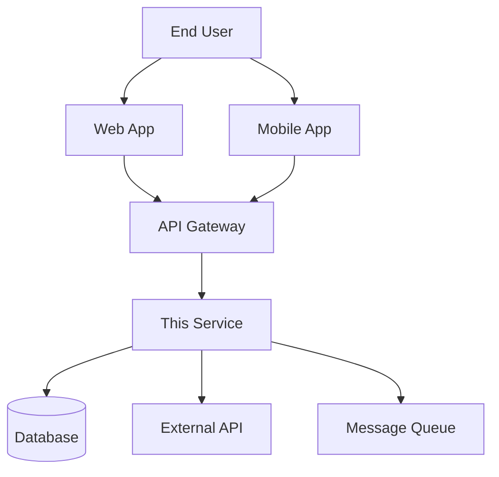

# Documentation Standards for Developers

**Target Audience**: Software Engineers, Technical Leads  
**Last Updated**: 2025-06-10 06:45:45 UTC by @parseen254

## Repository Documentation

### README Template

Every repository must have a comprehensive README following this structure:

```markdown
# Project Name

One-line description of what this service/application does.

## Overview

### What it does
- Primary functionality
- Role in the overall system
- Key business value

### Key features
- Feature 1: Brief description
- Feature 2: Brief description
- Feature 3: Brief description

## Quick Start

### Prerequisites
- Runtime version (Node.js 18+, .NET 8+, Java 17+)
- Database requirements
- External dependencies

### Local Development Setup
```bash
# 1. Clone and navigate
git clone <repository-url>
cd <project-name>

# 2. Install dependencies
npm install          # Node.js
dotnet restore       # .NET
./mvnw install       # Java/Maven

# 3. Environment configuration
cp .env.example .env
# Edit .env with your local values

# 4. Start dependencies (if using Docker)
docker-compose up -d postgres redis

# 5. Run database migrations
npm run db:migrate   # or equivalent

# 6. Start the application
npm run dev          # Node.js
dotnet run           # .NET
./mvnw spring-boot:run # Java
```

### Verification
After setup, verify everything works:
- Application: http://localhost:3000
- Health check: http://localhost:3000/health
- API documentation: http://localhost:3000/swagger
- Admin interface: http://localhost:3000/admin (if applicable)

## Architecture

### System Context


### Components
- **Controllers/Handlers**: Request handling and input validation
- **Services**: Business logic implementation
- **Repositories**: Data access and persistence
- **Models/DTOs**: Data structures and transfer objects
- **Middleware**: Cross-cutting concerns (auth, logging, etc.)

### Key Design Decisions
Document important architectural decisions:
- Why this framework was chosen
- Database design rationale
- External dependencies and alternatives considered
- Performance considerations

## API Documentation

### Required Elements
1. **Authentication**: How to authenticate requests
2. **Base URL**: Where the API is hosted
3. **Rate Limiting**: Request limits and headers
4. **Error Handling**: Standard error response format
5. **Versioning**: How API versions are managed

### OpenAPI/Swagger Documentation
- Must be generated from code annotations
- Include request/response examples
- Document all error codes
- Provide interactive testing interface

## Code Documentation

### When to Document
**Always document:**
- Public APIs and interfaces
- Complex business logic
- Non-obvious algorithmic decisions
- Integration points with external systems
- Configuration and environment setup

**Don't document:**
- Obvious code (getters, setters)
- Implementation details that change frequently
- Temporary workarounds (use TODO comments instead)

### Documentation Patterns by Language

#### TypeScript/JavaScript
```typescript
/**
 * Calculates the total price for a shopping cart including taxes and discounts
 * 
 * @param items - Array of cart items with quantities and prices
 * @param customerTier - Customer loyalty tier affecting discount rates
 * @param shippingAddress - Used for tax calculation based on jurisdiction
 * @returns Detailed price breakdown including subtotal, taxes, and final total
 * 
 * @throws {ValidationError} When cart is empty or items have invalid data
 * @throws {TaxServiceError} When tax calculation service is unavailable
 * 
 * @example
 * ```typescript
 * const cart = [
 *   { productId: 'abc123', quantity: 2, unitPrice: 29.99 },
 *   { productId: 'def456', quantity: 1, unitPrice: 49.99 }
 * ];
 * 
 * const pricing = await calculateCartTotal(
 *   cart, 
 *   'PREMIUM', 
 *   { state: 'CA', country: 'US' }
 * );
 * 
 * console.log(`Total: $${pricing.finalTotal}`);
 * ```
 */
export async function calculateCartTotal(
  items: CartItem[],
  customerTier: CustomerTier,
  shippingAddress: Address
): Promise<PriceBreakdown> {
  // Implementation here
}
```

#### C# (ASP.NET)
```csharp
/// <summary>
/// Processes user registration with email verification and welcome workflow
/// </summary>
/// <param name="registrationData">User details including email, password, and profile info</param>
/// <param name="ipAddress">Client IP address for security logging</param>
/// <param name="cancellationToken">Cancellation token for async operation timeout</param>
/// <returns>
/// Registration result containing user ID, verification status, and next steps
/// </returns>
/// <exception cref="DuplicateEmailException">
/// Thrown when email address is already registered
/// </exception>
/// <exception cref="WeakPasswordException">
/// Thrown when password doesn't meet security requirements
/// </exception>
/// <example>
/// <code>
/// var userData = new UserRegistrationData
/// {
///     Email = "user@example.com",
///     Password = "SecurePass123!",
///     FirstName = "John",
///     LastName = "Doe"
/// };
/// 
/// var result = await userService.RegisterUserAsync(
///     userData, 
///     HttpContext.Connection.RemoteIpAddress?.ToString(),
///     cancellationToken
/// );
/// 
/// if (result.RequiresEmailVerification)
/// {
///     // Redirect to verification page
///     return RedirectToAction("VerifyEmail", new { userId = result.UserId });
/// }
/// </code>
/// </example>
/// <remarks>
/// This method automatically:
/// - Validates password strength using configured policy
/// - Sends welcome email with verification link
/// - Logs registration attempt for security monitoring
/// - Creates user profile with default preferences
/// </remarks>
public async Task<RegistrationResult> RegisterUserAsync(
    UserRegistrationData registrationData,
    string ipAddress,
    CancellationToken cancellationToken = default)
{
    // Implementation here
}
```

#### Java (Spring Boot)
```java
/**
 * Retrieves paginated transaction history with filtering and sorting options
 * 
 * <p>This method provides flexible transaction querying with support for:
 * <ul>
 *   <li>Date range filtering</li>
 *   <li>Transaction type filtering</li>
 *   <li>Amount range filtering</li>
 *   <li>Custom sorting by various fields</li>
 * </ul>
 * 
 * <p>Results are cached for 5 minutes to improve performance for repeated queries.
 * 
 * @param userId The unique identifier of the user whose transactions to retrieve
 * @param filter Filter criteria including date ranges, types, and amounts
 * @param pageable Pagination and sorting configuration
 * @return Page of transactions matching the criteria, with total count metadata
 * 
 * @throws UserNotFoundException when the specified user ID doesn't exist
 * @throws InvalidDateRangeException when filter date range is invalid (end before start)
 * @throws UnauthorizedAccessException when requesting user lacks permission to view transactions
 * 
 * @since 2.1.0
 * @author Payment Team
 * 
 * @see TransactionFilter for available filter options
 * @see TransactionSummary for transaction data structure
 */
@Cacheable(value = "transactions", key = "#userId + '_' + #filter.hashCode() + '_' + #pageable.hashCode()")
public Page<TransactionSummary> getTransactionHistory(
        @NonNull String userId,
        @NonNull TransactionFilter filter,
        @NonNull Pageable pageable) {
    
    // Validate user exists and current user has permission
    validateUserAccess(userId);
    
    // Apply filters and execute query
    return transactionRepository.findByUserIdWithFilter(userId, filter, pageable);
}
```

### Inline Comments Best Practices

**Good inline comments explain WHY, not WHAT:**
```typescript
// Calculate tax rate based on shipping destination
// Different states have different tax rules and we need to handle edge cases
// for military addresses (APO/FPO) which are tax-exempt
const taxRate = await this.taxService.getRateForAddress(shippingAddress);

// Apply bulk discount for orders over $500
// Business rule: 5% discount for orders $500-999, 10% for $1000+
if (subtotal >= 500) {
  const discountRate = subtotal >= 1000 ? 0.10 : 0.05;
  discount = subtotal * discountRate;
}
```

**Avoid obvious comments:**
```typescript
// Bad: Comments that just repeat the code
const user = await userRepository.findById(userId); // Find user by ID
user.email = newEmail; // Set the email
await userRepository.save(user); // Save the user

// Good: Comments that add context
const user = await userRepository.findById(userId);
// Email changes require re-verification for security compliance
user.email = newEmail;
user.emailVerified = false;
user.emailVerificationToken = generateVerificationToken();
await userRepository.save(user);
```

## Testing Documentation

### Test Documentation Standards
- **Test names**: Should describe the scenario and expected outcome
- **Test organization**: Group related tests in describe/context blocks
- **Setup/teardown**: Document any special test environment requirements
- **Data**: Explain test data and why specific values are used

```typescript
describe('UserRegistrationService', () => {
  describe('registerUser', () => {
    describe('when provided valid user data', () => {
      it('should create user account and send verification email', async () => {
        // Test implementation
      });
      
      it('should hash password using bcrypt with salt rounds 12', async () => {
        // Test implementation
      });
    });
    
    describe('when email already exists', () => {
      it('should throw DuplicateEmailException with user-friendly message', async () => {
        // Test implementation
      });
    });
  });
});
```

## Repository-Specific Documentation

### Contributing Guidelines
Create `.github/CONTRIBUTING.md`:

```markdown
# Contributing Guidelines

## Development Workflow
1. Fork the repository
2. Create feature branch: `git checkout -b feature/description`
3. Make changes with tests
4. Run quality checks: `npm run lint && npm test`
5. Submit pull request using our template

## Code Standards
- Follow [language-specific style guide link]
- Maintain 80%+ test coverage
- Document all public APIs
- Use conventional commit messages

## Review Process
- All PRs require 2 approvals
- CI must pass before merge
- Update documentation for user-facing changes

## Getting Help
- General questions: #team-channel
- Technical issues: Create GitHub issue
- Urgent matters: Contact @team-lead
```

### Troubleshooting Guide
Include common issues in your README:

```markdown
## Troubleshooting

### Common Issues

#### "Connection refused" errors
**Symptoms**: Application can't connect to database/external services
**Cause**: Dependencies not running or incorrect configuration
**Solution**:
1. Check if Docker containers are running: `docker-compose ps`
2. Verify environment variables in `.env`
3. Check network connectivity: `ping database-host`

#### "Authentication failed" errors  
**Symptoms**: API requests return 401 Unauthorized
**Cause**: Invalid or expired tokens
**Solution**:
1. Check token expiration: `jwt-cli decode <token>`
2. Verify JWT secret matches between services
3. Ensure clock synchronization between services

#### Slow query performance
**Symptoms**: Database queries taking >5 seconds
**Cause**: Missing indexes or inefficient queries
**Solution**:
1. Enable query logging: Set `LOG_LEVEL=debug`
2. Check query execution plans
3. Review indexes on filtered columns
4. Consider query optimization or caching

### Getting Additional Help
If you can't resolve the issue:
1. Check existing GitHub issues
2. Ask in #team-channel with error details
3. Create new issue with reproduction steps
4. For production issues: Follow incident response procedures
```

---

**Next Steps:**
- Review your stack-specific documentation guide: [Spring Boot](../stacks/spring-boot/documentation.md) | [ASP.NET](../stacks/aspnet/documentation.md) | [NextJS](../stacks/nextjs/documentation.md) | [Flutter](../stacks/flutter/documentation.md)
- Use our [documentation templates](../../templates/documentation/)
- Join documentation reviews in #engineering-team