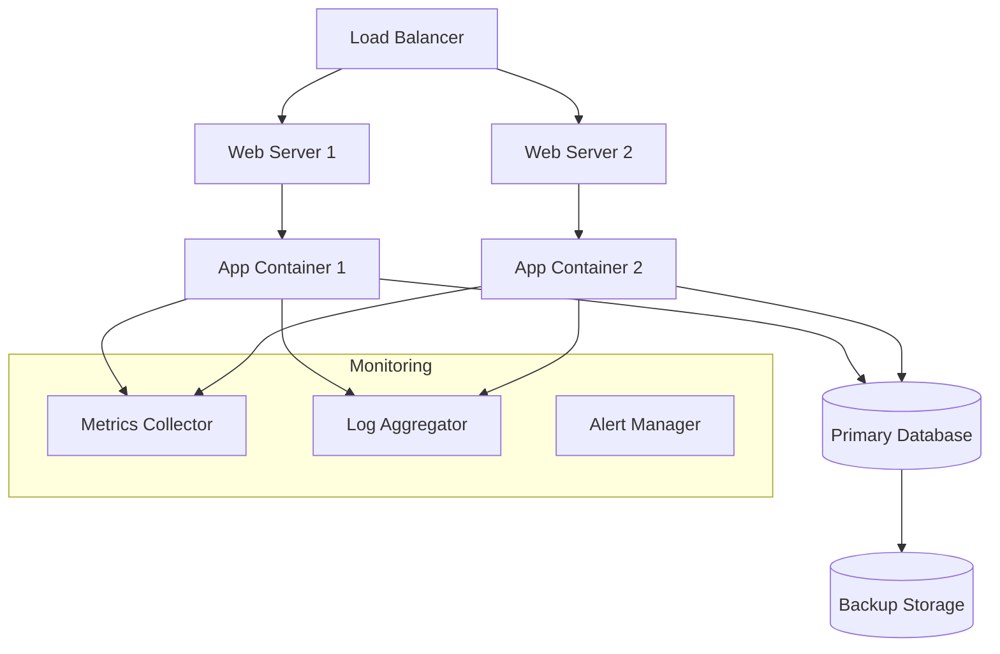

# Documentation Standards for DevOps Engineers

**Target Audience**: DevOps Engineers, Site Reliability Engineers, Platform Engineers  
**Last Updated**: 2025-06-10 06:45:45 UTC by @parseen254

## Infrastructure Documentation

### System Architecture Documentation

Every major system component must have architecture documentation including:

```markdown
# System Architecture: [Service/Component Name]

## Overview
High-level description of the system's purpose and role in the infrastructure.

## Architecture Diagram


## Infrastructure Components

### Compute Resources
| Component | Type | Size | Location | Purpose |
|-----------|------|------|----------|---------|
| Web Servers | Azure VM | Standard_D2s_v3 | East US | Load balancing |
| App Servers | AKS Pods | 2 CPU, 4GB RAM | East US | Application hosting |
| Database | Azure SQL | S2 Standard | East US | Data persistence |

### Network Configuration
- **VNet**: 10.0.0.0/16
- **Subnets**: 
  - Web: 10.0.1.0/24
  - App: 10.0.2.0/24  
  - Data: 10.0.3.0/24
- **Security Groups**: [Link to detailed rules]
- **Load Balancer**: Azure Application Gateway

### Storage Systems
- **Primary**: Azure SQL Database (500 GB)
- **Backup**: Azure Blob Storage (retention: 30 days)
- **Logs**: Azure Monitor Logs (retention: 90 days)
- **Metrics**: Azure Monitor Metrics (retention: 93 days)

## Scaling Configuration
- **Auto-scaling**: Enabled based on CPU >70% or Memory >80%
- **Min instances**: 2
- **Max instances**: 10
- **Scale-out threshold**: 70% CPU for 5 minutes
- **Scale-in threshold**: 30% CPU for 10 minutes

## Security
- **Authentication**: Azure AD integration
- **Network**: Private endpoints, NSG rules
- **Encryption**: TLS 1.3 in transit, AES-256 at rest
- **Secrets**: Azure Key Vault
- **Compliance**: SOC 2 Type II, GDPR

## Disaster Recovery
- **RTO**: 4 hours
- **RPO**: 1 hour  
- **Backup Strategy**: Daily automated backups
- **Failover Process**: [Link to runbook]
```

### Environment Documentation

Document each environment (dev, staging, production):

```markdown
# Environment: Production

## Access Information
- **Azure Subscription**: prod-subscription-id
- **Resource Group**: rg-myapp-prod-eastus
- **AKS Cluster**: aks-myapp-prod
- **Key Vault**: kv-myapp-prod
- **App Gateway**: agw-myapp-prod

## Configuration
- **Environment Variables**: Stored in Azure Key Vault
- **Feature Flags**: LaunchDarkly production environment
- **Database**: myapp-prod.database.windows.net
- **Redis Cache**: myapp-prod.redis.cache.windows.net

## Monitoring & Alerting
- **Application Insights**: myapp-prod-insights
- **Log Analytics**: myapp-prod-logs
- **Alert Rules**: 15 active alerts
- **Dashboard**: [Azure Dashboard Link]

## Access Control
- **Admin Access**: DevOps team + On-call engineers
- **Read Access**: Development team
- **Emergency Access**: Break-glass procedure via PIM

## Maintenance Windows
- **Scheduled**: Sunday 2-4 AM EST (low traffic period)
- **Emergency**: Coordinate with on-call engineer
- **Notification**: #alerts channel 24h advance notice
```

## Runbook Documentation

### Runbook Template

Every operational procedure must have a comprehensive runbook:

```markdown
# Runbook: [Procedure Name]

## Overview
**Purpose**: What this procedure accomplishes
**When to use**: Specific scenarios requiring this procedure
**Estimated time**: How long this typically takes
**Risk level**: Low/Medium/High and why

## Prerequisites
- [ ] Required access permissions
- [ ] Tools/software needed
- [ ] Knowledge requirements
- [ ] Approval needed (if applicable)

## Pre-execution Checklist
- [ ] Verify maintenance window/change approval
- [ ] Notify stakeholders via #alerts channel
- [ ] Create change ticket: CHG-YYYY-NNNN
- [ ] Backup current state (if applicable)
- [ ] Verify rollback procedure is ready

## Step-by-Step Procedure

### Step 1: [Action Description]
**Purpose**: Why this step is necessary
**Expected duration**: ~5 minutes

```bash
# Login to Azure
az login
az account set --subscription "production-subscription"

# Get current deployment status
kubectl get deployments -n myapp-prod
```

**Expected output**:
```
NAME           READY   UP-TO-DATE   AVAILABLE   AGE
api-service    3/3     3            3           5d
web-service    2/2     2            2           5d
```

**Validation**: Verify all deployments show READY status

### Step 2: [Next Action]
**Purpose**: 
**Expected duration**: 

```bash
# Commands for this step
```

**Expected output**:
```
# What you should see
```

**Validation**: How to confirm this step succeeded

## Rollback Procedure
If something goes wrong, follow these steps to rollback:

1. **Immediate rollback**:
   ```bash
   kubectl rollout undo deployment/api-service -n myapp-prod
   ```

2. **Verify rollback success**:
   ```bash
   kubectl rollout status deployment/api-service -n myapp-prod
   ```

3. **Notify team**: Post in #alerts with incident details

## Post-execution Checklist
- [ ] Verify application health via monitoring dashboard
- [ ] Run smoke tests: [Link to test suite]
- [ ] Update change ticket with completion status
- [ ] Document any issues encountered
- [ ] Notify stakeholders of completion

## Troubleshooting

### Common Issues
| Issue | Symptoms | Solution |
|-------|----------|----------|
| Deployment stuck | Pods in Pending state | Check resource quotas and node availability |
| Health check failures | 503 errors from load balancer | Verify application startup logs |
| Database connectivity | Connection timeout errors | Check firewall rules and connection strings |

### Emergency Contacts
- **On-call Engineer**: [PagerDuty rotation]
- **Database Team**: #database-team
- **Network Team**: #infrastructure-team
- **Escalation**: [Manager contact]

## Validation & Testing
After completion, verify system health:
1. **Application health**: https://myapp.com/health
2. **API endpoints**: Run Postman collection "Production Smoke Tests"
3. **User workflows**: Execute critical user journeys
4. **Monitoring**: Check dashboards for 15 minutes

## Related Documentation
- [Architecture Overview](../architecture/overview.md)
- [Deployment Pipeline](../ci-cd/deployment.md)
- [Monitoring Setup](../monitoring/setup.md)
- [Incident Response](../incident-response/procedures.md)

## Change History
| Date | Author | Changes |
|------|--------|---------|
| 2025-06-10 | @parseen254 | Initial version |
```

### Critical Runbooks Required

Every system must have these essential runbooks:

1. **[Deployment Runbook](../../templates/runbooks/deployment.md)**
   - Standard deployment procedure
   - Blue-green deployment steps
   - Rollback procedures

2. **[Incident Response Runbook](../../templates/runbooks/incident-response.md)**
   - Initial triage steps
   - Escalation procedures
   - Communication templates

3. **[Backup & Recovery Runbook](../../templates/runbooks/backup-recovery.md)**
   - Backup verification
   - Data recovery procedures
   - Point-in-time recovery

4. **[Scaling Runbook](../../templates/runbooks/scaling.md)**
   - Manual scaling procedures
   - Auto-scaling configuration
   - Performance optimization

5. **[Security Incident Runbook](../../templates/runbooks/security-incident.md)**
   - Security breach response
   - Access revocation procedures
   - Forensic data collection

## Monitoring & Alerting Documentation

### Alert Documentation Template

```markdown
# Alert: [Alert Name]

## Overview
**Severity**: Critical/Warning/Info
**Service**: Which service this monitors
**Metric**: What metric triggers this alert
**Threshold**: Specific threshold values

## Alert Definition
```yaml
alert: HighErrorRate
expr: (sum(rate(http_requests_total{code=~"5.."}[5m])) / sum(rate(http_requests_total[5m]))) > 0.05
for: 2m
labels:
  severity: critical
  service: api-gateway
annotations:
  summary: "High error rate detected in API Gateway"
  description: "Error rate is {{ $value | humanizePercentage }} for the last 5 minutes"
  runbook_url: "https://wiki.company.com/runbooks/high-error-rate"
```

## Business Impact
**User Impact**: How this affects end users
**Business Impact**: Revenue/reputation implications
**Dependencies**: What other services are affected

## Response Procedure
1. **Immediate actions** (first 5 minutes):
   - Check service health dashboard
   - Verify recent deployments
   - Check infrastructure status

2. **Investigation steps** (next 10 minutes):
   - Review application logs
   - Check database performance
   - Verify external dependencies

3. **Escalation criteria**:
   - Alert persists >15 minutes
   - Error rate exceeds 10%
   - Customer complaints received

## Historical Data
- **Normal range**: 0.1-0.5% error rate
- **Previous incidents**: [Links to incident reports]
- **Seasonal patterns**: Higher during business hours
- **False positive rate**: <2%

## Tuning Notes
- **Last tuned**: 2025-06-01
- **Threshold rationale**: Based on 6 months of historical data
- **Known false positives**: Deployment windows cause temporary spikes
```

### Dashboard Documentation

```markdown
# Dashboard: Production System Health

## Overview
**Purpose**: Monitor overall system health and performance
**Audience**: On-call engineers, development team
**Update frequency**: Real-time
**Data retention**: 30 days

## Panels

### Panel 1: Request Rate
- **Metric**: `sum(rate(http_requests_total[5m]))`
- **Purpose**: Monitor traffic patterns
- **Baseline**: 100-500 RPS during business hours
- **Alert threshold**: >1000 RPS (traffic spike)

### Panel 2: Error Rate
- **Metric**: `sum(rate(http_requests_total{code=~"5.."}[5m])) / sum(rate(http_requests_total[5m]))`
- **Purpose**: Track application errors
- **Baseline**: <0.5%
- **Alert threshold**: >5% (high error rate)

### Panel 3: Response Time
- **Metric**: `histogram_quantile(0.95, sum(rate(http_request_duration_seconds_bucket[5m])) by (le))`
- **Purpose**: Monitor application performance
- **Baseline**: <200ms (95th percentile)
- **Alert threshold**: >1s (slow response)

## Usage Guidelines
- **Check frequency**: Every 15 minutes during business hours
- **Incident response**: Use this dashboard for initial triage
- **Trend analysis**: Review daily trends for capacity planning
```

## Configuration Management

### Infrastructure as Code Documentation

```markdown
# Terraform Configuration: Production Environment

## Overview
This Terraform configuration manages our production infrastructure in Azure.

## Structure
```
infrastructure/
├── environments/
│   ├── dev/
│   ├── staging/
│   └── prod/
├── modules/
│   ├── aks-cluster/
│   ├── app-gateway/
│   └── sql-database/
└── shared/
    ├── key-vault/
    └── monitoring/
```

## Usage

### Prerequisites
- Azure CLI installed and configured
- Terraform 1.5+ installed
- Access to Azure subscription
- Backend storage account configured

### Deployment
```bash
# Navigate to environment
cd infrastructure/environments/prod

# Initialize Terraform
terraform init

# Plan changes
terraform plan -var-file="prod.tfvars"

# Apply changes (requires approval)
terraform apply -var-file="prod.tfvars"
```

### Variables
Key variables defined in `prod.tfvars`:
- `location`: Azure region (eastus)
- `environment`: Environment name (prod)
- `aks_node_count`: Number of AKS nodes (3)
- `sql_tier`: Database tier (S2)

## State Management
- **Backend**: Azure Storage Account
- **State file**: `prod.tfstate`
- **Locking**: Enabled via blob lease
- **Backup**: Daily automated backup to separate storage account

## Security
- **Secrets**: Stored in Azure Key Vault, referenced in Terraform
- **Access control**: Terraform service principal with minimal permissions
- **State encryption**: Enabled on storage account
- **Plan review**: All changes require approval before apply
```

---

**Next Steps:**
- Review [incident response procedures](../incident-response/overview.md)
- Set up [monitoring and alerting](../monitoring/setup.md)
- Create environment-specific runbooks
- Join #devops-team for collaboration