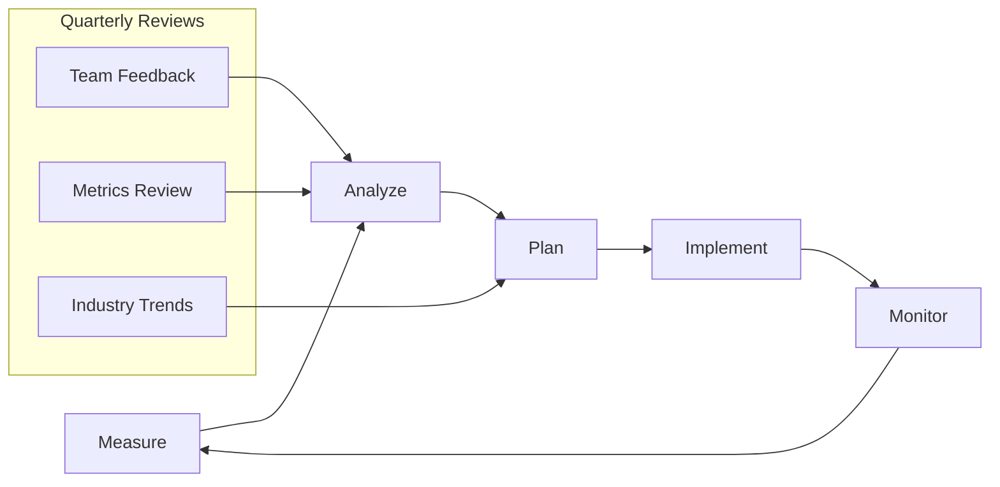

# Best Practices Improvement Guide

**Target Audience**: All Engineers, Tech Leads, Engineering Managers  
**Last Updated**: 2025-06-10 by System  
**Review Cycle**: Quarterly

## Quick Navigation

### By Process
- [Assessment Framework](#assessment-framework) - How to evaluate current practices
- [Improvement Methodology](#improvement-methodology) - Systematic improvement approach
- [Feedback Collection](#feedback-collection) - Gathering team input
- [Implementation Planning](#implementation-planning) - Rolling out changes

### By Role
- **Individual Contributors**: Feedback submission, practice adoption
- **Tech Leads**: Assessment leadership, change implementation
- **Engineering Managers**: Strategic planning, resource allocation

### Quick Start
- [Submit Feedback](feedback-submission.md) - How to suggest improvements
- [Assessment Checklist](assessment-checklist.md) - Evaluate current practices
- [Change Implementation](change-implementation.md) - Implement improvements

## Overview

This guide outlines how to continuously improve our engineering best practices over time. It provides frameworks for regular assessment, feedback collection, and iterative improvement of our standards and processes.

## Improvement Methodology

### Continuous Improvement Cycle



### 1. Measure (Ongoing)

#### Quantitative Metrics
Track these metrics monthly:

```markdown
# Monthly Metrics Template

## Development Velocity
- **Deployment frequency**: X deployments per day/week
- **Lead time**: Average time from commit to production
- **MTTR**: Mean time to recovery from incidents
- **Change failure rate**: % of deployments causing failures

## Code Quality
- **Test coverage**: % across all repositories
- **Code review time**: Average time for PR approval
- **Bug detection rate**: Bugs found per feature/sprint
- **Technical debt**: Time spent on maintenance vs features

## Developer Experience
- **Build time**: Average CI/CD pipeline duration
- **Setup time**: Time for new developer to be productive
- **Documentation usage**: Page views, search queries
- **Support requests**: Number of help requests in #engineering-team

## Operational Excellence
- **Uptime**: System availability percentage
- **Performance**: API response times (p95, p99)
- **Error rates**: Application and infrastructure errors
- **Security incidents**: Number and severity
```

#### Data Collection Tools
- **GitHub Analytics**: PR metrics, repository activity
- **Azure DevOps**: Pipeline performance, deployment frequency
- **Application Insights**: Performance and error metrics
- **Developer Surveys**: Quarterly satisfaction surveys

### 2. Analyze (Monthly)

#### Monthly Best Practices Review

**Meeting Cadence**: First Thursday of each month  
**Duration**: 2 hours  
**Attendees**: Engineering leads, senior developers, QA leads

**Agenda Template**:
```markdown
# Monthly Best Practices Review - [Month Year]

## Metrics Review (30 min)
- Review dashboard with previous month's metrics
- Identify trends and outliers
- Compare against targets and industry benchmarks

## Feedback Analysis (30 min)
- Review team feedback from past month
- Categorize feedback by area (tooling, process, documentation)
- Identify recurring themes and pain points

## Pain Point Deep Dive (45 min)
- Select 2-3 highest impact issues
- Root cause analysis using 5 Whys technique
- Brainstorm potential solutions
- Assign owners for investigation

## Action Planning (15 min)
- Prioritize improvements using MoSCoW method
- Assign owners and deadlines
- Schedule follow-up reviews
```

#### Root Cause Analysis Template

```markdown
# Root Cause Analysis: [Issue Description]

## Problem Statement
Clear, specific description of the issue and its impact.

## 5 Whys Analysis
1. **Why did this problem occur?**
   - Answer 1

2. **Why did [Answer 1] happen?**
   - Answer 2

3. **Why did [Answer 2] happen?**
   - Answer 3

4. **Why did [Answer 3] happen?**
   - Answer 4

5. **Why did [Answer 4] happen?**
   - Root cause identified

## Contributing Factors
- Factor 1: Description
- Factor 2: Description
- Factor 3: Description

## Impact Assessment
- **Frequency**: How often this occurs
- **Severity**: Impact when it occurs
- **Affected teams**: Who is impacted
- **Business impact**: Cost/time implications

## Proposed Solutions
| Solution | Effort | Impact | Risk | Timeline |
|----------|--------|--------|------|----------|
| Solution A | Medium | High | Low | 2 weeks |
| Solution B | Low | Medium | Low | 1 week |
| Solution C | High | High | Medium | 1 month |

## Recommended Action
Based on effort/impact analysis, recommend specific solution with rationale.

## Success Metrics
How will we know this solution worked?
- Metric 1: Target value
- Metric 2: Target value
- Metric 3: Target value
```

### 3. Plan (Quarterly)

#### Quarterly Planning Process

**Quarter Planning Meeting**:
- **When**: Last week of each quarter
- **Duration**: Half day (4 hours)
- **Output**: Quarterly improvement roadmap

**Quarterly Planning Template**:
```markdown
# Q[X] 2025 Best Practices Roadmap

## Quarter Objectives
Based on data analysis and team feedback, our focus areas are:

1. **Primary Focus**: [e.g., Reduce deployment time by 50%]
2. **Secondary Focus**: [e.g., Improve test coverage to 85%]
3. **Exploratory**: [e.g., Evaluate new monitoring tools]

## Improvement Initiatives

### Initiative 1: [Name]
- **Problem**: What we're solving
- **Solution**: High-level approach
- **Success Metrics**: How we'll measure success
- **Owner**: Who's responsible
- **Timeline**: Key milestones
- **Resources**: What's needed

### Initiative 2: [Name]
[Same structure as above]

## Investment Allocation
- **Documentation**: 30% of improvement time
- **Tooling**: 40% of improvement time
- **Process**: 20% of improvement time
- **Training**: 10% of improvement time

## Risk Assessment
| Risk | Probability | Impact | Mitigation |
|------|-------------|--------|------------|
| Team capacity constraints | High | Medium | Stagger implementation |
| Tool adoption resistance | Medium | High | Pilot with willing teams |
| Technical complexity | Low | High | Proof of concept first |
```

### 4. Implement (Ongoing)

#### Implementation Framework

**Pilot-First Approach**:
1. **Pilot Team**: Start with 1-2 willing teams
2. **Duration**: 2-4 weeks
3. **Feedback**: Daily check-ins during pilot
4. **Evaluation**: Metrics comparison before/after
5. **Iteration**: Refine based on pilot learnings
6. **Rollout**: Gradual expansion to all teams

**Change Management Process**:
```markdown
# Change Implementation Template

## Change Description
What we're implementing and why.

## Impact Assessment
- **Teams affected**: List of teams
- **Training required**: What training is needed
- **Tools needed**: New tools or configuration
- **Timeline**: Implementation schedule

## Communication Plan
- **Announcement**: How and when to announce
- **Training sessions**: Schedule and content
- **Support**: How teams get help during transition
- **Feedback channels**: How to collect ongoing feedback

## Success Criteria
- **Adoption metrics**: % of teams using new practice
- **Performance metrics**: Improvement in key metrics
- **Satisfaction metrics**: Team feedback scores

## Rollback Plan
If implementation doesn't work:
- **Triggers**: When to consider rollback
- **Process**: How to revert changes
- **Communication**: How to explain rollback
```

### 5. Monitor (Ongoing)

#### Real-time Monitoring

**Dashboard Requirements**:
- **Metrics refresh**: Every 15 minutes
- **Trend analysis**: 30-day rolling averages
- **Alerting**: Notifications for significant changes
- **Accessibility**: Available to all team members

**Key Performance Indicators (KPIs)**:
```markdown
# Best Practices KPI Dashboard

## Developer Productivity
- 📈 **Deployment Frequency**: 15 per day (target: 20)
- ⏱️ **Lead Time**: 4.2 hours (target: <4 hours)
- 🔄 **PR Review Time**: 18 hours (target: <24 hours)
- 🚀 **Feature Delivery**: 85% on time (target: 90%)

## Quality Metrics
- 🧪 **Test Coverage**: 82% (target: 85%)
- 🐛 **Bug Rate**: 0.8 bugs/feature (target: <1)
- 🔙 **Rollback Rate**: 3% (target: <5%)
- 📚 **Documentation Coverage**: 78% (target: 90%)

## Team Health
- 😊 **Developer Satisfaction**: 4.2/5 (target: 4.5/5)
- 🎯 **Process Clarity**: 4.0/5 (target: 4.5/5)
- 🛠️ **Tool Satisfaction**: 3.8/5 (target: 4.0/5)
- 📞 **Support Response**: 2.1 hours (target: <4 hours)
```

## Feedback Collection Systems

### 1. Continuous Feedback

#### Slack Integration
```markdown
# Feedback Bot Commands

## Quick Feedback
`/feedback-quick [area] [1-5 stars] [comment]`
Example: `/feedback-quick documentation 3 README templates are helpful but need more examples`

## Detailed Feedback  
`/feedback-detailed`
Opens form for comprehensive feedback

## Anonymous Feedback
`/feedback-anon [comment]`
For sensitive feedback without attribution
```

#### GitHub Integration
- **Issue Templates**: For formal improvement proposals
- **Discussion Forum**: For open-ended conversations
- **Survey Issues**: Monthly feedback collection

### 2. Structured Surveys

#### Quarterly Developer Experience Survey

```markdown
# Q[X] 2025 Developer Experience Survey

## Overall Satisfaction
1. How satisfied are you with our current development practices? (1-5 scale)
2. How likely are you to recommend our practices to a friend? (NPS score)

## Process Effectiveness
Rate each area (1-5, where 5 = extremely effective):
- Git workflow and branching strategy
- Code review process
- Testing practices
- Documentation standards
- CI/CD pipelines
- Release management

## Tool Satisfaction
Rate your satisfaction with current tools (1-5):
- IDE/Editor setup
- Local development environment
- CI/CD tools (Azure DevOps)
- Monitoring and logging
- Communication tools

## Pain Points
1. What is your biggest daily frustration?
2. What takes longer than it should?
3. What causes the most confusion?

## Improvement Suggestions
1. What one change would have the biggest positive impact?
2. What tools or practices from other companies interest you?
3. What training or documentation would be most helpful?

## Open Feedback
Any additional comments or suggestions?
```

### 3. Retrospective Integration

#### Sprint Retrospectives
- **Process improvements**: Include best practices review
- **Action items**: Track process-related action items
- **Patterns**: Identify recurring issues across teams

#### Incident Retrospectives
- **Process failures**: How practices contributed to incidents
- **Documentation gaps**: Missing runbooks or unclear procedures
- **Tool limitations**: Where current tools fell short

## Industry Benchmarking

### Annual Benchmarking Process

#### 1. Industry Research (Quarterly)
- **DORA Report**: Compare against industry DORA metrics
- **Stack Overflow Survey**: Developer tool satisfaction trends
- **Technology Radar**: Emerging practices and tools
- **Conference Talks**: New approaches and case studies

#### 2. Peer Networking
- **Engineering meetups**: Local engineering community events
- **Conference attendance**: Major industry conferences
- **Company visits**: Learn from similar organizations
- **Open source contribution**: Engagement with broader community

#### 3. Competitive Analysis
```markdown
# Competitive Practice Analysis Template

## Company: [Competitor Name]
**Industry**: [Similar industry sector]
**Size**: [Similar team size]
**Stack**: [Technology overlap]

## Practices of Interest
1. **Practice 1**: Description and potential applicability
2. **Practice 2**: Description and potential applicability
3. **Practice 3**: Description and potential applicability

## Adaptation Strategy
- **Direct adoption**: Practices we can implement as-is
- **Modified adoption**: Practices that need customization
- **Inspiration only**: Concepts that inform our own solutions

## Implementation Priority
- **High**: Immediate pilot candidate
- **Medium**: Include in quarterly planning
- **Low**: Long-term consideration
```

## Documentation Evolution

### Version Control for Best Practices

#### Semantic Versioning for Practices
- **Major version** (1.0 → 2.0): Fundamental changes requiring retraining
- **Minor version** (1.1 → 1.2): New practices or significant updates
- **Patch version** (1.1.1 → 1.1.2): Clarifications and small improvements

#### Change Documentation
```markdown
# Practice Change Log

## [2.1.0] - 2025-06-10
### Added
- New API documentation standards for GraphQL
- Security checklist for code reviews

### Changed
- Updated Git workflow to include conventional commits
- Modified PR template to include security considerations

### Deprecated
- Old commit message format (will be removed in 3.0)

### Removed
- Legacy testing framework documentation

## [2.0.1] - 2025-05-15
### Fixed
- Corrected example in deployment runbook
- Updated broken links in tool setup guides
```

#### Migration Guides
```markdown
# Migration Guide: Git Workflow v1.0 → v2.0

## Overview
This guide helps teams migrate from our old Git workflow to the new conventional commits standard.

## What's Changing
- **Commit message format**: New structured format required
- **PR templates**: Updated to include type classification
- **Automated checks**: New pre-commit hooks

## Migration Steps
1. **Week 1**: Install new Git hooks
2. **Week 2**: Start using new commit format (enforced warnings only)
3. **Week 3**: Enable enforcement (builds fail on invalid commits)
4. **Week 4**: Remove old templates and documentation

## Training Resources
- **Video**: 15-minute overview of new format
- **Workshop**: Hands-on practice session
- **Examples**: Common scenarios and proper formatting

## Support
- **Slack**: #git-migration for questions
- **Office hours**: Daily 3 PM for first two weeks
- **Documentation**: Updated guides in wiki
```

## Success Metrics and KPIs

### Organizational Health Metrics

#### Team Velocity and Quality
```markdown
# Quarterly Health Report Template

## Velocity Indicators
- **Feature delivery**: % of features delivered on time
- **Cycle time**: Average time from idea to production
- **Throughput**: Features delivered per sprint
- **Predictability**: