# Monitoring & Logging Practices Overview

**Target Audience**: All Engineers, DevOps Team, On-Call Engineers  
**Last Updated**: 2025-06-10 07:03:59 UTC by @parseen254

## Overview

Comprehensive monitoring and logging standards to ensure system observability, rapid incident detection, and effective debugging across all technology stacks.

## Quick Navigation

### By Technology Stack
- [🍃 Spring Boot Monitoring](spring-boot.md) - Java application observability patterns
- [⚡ ASP.NET Core Monitoring](aspnet.md) - C# application monitoring standards
- [⚛️ NextJS Monitoring](nextjs.md) - Frontend application monitoring
- [📱 Flutter Monitoring](flutter.md) - Mobile application analytics and crash reporting
- [🔄 Laravel Monitoring](laravel.md) - Legacy system monitoring and migration prep

### By Monitoring Type
- [📊 Application Performance Monitoring](types/apm.md) - Response times, throughput, errors
- [🏗️ Infrastructure Monitoring](types/infrastructure.md) - Servers, containers, networks
- [📈 Business Metrics](types/business-metrics.md) - KPIs, conversion rates, revenue tracking
- [🔒 Security Monitoring](types/security.md) - Threat detection, audit logs, compliance
- [👤 User Experience Monitoring](types/user-experience.md) - Real user monitoring, synthetic tests

### By Role
- [👨‍💻 Developer Monitoring Guide](roles/developers.md) - Application-level observability
- [🏗️ DevOps Monitoring Standards](roles/devops.md) - Infrastructure and deployment monitoring
- [🚨 On-Call Engineer Playbook](roles/on-call.md) - Incident response and troubleshooting

### By Implementation Area
- [📝 Structured Logging](implementation/structured-logging.md) - JSON logging standards
- [🚨 Alerting Strategy](implementation/alerting.md) - Alert management and escalation
- [📊 Dashboard Design](implementation/dashboards.md) - Visualization best practices
- [🔍 Distributed Tracing](implementation/tracing.md) - Request flow tracking

## Monitoring Philosophy

### Three Pillars of Observability

```mermaid
graph TB
    subgraph "Observability Foundation"
        METRICS["`📊 Metrics
        • Time-series data
        • Aggregated measurements  
        • Alerting thresholds
        • SLA monitoring`"]
        
        LOGS["`📝 Logs
        • Structured events
        • Debug information
        • Audit trails
        • Error details`"]
        
        TRACES["`🔍 Traces
        • Request journeys
        • Service interactions
        • Performance bottlenecks
        • Dependency mapping`"]
    end
    
    METRICS -.-> LOGS
    LOGS -.-> TRACES
    TRACES -.-> METRICS
    
    subgraph "Analysis & Action"
        DASHBOARDS[Real-time Dashboards]
        ALERTS[Intelligent Alerting]
        DEBUG[Rapid Debugging]
        OPTIMIZATION[Performance Optimization]
    end
    
    METRICS --> DASHBOARDS
    METRICS --> ALERTS
    LOGS --> DEBUG
    TRACES --> OPTIMIZATION
```

### Monitoring Maturity Model

| Level | Characteristics | Tools Used | Coverage | Team Capability |
|-------|----------------|------------|----------|-----------------|
| **L1: Reactive** | Basic health checks, manual log review | Azure Monitor, file logs | Core services only | React to outages |
| **L2: Proactive** | Structured logging, basic alerting | Application Insights, centralized logs | All services | Prevent some issues |
| **L3: Predictive** | APM, anomaly detection, SLA monitoring | Full APM suite, ML alerts | End-to-end visibility | Anticipate problems |
| **L4: Intelligent** | Auto-healing, capacity prediction | AI-driven insights, automated responses | Business-driven monitoring | Self-healing systems |

**Current State**: Transitioning from L1 to L2  
**Target State**: Achieve L3 within 6 months

## Current State Assessment

### Monitoring Challenges
- **Fragmented Tooling**: Different monitoring approaches across technology stacks
- **Alert Fatigue**: High false positive rate (>30%) causing important alerts to be missed
- **Limited Correlation**: Difficult to trace issues across service boundaries
- **Reactive Posture**: Most monitoring alerts after problems occur rather than preventing them
- **Inconsistent Logging**: Log formats and verbosity levels vary significantly between services

### Success Areas
- **Infrastructure Monitoring**: Azure Monitor provides comprehensive infrastructure visibility
- **Database Performance**: SQL Server monitoring is well-established with good alerting
- **Basic APM**: Application Insights covers core performance metrics for critical services
- **Security Logging**: Audit trails and security events are consistently logged

### By Technology Stack Assessment

| Stack | Current Maturity | Key Gaps | Priority Actions |
|-------|------------------|----------|------------------|
| **Spring Boot** | L2 - Proactive | Distributed tracing, business metrics | Implement OpenTelemetry |
| **ASP.NET Core** | L2 - Proactive | Cross-service correlation | Enhance Application Insights |
| **NextJS** | L1 - Reactive | User experience monitoring, error tracking | Add Sentry, implement RUM |
| **Flutter** | L1 - Reactive | Crash reporting, performance monitoring | Firebase Analytics, Crashlytics |
| **Laravel** | L1 - Reactive | Modern monitoring stack | Document for C# migration |

## Monitoring Standards Summary

### Universal Requirements

#### Logging Standards
- **Format**: Structured JSON logging for all applications
- **Correlation**: Request correlation IDs for distributed tracing
- **Retention**: Error logs 6 months, info logs 3 months, debug logs 1 month
- **Security**: No PII or sensitive data in logs
- **Performance**: Async logging to prevent performance impact

#### Metrics Standards
- **Golden Signals**: Latency, traffic, errors, saturation for all services
- **Business Metrics**: Revenue, conversion, user engagement tracking
- **SLA Targets**: 99.9% availability, p95 response time <500ms
- **Custom Metrics**: Business-specific KPIs for each service

#### Alerting Standards
- **Severity Levels**: Critical (5min), High (30min), Medium (2h), Low (next day)
- **Escalation**: Automated escalation with PagerDuty integration
- **Runbooks**: Every alert must link to remediation documentation
- **Testing**: Monthly alert testing and tuning reviews

### Technology-Specific Targets

| Metric Category | Spring Boot | ASP.NET Core | NextJS | Flutter |
|-----------------|-------------|--------------|---------|---------|
| **Response Time (p95)** | <200ms | <200ms | <1s page load | <100ms UI response |
| **Error Rate** | <1% | <1% | <0.5% | <0.1% crashes |
| **Availability** | 99.9% | 99.9% | 99.5% | N/A (client-side) |
| **Coverage** | All endpoints | All endpoints | Critical user flows | Key user journeys |

## Implementation Roadmap

### Phase 1: Foundation (Weeks 1-2) ✅ In Progress
- [x] Establish monitoring standards documentation
- [ ] Standardize logging formats across all services
- [ ] Implement correlation ID tracking
- [ ] Set up centralized log aggregation in Azure
- [ ] Configure basic Application Insights for all services

### Phase 2: Enhanced Observability (Weeks 3-4)
- [ ] Implement distributed tracing with OpenTelemetry
- [ ] Create service-specific monitoring dashboards
- [ ] Set up intelligent alerting rules with reduced false positives
- [ ] Deploy business metrics tracking
- [ ] Configure SLA monitoring and reporting

### Phase 3: Proactive Monitoring (Weeks 5-6)
- [ ] Implement anomaly detection for key metrics
- [ ] Set up synthetic monitoring for critical user journeys
- [ ] Create capacity planning dashboards
- [ ] Deploy chaos engineering monitoring
- [ ] Implement automated incident response workflows

### Phase 4: Advanced Analytics (Weeks 7-8)
- [ ] Machine learning-powered alerting
- [ ] Predictive scaling based on monitoring data
- [ ] Advanced security monitoring and threat detection
- [ ] Custom business intelligence dashboards
- [ ] Performance optimization recommendations engine

## Success Metrics

### Technical Metrics

| Metric | Baseline | 3-Month Target | 6-Month Target | Measurement Method |
|--------|----------|----------------|----------------|--------------------|
| **MTTR** (Mean Time to Recovery) | 45 minutes | 20 minutes | 10 minutes | Incident tracking |
| **MTTD** (Mean Time to Detection) | 15 minutes | 5 minutes | 2 minutes | Alert timestamps |
| **Alert False Positive Rate** | 35% | 15% | 5% | Manual alert review |
| **Service Availability** | 99.5% | 99.8% | 99.9% | Uptime monitoring |
| **Monitoring Coverage** | 60% | 85% | 95% | Service inventory audit |

### Business Impact Metrics

| Metric | Current | Target | Business Value |
|--------|---------|--------|----------------|
| **Customer Issue Resolution Time** | 2 hours | 30 minutes | Improved customer satisfaction |
| **Revenue Impact of Outages** | $5K/hour | <$1K/hour | Direct cost savings |
| **Engineering Productivity** | 70% feature work | 85% feature work | Reduced firefighting time |
| **On-Call Burden** | 5 alerts/night | 1 alert/night | Improved engineer well-being |

## Monitoring Tools Ecosystem

### Approved Technology Stack

| Category | Primary Tool | Secondary | Technology Focus |
|----------|--------------|-----------|------------------|
| **APM** | Azure Application Insights | DataDog | Cross-platform |
| **Infrastructure** | Azure Monitor | Prometheus + Grafana | Hybrid cloud |
| **Logging** | Azure Log Analytics | ELK Stack | Centralized logging |
| **Tracing** | OpenTelemetry + Jaeger | Azure Monitor | Distributed systems |
| **Alerting** | PagerDuty | Azure Alerts | Incident management |
| **Dashboards** | Grafana | Azure Dashboards | Visualization |
| **Synthetic Monitoring** | Azure Application Insights | Pingdom | Uptime monitoring |
| **Security Monitoring** | Azure Sentinel | Splunk | Security operations |

### Tool Integration Architecture

## Getting Started

### For New Services
1. **Review your stack-specific monitoring guide** from the navigation above
2. **Implement structured logging** using our [logging templates](../../templates/monitoring/)
3. **Add basic metrics collection** following the golden signals approach
4. **Set up health checks** and basic alerting
5. **Create service dashboard** using our dashboard templates

### For Existing Services
1. **Assess current monitoring maturity** using our [assessment checklist](../../templates/monitoring/maturity-assessment.md)
2. **Identify critical monitoring gaps** focusing on business impact
3. **Implement quick wins** like structured logging and basic metrics
4. **Plan incremental improvements** following our phased approach
5. **Join monitoring community** for support and knowledge sharing

### For Incident Response
1. **Review the on-call playbook** for your role and services
2. **Familiarize yourself with dashboards** and alerting systems
3. **Practice using monitoring tools** during non-incident times
4. **Understand escalation procedures** and communication channels
5. **Contribute to runbook improvements** based on incident learnings

## Support & Community

### Training & Resources
- **[Monitoring Workshop Series](../../resources/training/monitoring/)** - Monthly hands-on training
- **[Tool-Specific Tutorials](../../resources/tutorials/monitoring/)** - Step-by-step implementation guides
- **[Best Practices Library](../../resources/best-practices/monitoring/)** - Curated industry practices
- **[Monitoring Champions Program](../../resources/community/monitoring-champions.md)** - Expert mentorship

### Communication Channels
- **Slack Communities**:
  - `#monitoring-help` - General monitoring questions and support
  - `#alerting-discussion` - Alert tuning and strategy discussions
  - `#dashboards` - Dashboard sharing and feedback
  - `#on-call-support` - Incident response coordination
- **Office Hours**: Fridays 2-3 PM UTC with Monitoring Team
- **Monthly Reviews**: First Thursday of each month for metrics and improvements

### External Resources
- [Google SRE Book - Monitoring](https://sre.google/sre-book/monitoring-distributed-systems/)
- [Observability Engineering (O'Reilly)](https://www.oreilly.com/library/view/observability-engineering/9781492076438/)
- [Azure Monitor Best Practices](https://docs.microsoft.com/en-us/azure/azure-monitor/best-practices)

---

**Next Steps:**
1. Choose your technology stack guide from navigation above
2. Complete the monitoring maturity assessment for your services  
3. Implement quick wins identified in the assessment
4. Join our monitoring community for ongoing support
5. Schedule regular monitoring reviews for your team

**Questions or Feedback?** Contact @parseen254 or post in #monitoring-help