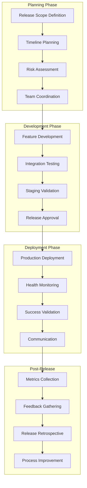
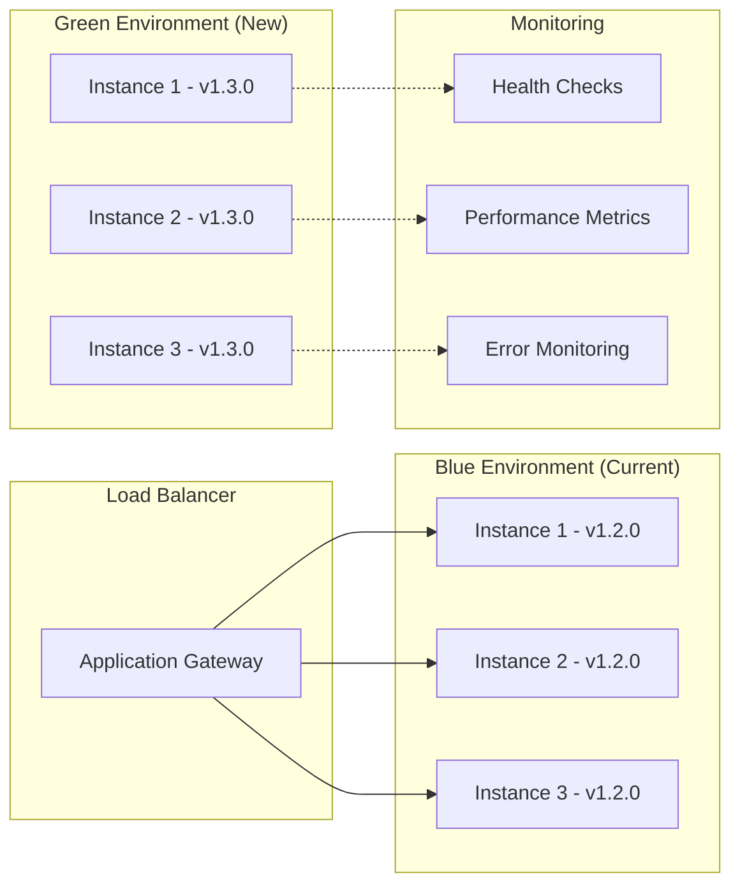

# Delivery & Release Management Overview

**Target Audience**: All Engineers, DevOps Team, Release Managers, Product Teams  
**Last Updated**: 2025-06-10 07:14:00 UTC by @parseen254

## Overview

Comprehensive release management practices covering versioning strategies, release planning, deployment coordination, and delivery orchestration across all technology stacks.

## Quick Navigation

### By Release Type
- [🚀 Feature Releases](release-types/feature-releases.md) - New functionality rollouts
- [🔧 Hotfix Releases](release-types/hotfix-releases.md) - Critical issue resolution
- [📦 Patch Releases](release-types/patch-releases.md) - Bug fixes and minor updates
- [🎯 Major Releases](release-types/major-releases.md) - Breaking changes and major features
- [🔄 Rollback Procedures](release-types/rollbacks.md) - Release reversal strategies

### By Technology Stack
- [🍃 Spring Boot Releases](stacks/spring-boot.md) - Java application release management
- [⚡ ASP.NET Core Releases](stacks/aspnet.md) - .NET service release coordination
- [⚛️ NextJS Releases](stacks/nextjs.md) - Frontend application deployments
- [📱 Flutter Releases](stacks/flutter.md) - Mobile app release management
- [🔄 Laravel Migration Releases](stacks/laravel-migration.md) - Legacy system transition

### By Environment
- [🛠️ Development Releases](environments/development.md) - Continuous integration releases
- [🧪 Staging Releases](environments/staging.md) - Pre-production validation
- [🌟 Production Releases](environments/production.md) - Live environment deployments
- [🔧 Environment Coordination](environments/coordination.md) - Cross-environment management

### By Process Area
- [📋 Release Planning](processes/planning.md) - Release scope and timeline management
- [✅ Release Validation](processes/validation.md) - Testing and quality assurance
- [📊 Release Metrics](processes/metrics.md) - Success measurement and analytics
- [📢 Release Communication](processes/communication.md) - Stakeholder coordination

## Release Management Philosophy

### Release Pipeline Flow



### Release Strategy Principles

1. **Predictable Releases**: Regular, scheduled releases with consistent processes
2. **Risk Mitigation**: Comprehensive testing and gradual rollouts
3. **Fast Recovery**: Quick rollback capabilities and incident response
4. **Stakeholder Communication**: Clear, timely updates to all affected parties
5. **Continuous Improvement**: Regular retrospectives and process optimization
6. **Automated Where Possible**: Reduce manual errors through automation
7. **Quality Over Speed**: Never compromise quality for release deadlines

## Current State Assessment

### Release Management Challenges

| Challenge | Impact | Current State | Target State |
|-----------|--------|---------------|--------------|
| **Inconsistent Release Cadence** | Unpredictable delivery | Ad-hoc releases | Bi-weekly scheduled releases |
| **Manual Release Steps** | Error-prone, slow | 60% manual | 90% automated |
| **Limited Rollback Testing** | High risk deployments | Quarterly testing | Every release tested |
| **Cross-Service Coordination** | Deployment conflicts | Reactive coordination | Proactive orchestration |
| **Release Communication** | Stakeholder confusion | Inconsistent updates | Standardized communication |

### Success Areas
- **CI/CD Foundation**: Basic automated deployment pipelines in place
- **Environment Management**: Clear separation between dev, staging, and production
- **Monitoring Integration**: Good post-deployment health monitoring
- **Team Collaboration**: Strong collaboration within individual teams

## Release Versioning Standards

### Semantic Versioning (SemVer)

All projects must follow semantic versioning: `MAJOR.MINOR.PATCH`

```
Version Format: X.Y.Z

MAJOR (X): Breaking changes, incompatible API changes
MINOR (Y): New features, backward-compatible functionality
PATCH (Z): Bug fixes, backward-compatible patches

Examples:
- 1.0.0 → 1.0.1 (bug fix)
- 1.0.1 → 1.1.0 (new feature)
- 1.1.0 → 2.0.0 (breaking change)
```

### Version Management by Stack

| Stack | Version Pattern | Example | Special Considerations |
|-------|----------------|---------|------------------------|
| **Spring Boot** | `X.Y.Z` | `2.1.3` | Align with Spring Boot major versions |
| **ASP.NET Core** | `X.Y.Z` | `1.4.2` | Follow .NET release schedule |
| **NextJS** | `X.Y.Z` | `3.2.1` | Consider NextJS framework updates |
| **Flutter** | `X.Y.Z+B` | `1.2.0+5` | Build number (B) for app store submissions |

### Pre-Release Versioning

```
Pre-release Identifiers:
- alpha: Early development, major features incomplete
- beta: Feature complete, undergoing testing
- rc (release candidate): Ready for release, final testing

Examples:
- 2.0.0-alpha.1
- 2.0.0-beta.2
- 2.0.0-rc.1
- 2.0.0 (final release)
```

## Release Planning Standards

### Release Schedule

#### Standard Release Cadence
```markdown
# Bi-Weekly Release Schedule

## Sprint Planning (Monday Week 1)
- Define sprint goals and release scope
- Identify dependencies and risks
- Plan cross-team coordination

## Development Phase (Week 1-2)
- Feature development and testing
- Code reviews and quality gates
- Integration testing in staging

## Release Preparation (Friday Week 2)
- Final testing and validation
- Release notes preparation
- Stakeholder communication

## Release Deployment (Monday Week 3)
- Production deployment
- Health monitoring and validation
- Post-release communication

## Release Review (Friday Week 3)
- Metrics collection and analysis
- Stakeholder feedback gathering
- Release retrospective
```

#### Release Planning Template
```markdown
# Release Plan: Version X.Y.Z

## Release Information
- **Target Date**: YYYY-MM-DD
- **Release Type**: Major/Minor/Patch/Hotfix
- **Release Manager**: @username
- **Go/No-Go Decision**: YYYY-MM-DD at HH:MM

## Release Scope
### Features Included
- [ ] Feature 1: Brief description
- [ ] Feature 2: Brief description
- [ ] Feature 3: Brief description

### Bug Fixes
- [ ] Critical Bug #123: Description
- [ ] High Priority Bug #456: Description

### Technical Improvements
- [ ] Performance optimization in payment processing
- [ ] Security update for authentication module

## Dependencies and Risks
### External Dependencies
- [ ] Third-party API update (Provider X)
- [ ] Database migration scripts
- [ ] Infrastructure changes

### Risk Assessment
| Risk | Probability | Impact | Mitigation |
|------|------------|--------|------------|
| API breaking change | Medium | High | Backward compatibility layer |
| Database migration failure | Low | Critical | Rollback scripts ready |

## Team Coordination
### Teams Involved
- **Backend Team**: API changes and database migrations
- **Frontend Team**: UI updates for new features
- **Mobile Team**: App store submission coordination
- **DevOps Team**: Infrastructure and deployment

### Communication Plan
- **Daily Standups**: Progress updates and blocker resolution
- **Weekly Check-ins**: Cross-team coordination and risk review
- **Go/No-Go Meeting**: Final release decision (2 days before)

## Success Criteria
- [ ] All automated tests passing
- [ ] Performance metrics within acceptable range
- [ ] Security scan completed with no critical issues
- [ ] Stakeholder acceptance received
- [ ] Rollback plan tested and ready
```

## Deployment Strategies

### Blue-Green Deployment (Production Standard)



**Deployment Process:**
1. **Preparation**: Deploy new version to Green environment
2. **Validation**: Run health checks and smoke tests on Green
3. **Traffic Shift**: Gradually move traffic from Blue to Green (5%, 25%, 50%, 100%)
4. **Monitoring**: Monitor metrics during each traffic shift phase
5. **Completion**: Once stable, mark Green as active, keep Blue for rollback

### Canary Deployment (For High-Risk Changes)

```yaml
# Canary Deployment Configuration
canary_deployment:
  phases:
    - name: "Initial Canary"
      traffic_percentage: 5
      duration: 30 minutes
      success_criteria:
        - error_rate < 0.1%
        - response_time_p95 < 500ms
        - no_critical_alerts: true
    
    - name: "Expanded Canary"
      traffic_percentage: 25
      duration: 60 minutes
      success_criteria:
        - error_rate < 0.1%
        - response_time_p95 < 500ms
        - user_satisfaction > 4.5
    
    - name: "Full Rollout"
      traffic_percentage: 100
      duration: ongoing
      success_criteria:
        - all_health_checks_pass: true
        - business_metrics_stable: true

  rollback_triggers:
    - error_rate > 1%
    - response_time_p95 > 1000ms
    - critical_alert_fired: true
    - manual_trigger: true
```

## Release Validation Standards

### Pre-Release Testing Checklist

#### Functional Testing
- [ ] **Unit Tests**: 100% passing with >80% coverage
- [ ] **Integration Tests**: All service interactions validated
- [ ] **End-to-End Tests**: Critical user journeys verified
- [ ] **Regression Tests**: Existing functionality unaffected
- [ ] **Cross-Browser Testing**: UI compatibility verified (for frontend)

#### Non-Functional Testing
- [ ] **Performance Testing**: Load testing meets SLA requirements
- [ ] **Security Testing**: Vulnerability scan completed
- [ ] **Accessibility Testing**: WCAG compliance verified (for frontend)
- [ ] **Compatibility Testing**: Backward compatibility maintained
- [ ] **Disaster Recovery**: Rollback procedures tested

#### Business Validation
- [ ] **Feature Acceptance**: Product owner sign-off received
- [ ] **User Acceptance**: Key user workflows validated
- [ ] **Compliance Check**: Regulatory requirements met
- [ ] **Documentation**: Release notes and user docs updated
- [ ] **Training**: Support team trained on new features

### Release Health Monitoring

#### Key Metrics to Monitor Post-Release

| Metric Category | Specific Metrics | Target | Alert Threshold |
|-----------------|------------------|--------|-----------------|
| **Performance** | Response time p95 | <500ms | >1000ms |
| **Reliability** | Error rate | <1% | >5% |
| **Availability** | Uptime | >99.9% | <99.5% |
| **Business** | Conversion rate | Baseline ±5% | >10% deviation |
| **User Experience** | Page load time | <3s | >5s |

#### Monitoring Timeline
```markdown
# Post-Release Monitoring Schedule

## First Hour (Critical Monitoring)
- **Frequency**: Every 5 minutes
- **Focus**: Critical errors, performance degradation
- **Response**: Immediate rollback if thresholds exceeded

## First 24 Hours (Active Monitoring)
- **Frequency**: Every 15 minutes
- **Focus**: User behavior, business metrics
- **Response**: Investigation and mitigation

## First Week (Trend Monitoring)
- **Frequency**: Daily review
- **Focus**: Performance trends, user feedback
- **Response**: Optimization and improvement planning

## Ongoing (Baseline Monitoring)
- **Frequency**: Weekly review
- **Focus**: Long-term impact, success metrics
- **Response**: Strategic adjustments and learning
```

## Release Communication Standards

### Stakeholder Communication Matrix

| Stakeholder Group | Communication Type | Timing | Content Level |
|------------------|-------------------|--------|---------------|
| **Engineering Teams** | Technical details | 1 week before | Detailed technical changes |
| **Product Teams** | Feature summary | 3 days before | Business impact and features |
| **Support Teams** | Change summary | 2 days before | Customer-facing changes |
| **Executive Team** | High-level overview | 1 day before | Business value and risks |
| **End Users** | User-friendly summary | Day of release | New features and improvements |

### Release Communication Templates

#### Pre-Release Announcement
```markdown
# Upcoming Release: Version X.Y.Z - [Release Name]

## 📅 Release Information
- **Deployment Date**: YYYY-MM-DD at HH:MM EAT
- **Expected Duration**: 30 minutes
- **Service Impact**: Minimal (rolling deployment)

## ✨ What's New
### New Features
- **Feature 1**: Brief user-friendly description
- **Feature 2**: Brief user-friendly description

### Improvements
- **Performance**: 25% faster page load times
- **Security**: Enhanced authentication security

### Bug Fixes
- Fixed login issue affecting mobile users
- Resolved payment processing timeout errors

## 🔧 Technical Changes
- Database migration: 15 minutes downtime expected
- API version update: v1.2 → v1.3 (backward compatible)
- Security patches applied

## 📞 Support
- **Questions**: Contact @release-manager
- **Issues**: Report in #support channel
- **Documentation**: Updated user guides available

## 📈 Success Metrics
We'll be monitoring:
- System performance and stability
- User adoption of new features
- Support ticket volume

**Release Manager**: @username  
**Next Update**: Post-deployment summary tomorrow
```

#### Post-Release Summary
```markdown
# Release Completed: Version X.Y.Z - [Release Name]

## ✅ Deployment Status: SUCCESSFUL
- **Completed**: YYYY-MM-DD at HH:MM EAT
- **Duration**: 25 minutes (5 minutes under estimate)
- **Issues**: None reported

## 📊 Initial Metrics (24 hours)
- **System Performance**: All metrics within normal range
- **Error Rate**: 0.1% (below 1% target)
- **User Adoption**: 45% of users accessed new features
- **Support Tickets**: 3 questions, 0 issues

## 🎯 Key Successes
- Zero downtime deployment achieved
- All automated tests passed
- Positive user feedback on new features
- Performance improvements validated

## 📝 Lessons Learned
- Database migration completed faster than expected
- User adoption higher than projected
- Documentation was well-received by support team

## 🔮 Next Steps
- Monitor long-term performance trends
- Gather detailed user feedback
- Plan next sprint based on adoption metrics

**Thank you** to all teams for a successful release! 🎉

**Release Manager**: @username  
**Full Metrics Report**: Available in #metrics-dashboard
```

## Implementation Roadmap

### Phase 1: Process Standardization (Weeks 1-2) ✅ In Progress
- [x] Document release management standards and procedures
- [ ] Standardize versioning across all technology stacks
- [ ] Create release planning templates and checklists
- [ ] Establish release communication protocols
- [ ] Set up release metrics tracking

### Phase 2: Automation Enhancement (Weeks 3-4)
- [ ] Implement automated release validation pipelines
- [ ] Set up blue-green deployment for all production services
- [ ] Create automated rollback mechanisms
- [ ] Implement release health monitoring dashboards
- [ ] Set up automated stakeholder notifications

### Phase 3: Advanced Orchestration (Weeks 5-6)
- [ ] Implement cross-service release coordination
- [ ] Set up canary deployment strategies
- [ ] Create predictive release risk assessment
- [ ] Implement automated release decision making
- [ ] Set up advanced release analytics

### Phase 4: Continuous Optimization (Weeks 7-8)
- [ ] Implement AI-assisted release planning
- [ ] Set up predictive failure detection
- [ ] Create automated performance optimization
- [ ] Implement intelligent release scheduling
- [ ] Establish release excellence recognition

## Success Metrics

### Release Performance Metrics

| Metric | Current | 3-Month Target | 6-Month Target |
|--------|---------|----------------|----------------|
| **Deployment Frequency** | 1x/month | 2x/month | 1x/week |
| **Lead Time for Changes** | 2 weeks | 1 week | 3 days |
| **Mean Time to Recovery** | 2 hours | 30 minutes | 15 minutes |
| **Change Failure Rate** | 15% | 10% | 5% |

### Quality Metrics

| Metric | Current | Target | Impact |
|--------|---------|--------|--------|
| **Release Success Rate** | 85% | 95% | Improved reliability |
| **Rollback Frequency** | 1 in 6 releases | 1 in 20 releases | Reduced risk |
| **Post-Release Issues** | 8 per release | 2 per release | Better quality |
| **Stakeholder Satisfaction** | 3.5/5 | 4.5/5 | Improved communication |

## Getting Started

### For Development Teams
1. **Adopt semantic versioning** for your projects following our standards
2. **Implement release planning** using our templates and checklists
3. **Set up automated testing** pipelines for release validation
4. **Practice deployment procedures** in staging environments
5. **Participate in release retrospectives** for continuous improvement

### For Release Managers
1. **Use standardized release planning** templates and communication protocols
2. **Set up monitoring and metrics** collection for release tracking
3. **Coordinate cross-team dependencies** using our coordination frameworks
4. **Implement rollback procedures** and test them regularly
5. **Facilitate release retrospectives** and process improvements

### For DevOps Engineers
1. **Implement blue-green deployment** strategies for all production services
2. **Set up automated health monitoring** and alerting for releases
3. **Create rollback automation** and test procedures regularly
4. **Configure release pipelines** following our standards
5. **Monitor release metrics** and optimize deployment processes

## Support & Community

### Training & Resources
- **[Release Management Workshop](../../resources/training/release-management/)** - Comprehensive release planning and execution
- **[Deployment Strategy Guide](../../resources/tutorials/deployment-strategies/)** - Blue-green, canary, and rolling deployments
- **[Release Communication Training](../../resources/best