# Feature & Task Management Practices Overview

**Target Audience**: All Engineers, Product Managers, Project Managers  
**Last Updated**: 2025-06-10 07:14:00 UTC by @parseen254

## Overview

Standardized approaches to feature planning, task description, project tracking, and delivery coordination across all technology stacks and teams.

## Quick Navigation

### By Management Area
- [📋 Task Description Standards](task-descriptions.md) - Writing clear, actionable task descriptions
- [🎯 Feature Planning](feature-planning.md) - Breaking down features into manageable tasks
- [📊 Project Tracking](project-tracking.md) - Progress monitoring and reporting
- [🔄 Workflow Management](workflow-management.md) - Kanban, Scrum, and hybrid approaches
- [📈 Delivery Coordination](delivery-coordination.md) - Cross-team coordination and dependencies

### By Technology Stack
- [🍃 Spring Boot Tasks](stacks/spring-boot.md) - Backend API development tasks
- [⚡ ASP.NET Core Tasks](stacks/aspnet.md) - Microservices development tasks
- [⚛️ NextJS Tasks](stacks/nextjs.md) - Frontend development tasks
- [📱 Flutter Tasks](stacks/flutter.md) - Mobile development tasks
- [🔄 Laravel Migration Tasks](stacks/laravel-migration.md) - Legacy system migration tasks

### By Role
- [👨‍💻 Developer Task Management](roles/developers.md) - Daily task workflow and estimation
- [🏗️ Tech Lead Planning](roles/tech-leads.md) - Feature breakdown and team coordination
- [📋 Product Manager Interface](roles/product-managers.md) - Requirements and delivery tracking

## Task Management Philosophy

### Task Lifecycle

```mermaid
graph LR
    subgraph "Planning Phase"
        EPIC[Epic Creation]
        BREAKDOWN[Feature Breakdown]
        ESTIMATION[Task Estimation]
    end
    
    subgraph "Execution Phase"
        BACKLOG[Backlog]
        TODO[To Do]
        PROGRESS[In Progress]
        REVIEW[Code Review]
        TESTING[Testing]
        DONE[Done]
    end
    
    subgraph "Delivery Phase"
        STAGING[Staging Deploy]
        VALIDATION[User Validation]
        PRODUCTION[Production Deploy]
        CLOSED[Closed]
    end
    
    EPIC --> BREAKDOWN
    BREAKDOWN --> ESTIMATION
    ESTIMATION --> BACKLOG
    BACKLOG --> TODO
    TODO --> PROGRESS
    PROGRESS --> REVIEW
    REVIEW --> TESTING
    TESTING --> DONE
    DONE --> STAGING
    STAGING --> VALIDATION
    VALIDATION --> PRODUCTION
    PRODUCTION --> CLOSED
```



### Task Quality Principles

1. **Clear Acceptance Criteria**: Every task has measurable completion criteria
2. **Right-Sized Work**: Tasks are appropriately sized (1-3 days of work)
3. **Independent When Possible**: Tasks can be worked on without blocking dependencies
4. **Valuable**: Each task delivers business or technical value
5. **Traceable**: Tasks link back to features, epics, and business objectives

## Current State Assessment

### Task Management Challenges
- **Inconsistent Descriptions**: Task quality varies significantly between teams
- **Poor Estimation**: 40% of tasks exceed estimated time by >50%
- **Unclear Acceptance Criteria**: 30% of tasks lack clear completion criteria
- **Dependency Management**: Cross-team dependencies not well tracked
- **Limited Visibility**: Difficult to track progress across multiple projects

### Success Areas
- **Active Backlog Management**: Regular grooming and prioritization
- **Good Retrospective Culture**: Teams actively improve their processes
- **Strong Collaboration**: Good communication within individual teams

## Task Description Standards

### Standard Task Template

```markdown
# Task Title: [Action] [Component] [Outcome]
**Example**: Implement User Authentication JWT Token Validation

## Description
Brief description of what needs to be accomplished and why it's needed.

## Acceptance Criteria
- [ ] Specific, measurable outcome 1
- [ ] Specific, measurable outcome 2  
- [ ] Specific, measurable outcome 3

## Technical Details
### Implementation Notes
- Key technical considerations
- Architecture decisions required
- Integration points

### Dependencies
- [ ] Dependency 1: Description and status
- [ ] Dependency 2: Description and status

## Definition of Done
- [ ] Code implementation complete
- [ ] Unit tests written and passing (>80% coverage)
- [ ] Integration tests passing
- [ ] Code reviewed and approved
- [ ] Documentation updated
- [ ] Deployed to staging environment
- [ ] Smoke tests passing

## Estimation
**Story Points**: 5  
**Time Estimate**: 2-3 days  
**Complexity**: Medium

## Labels
`backend`, `authentication`, `security`, `sprint-24`

## Linked Issues
- Epic: #123 - User Authentication System
- Blocks: #456 - User Dashboard Implementation
- Related: #789 - Security Audit Requirements
```

### Task Sizing Guidelines

| Size | Story Points | Time Estimate | Characteristics |
|------|-------------|---------------|-----------------|
| **XS** | 1 | 2-4 hours | Simple bug fix, config change |
| **S** | 2-3 | 0.5-1 day | Small feature, straightforward implementation |
| **M** | 5-8 | 2-3 days | Standard feature with moderate complexity |
| **L** | 13 | 4-5 days | Complex feature requiring research/design |
| **XL** | 21+ | >1 week | Epic-level work, should be broken down |

### Acceptance Criteria Best Practices

#### Good Examples
```markdown
## Acceptance Criteria
- [ ] User can log in with email and password
- [ ] Invalid credentials show error message "Invalid email or password"
- [ ] Successful login redirects to dashboard
- [ ] Login attempt is logged for security monitoring
- [ ] Account locks after 5 failed attempts
- [ ] Locked account shows appropriate message to user
```

#### Poor Examples
```markdown
## Acceptance Criteria
- [ ] Login works ❌ (too vague)
- [ ] Handle errors ❌ (not specific)
- [ ] Make it secure ❌ (not measurable)
```

## Project Tracking Standards

### Sprint Planning Process

#### Sprint Planning Meeting Structure (2 hours for 2-week sprint)
1. **Sprint Goal Definition** (15 minutes)
   - Clear, measurable objective for the sprint
   - Aligns with quarterly and project goals

2. **Backlog Review** (30 minutes)
   - Review and refine top priority items
   - Ensure tasks are properly sized and detailed

3. **Capacity Planning** (15 minutes)
   - Team availability assessment
   - Consider vacation, meetings, support duties

4. **Task Selection** (45 minutes)
   - Select tasks that fit sprint goal and capacity
   - Break down large tasks if needed

5. **Commitment & Questions** (15 minutes)
   - Team commits to sprint backlog
   - Address any remaining questions or concerns

### Progress Tracking Metrics

| Metric | Purpose | Target | Current | Frequency |
|--------|---------|--------|---------|-----------|
| **Sprint Velocity** | Team capacity planning | 40-50 points | 35 points | Per sprint |
| **Sprint Completion Rate** | Predictability | >85% | 78% | Per sprint |
| **Estimation Accuracy** | Planning improvement | <20% variance | 35% variance | Monthly |
| **Cycle Time** | Delivery speed | <5 days | 7.2 days | Weekly |
| **Lead Time** | End-to-end delivery | <10 days | 14.1 days | Weekly |

### Kanban Board Configuration

```markdown
# Standard Board Columns

## 📋 Backlog
- Prioritized tasks ready for future sprints
- Properly sized and described
- Dependencies identified

## 🎯 Selected for Development  
- Tasks committed for current sprint
- All dependencies resolved
- Team member assigned

## 🏗️ In Progress
- Actively being worked on
- WIP limit: 2 tasks per developer
- Regular updates expected

## 👀 Code Review
- Implementation complete
- Pull request created
- Awaiting peer review

## 🧪 Testing
- Code review approved
- Deployed to staging
- QA validation in progress

## ✅ Done
- All acceptance criteria met
- Deployed to production
- Stakeholder acceptance received
```

## Cross-Team Coordination

### Dependency Management

#### Dependency Types and Handling
```markdown
# Dependency Classification

## Hard Dependencies (Blocking)
- Team A cannot proceed without Team B's completion
- **Management**: Explicit coordination, shared timelines
- **Example**: Frontend needs API endpoint before UI implementation

## Soft Dependencies (Preferential)
- Work can proceed but benefits from coordination
- **Management**: Regular communication, flexible timelines
- **Example**: UI design patterns that align with component library

## External Dependencies
- Dependencies on third-party services or vendors
- **Management**: Early identification, risk mitigation
- **Example**: Payment gateway API changes
```

#### Dependency Tracking Template
```markdown
# Cross-Team Dependency: [Description]

## Teams Involved
- **Providing Team**: [Team Name]
- **Consuming Team**: [Team Name]
- **Dependency Owner**: @username

## Dependency Details
- **What's Needed**: Specific deliverable or outcome
- **When Needed**: Target date and flexibility
- **Impact if Delayed**: Business and technical impact

## Coordination Plan
- **Communication Channel**: #shared-project-channel
- **Check-in Frequency**: Weekly/bi-weekly
- **Decision Points**: Key dates for go/no-go decisions

## Status Updates
- [Date]: Current status and any blockers
- [Date]: Progress update and revised timeline
```

## Success Metrics

### Task Quality Metrics

| Metric | Current | 3-Month Target | 6-Month Target |
|--------|---------|----------------|----------------|
| **Task Description Completeness** | 65% | 85% | 95% |
| **Estimation Accuracy** | 65% | 80% | 90% |
| **Sprint Completion Rate** | 78% | 85% | 90% |
| **Cycle Time Consistency** | 35% variance | 20% variance | 15% variance |

### Coordination Metrics

| Metric | Current | Target | Impact |
|--------|---------|--------|--------|
| **Cross-Team Dependency Lead Time** | 2.1 weeks | 1 week | Faster delivery |
| **Blocked Task Percentage** | 12% | 5% | Improved flow |
| **Dependency Prediction Accuracy** | 60% | 85% | Better planning |
| **Inter-Team Communication Quality** | 3.2/5 | 4.5/5 | Smoother coordination |

## Tools and Integration

### Recommended Project Management Stack

| Tool Category | Primary Tool | Integration | Use Case |
|---------------|--------------|-------------|----------|
| **Task Management** | Azure DevOps | Git, CI/CD | Sprint planning, tracking |
| **Documentation** | Confluence | Azure DevOps | Requirements, specifications |
| **Communication** | Teams | Azure DevOps | Daily coordination |
| **Analytics** | Power BI | Azure DevOps API | Progress reporting |

### Azure DevOps Configuration

#### Work Item Templates
```yaml
# Epic Template
epic:
  fields:
    - title: "Epic Title"
    - description: "Business objective and value"
    - acceptance_criteria: "High-level success criteria"
    - business_value: "Quantified business impact"
    - target_date: "Desired completion date"
    - dependencies: "Known external dependencies"

# User Story Template  
user_story:
  fields:
    - title: "Story Title"
    - description: "As a [user], I want [goal] so that [benefit]"
    - acceptance_criteria: "Specific, testable criteria"
    - definition_of_done: "Completion checklist"
    - story_points: "Relative sizing estimate"
    - dependencies: "Blocking or related work items"

# Task Template
task:
  fields:
    - title: "Task Title"
    - description: "Technical implementation details"
    - acceptance_criteria: "Specific deliverables"
    - original_estimate: "Time estimate in hours"
    - activity: "Development/Testing/Documentation"
    - dependencies: "Prerequisites and blockers"
```

## Getting Started

### For Development Teams
1. **Review task description standards** for your technology stack
2. **Adopt the standard task template** for new work items
3. **Practice estimation techniques** in sprint planning
4. **Set up dependency tracking** for cross-team work
5. **Join coordination discussions** in relevant channels

### For Project Managers
1. **Implement standardized planning processes** using our templates
2. **Set up progress tracking metrics** and dashboards
3. **Establish cross-team coordination workflows**
4. **Train teams on new standards** and expectations
5. **Monitor and improve processes** based on feedback

### For Product Managers
1. **Align feature planning** with development capacity
2. **Ensure requirements clarity** using acceptance criteria standards
3. **Participate in dependency planning** across product areas
4. **Track delivery metrics** and business value realization
5. **Provide feedback on process effectiveness**

## Support & Community

### Training & Resources
- **[Task Writing Workshop](../../resources/training/task-management/)** - Effective task description techniques
- **[Estimation Training](../../resources/tutorials/estimation/)** - Improving planning accuracy
- **[Cross-Team Coordination Guide](../../resources/best-practices/coordination.md)** - Managing dependencies
- **[Project Analytics Tutorial](../../resources/analytics/project-metrics.md)** - Using data for better planning

### Communication Channels
- **Teams Channels**:
  - `Anvil Shield Group Tech` - General project coordination
  - `#sprint-planning` - Sprint planning best practices
  - `#cross-team-dependencies` - Dependency coordination
  - `#project-metrics` - Analytics and reporting discussions
- **Office Hours**: Mondays 10-11 AM EAT with Project Management Team
- **Planning Sessions**: Bi-weekly cross-team planning coordination

---

**Next Steps:**
1. Choose your role-specific guide from navigation above
2. Start using standardized task templates for new work
3. Implement dependency tracking for your projects
4. Join cross-team coordination discussions
5. Share feedback on process improvements

**Questions or Feedback?** Contact @parseen254 or post in `Anvil Shield Group Tech` channel