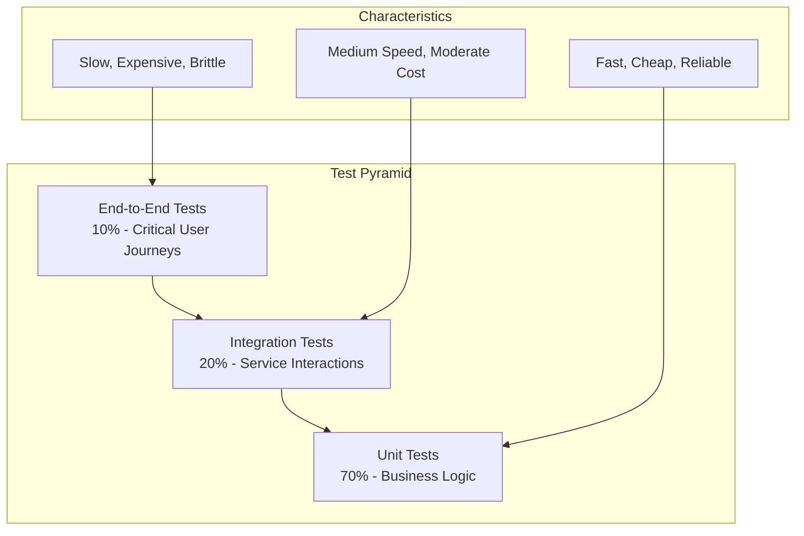

# Testing Practices Overview

**Target Audience**: All Engineers, QA Team, Technical Leads  
**Last Updated**: 2025-06-10 06:54:44 UTC by @parseen254

## Overview

This document establishes comprehensive testing standards across all technology stacks to ensure code quality, system reliability, and confidence in deployments.

## Quick Navigation

### By Technology Stack
- [🍃 Spring Boot Testing](spring-boot.md) - Java testing standards and frameworks
- [⚡ ASP.NET Core Testing](aspnet.md) - C# testing conventions and tools
- [⚛️ NextJS Testing](nextjs.md) - Frontend testing patterns and practices
- [📱 Flutter Testing](flutter.md) - Mobile app testing strategies
- [🔄 Laravel Testing](laravel.md) - Legacy testing and migration prep

### By Test Type
- [🧪 Unit Testing Standards](types/unit-testing.md) - Isolated component testing
- [🔗 Integration Testing](types/integration-testing.md) - Service interaction testing
- [🎭 End-to-End Testing](types/e2e-testing.md) - Full user journey testing
- [⚡ Performance Testing](types/performance-testing.md) - Load and stress testing
- [🔒 Security Testing](types/security-testing.md) - Vulnerability and penetration testing

### By Role
- [👨‍💻 Developer Testing Guide](roles/developers.md) - Daily testing practices
- [🧪 QA Testing Standards](roles/qa-engineers.md) - Quality assurance processes
- [🏗️ DevOps Testing Integration](roles/devops.md) - CI/CD testing automation

## Testing Philosophy

### Test Pyramid Strategy

### Core Principles
1. **Test Early, Test Often** - Shift-left testing approach
2. **Automate Everything Possible** - Reduce manual testing overhead
3. **Tests as Documentation** - Clear behavior specification
4. **Maintainable Test Code** - Same quality standards as production code
5. **Fast Feedback Loops** - Quick test execution for rapid iteration

## Current State Assessment

### Cross-Stack Challenges
- **Inconsistent Coverage**: Test coverage varies from 30-85% across repositories
- **Flaky Tests**: Intermittent failures in CI pipelines causing deployment delays
- **Slow Test Suites**: Some integration tests taking 10+ minutes
- **Limited E2E Coverage**: Critical user journeys not adequately tested
- **Test Data Management**: Inconsistent approaches to test data setup/teardown

### Success Stories
- **Payment Processing**: 95% coverage with comprehensive edge case testing
- **Authentication Services**: Robust security testing with penetration test integration
- **API Gateway**: Strong contract testing between microservices

## Testing Standards Summary

### Coverage Targets by Stack

| Stack | Unit Tests | Integration Tests | E2E Tests | Overall Target |
|-------|------------|-------------------|-----------|----------------|
| Spring Boot | 85% | 70% | Critical paths | 80% |
| ASP.NET Core | 85% | 70% | Critical paths | 80% |
| NextJS | 80% | 60% | Key user flows | 75% |
| Flutter | 80% | 65% | Core features | 75% |
| Laravel (Legacy) | Current state | Maintain existing | Document for migration | N/A |

### Quality Gates

#### CI/CD Requirements
- [ ] **Unit tests pass**: 100% pass rate required
- [ ] **Coverage threshold**: Must meet minimum coverage for stack
- [ ] **Integration tests pass**: Core service interactions validated
- [ ] **Security scans**: No critical vulnerabilities
- [ ] **Performance benchmarks**: Response times within SLA

#### Code Review Requirements
- [ ] **New code coverage**: New features must have 90%+ test coverage
- [ ] **Test quality**: Tests follow naming conventions and best practices
- [ ] **Edge cases covered**: Error conditions and boundary cases tested
- [ ] **Mocking strategy**: Appropriate use of mocks vs real dependencies

## Testing Tools & Frameworks

### Approved Testing Stack

| Category | Spring Boot | ASP.NET Core | NextJS | Flutter |
|----------|-------------|--------------|---------|---------|
| **Unit Testing** | JUnit 5 + Mockito | xUnit + Moq | Jest + Testing Library | flutter_test |
| **Integration** | TestContainers | WebApplicationFactory | Supertest | integration_test |
| **E2E Testing** | Selenium WebDriver | Playwright | Cypress | Patrol |
| **API Testing** | RestAssured | HttpClientFactory | Supertest | http package |
| **Mocking** | Mockito + WireMock | Moq + MockHttp | Jest mocks | mockito |
| **Coverage** | JaCoCo | Coverlet | Istanbul/nyc | Built-in |

### Supporting Tools
- **Test Data**: Docker containers for databases, Testcontainers
- **CI Integration**: Azure DevOps Test Plans, GitHub Actions
- **Reporting**: Allure Reports, Azure Test Results
- **Performance**: JMeter, k6, Artillery

## Implementation Roadmap

### Phase 1: Foundation (Weeks 1-2)
- [ ] Establish testing standards per stack
- [ ] Set up coverage reporting and quality gates
- [ ] Create test templates and examples
- [ ] Configure CI/CD integration

### Phase 2: Coverage Improvement (Weeks 3-6)
- [ ] Audit existing test suites
- [ ] Identify and fill critical coverage gaps
- [ ] Refactor flaky tests for reliability
- [ ] Implement parallel test execution

### Phase 3: Advanced Testing (Weeks 7-8)
- [ ] Implement contract testing between services
- [ ] Set up performance testing baselines
- [ ] Integrate security testing in pipelines
- [ ] Create comprehensive E2E test suites

### Phase 4: Optimization (Weeks 9-12)
- [ ] Optimize test execution speed
- [ ] Implement test result analytics
- [ ] Create test maintenance procedures
- [ ] Train teams on advanced testing practices

## Metrics & Success Criteria

### Key Performance Indicators

| Metric | Current Baseline | 3-Month Target | 6-Month Target |
|--------|------------------|----------------|----------------|
| Overall Test Coverage | 65% | 75% | 80% |
| CI Test Execution Time | 15 min | 10 min | 8 min |
| Test Flakiness Rate | 12% | 5% | 2% |
| Deployment Confidence | 3.2/5 | 4.0/5 | 4.5/5 |
| Bug Escape Rate | 8% | 5% | 3% |

### Quality Metrics
- **Test Reliability**: % of tests that pass consistently
- **Coverage Quality**: % of critical paths covered by tests
- **Test Maintainability**: Time spent on test maintenance vs feature development
- **Developer Satisfaction**: Survey scores on testing experience

## Getting Started

### For New Team Members
1. Review your stack-specific testing guide
2. Set up local testing environment using [setup guides](../tools/testing-setup.md)
3. Run existing test suites to understand current patterns
4. Write your first test following our [templates](../../templates/testing/)

### For Existing Projects
1. Run coverage analysis using stack-specific tools
2. Identify critical paths lacking test coverage
3. Create improvement plan using our [assessment template](../../templates/testing/coverage-assessment.md)
4. Implement tests incrementally, focusing on high-risk areas

### For New Projects
1. Start with test-driven development (TDD) approach
2. Use our [project templates](../../templates/projects/) which include testing setup
3. Aim for 90%+ coverage from day one
4. Set up automated testing in CI/CD pipeline

## Support & Resources

### Training Materials
- [Testing Best Practices Workshop](../../resources/training/testing-workshop.md)
- [Stack-Specific Testing Tutorials](../../resources/tutorials/)
- [Video Library](../../resources/videos/testing/)

### Community Support
- **Slack Channels**: 
  - `#testing-help` - General testing questions
  - `#test-automation` - CI/CD and automation discussions
  - `#qa-engineering` - Quality assurance practices
- **Office Hours**: Thursdays 3-4 PM UTC with Testing Champions
- **Code Reviews**: Request testing-focused reviews using `testing` label

### External Resources
- [Testing Trophy Philosophy](https://kentcdodds.com/blog/the-testing-trophy-and-testing-classifications)
- [Google Testing Blog](https://testing.googleblog.com/)
- [Martin Fowler on Testing](https://martinfowler.com/testing/)

---

**Next Steps:**
1. Choose your technology stack guide from the navigation above
2. Review the testing standards for your role
3. Assess your current project's testing maturity
4. Create an improvement plan and start implementing
5. Join our testing community for support and collaboration

**Questions or Feedback?** Contact @parseen254 or post in #testing-help