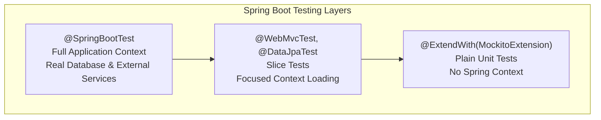

# Spring Boot Testing Standards

**Target Audience**: Java Developers, Spring Boot Engineers  
**Last Updated**: 2025-06-10 06:54:44 UTC by @parseen254

## Overview

Comprehensive testing standards for Spring Boot applications including API Gateway and microservices. This guide covers unit testing, integration testing, and end-to-end testing patterns specific to the Spring ecosystem.

## Testing Architecture

### Spring Boot Test Categories



### Test Types by Purpose

| Test Type | Annotation | Context | Database | External Services | Speed |
|-----------|------------|---------|----------|-------------------|-------|
| **Unit Tests** | `@ExtendWith(MockitoExtension)` | None | Mocked | Mocked | ⚡ Fast |
| **Repository Tests** | `@DataJpaTest` | JPA only | TestContainers/H2 | Mocked | 🔄 Medium |
| **Web Layer Tests** | `@WebMvcTest` | Web only | Mocked | Mocked | 🔄 Medium |
| **Integration Tests** | `@SpringBootTest` | Full | TestContainers | WireMock | 🐌 Slow |
| **E2E Tests** | `@SpringBootTest` | Full | Real/TestContainers | Real/Sandbox | 🐌 Very Slow |

## Unit Testing Standards

### Service Layer Testing

```java
@ExtendWith(MockitoExtension.class)
class PaymentServiceTest {

    @Mock
    private PaymentRepository paymentRepository;
    
    @Mock
    private PaymentGatewayClient paymentGatewayClient;
    
    @Mock
    private NotificationService notificationService;
    
    @InjectMocks
    private PaymentService paymentService;

    @Test
    void processPayment_WithValidPaymentRequest_ShouldReturnSuccessfulResult() {
        // Given
        PaymentRequest request = PaymentRequest.builder()
            .amount(new BigDecimal("99.99"))
            .currency("USD")
            .customerId("cust_123")
            .paymentMethodId("pm_456")
            .build();
            
        Payment savedPayment = Payment.builder()
            .id("pay_789")
            .amount(request.getAmount())
            .status(PaymentStatus.PENDING)
            .build();
            
        PaymentGatewayResponse gatewayResponse = PaymentGatewayResponse.builder()
            .transactionId("txn_abc123")
            .status("SUCCESS")
            .build();

        when(paymentRepository.save(any(Payment.class))).thenReturn(savedPayment);
        when(paymentGatewayClient.processPayment(any())).thenReturn(gatewayResponse);
        doNothing().when(notificationService).sendPaymentConfirmation(any());

        // When
        PaymentResult result = paymentService.processPayment(request);

        // Then
        assertThat(result.isSuccessful()).isTrue();
        assertThat(result.getTransactionId()).isEqualTo("txn_abc123");
        assertThat(result.getPaymentId()).isEqualTo("pay_789");
        
        verify(paymentRepository).save(argThat(payment -> 
            payment.getAmount().equals(request.getAmount()) &&
            payment.getStatus() == PaymentStatus.PENDING
        ));
        verify(paymentGatewayClient).processPayment(argThat(gatewayRequest ->
            gatewayRequest.getAmount().equals(request.getAmount())
        ));
        verify(notificationService).sendPaymentConfirmation(argThat(notification ->
            notification.getCustomerId().equals(request.getCustomerId())
        ));
    }

    @Test
    void processPayment_WithInsufficientFunds_ShouldThrowPaymentDeclinedException() {
        // Given
        PaymentRequest request = PaymentRequest.builder()
            .amount(new BigDecimal("1000.00"))
            .currency("USD")
            .customerId("cust_123")
            .paymentMethodId("pm_456")
            .build();

        when(paymentRepository.save(any(Payment.class))).thenReturn(
            Payment.builder().id("pay_789").status(PaymentStatus.PENDING).build()
        );
        when(paymentGatewayClient.processPayment(any()))
            .thenThrow(new PaymentGatewayException("INSUFFICIENT_FUNDS", "Insufficient funds"));

        // When & Then
        PaymentDeclinedException exception = assertThrows(PaymentDeclinedException.class, () -> {
            paymentService.processPayment(request);
        });

        assertThat(exception.getDeclineReason()).isEqualTo("INSUFFICIENT_FUNDS");
        
        // Verify payment status was updated to FAILED
        verify(paymentRepository, times(2)).save(argThat(payment ->
            payment.getStatus() == PaymentStatus.FAILED
        ));
        
        // Verify no success notification was sent
        verify(notificationService, never()).sendPaymentConfirmation(any());
    }

    @ParameterizedTest
    @ValueSource(strings = {"", "   ", "invalid-customer"})
    void processPayment_WithInvalidCustomerId_ShouldThrowValidationException(String customerId) {
        // Given
        PaymentRequest request = PaymentRequest.builder()
            .amount(new BigDecimal("99.99"))
            .currency("USD")
            .customerId(customerId)
            .paymentMethodId("pm_456")
            .build();

        // When & Then
        assertThrows(ValidationException.class, () -> {
            paymentService.processPayment(request);
        });

        verify(paymentRepository, never()).save(any());
        verify(paymentGatewayClient, never()).processPayment(any());
    }
}
```

### Utility Class Testing

```java
class PaymentUtilsTest {

    @Test
    void calculateFee_WithStandardPayment_ShouldReturnCorrectFee() {
        // Given
        BigDecimal amount = new BigDecimal("100.00");
        PaymentMethod method = PaymentMethod.CREDIT_CARD;

        // When
        BigDecimal fee = PaymentUtils.calculateFee(amount, method);

        // Then
        assertThat(fee).isEqualByComparingTo("2.90"); // 2.9% for credit cards
    }

    @ParameterizedTest
    @CsvSource({
        "100.00, CREDIT_CARD, 2.90",
        "100.00, DEBIT_CARD, 1.50", 
        "100.00, BANK_TRANSFER, 0.50",
        "100.00, DIGITAL_WALLET, 2.40"
    })
    void calculateFee_WithDifferentPaymentMethods_ShouldReturnCorrectFees(
            String amount, PaymentMethod method, String expectedFee) {
        
        BigDecimal result = PaymentUtils.calculateFee(new BigDecimal(amount), method);
        
        assertThat(result).isEqualByComparingTo(expectedFee);
    }
}
```

## Integration Testing Standards

### Repository Testing with TestContainers

```java
@DataJpaTest
@Testcontainers
class PaymentRepositoryTest {

    @Container
    static PostgreSQLContainer<?> postgres = new PostgreSQLContainer<>("postgres:15-alpine")
            .withDatabaseName("payment_test")
            .withUsername("test")
            .withPassword("test");

    @DynamicPropertySource
    static void configureProperties(DynamicPropertyRegistry registry) {
        registry.add("spring.datasource.url", postgres::getJdbcUrl);
        registry.add("spring.datasource.username", postgres::getUsername);
        registry.add("spring.datasource.password", postgres::getPassword);
    }

    @Autowired
    private TestEntityManager entityManager;

    @Autowired
    private PaymentRepository paymentRepository;

    @Test
    void findByCustomerIdAndStatus_WithExistingPayments_ShouldReturnFilteredResults() {
        // Given
        String customerId = "cust_123";
        
        Payment successfulPayment = Payment.builder()
            .customerId(customerId)
            .amount(new BigDecimal("99.99"))
            .status(PaymentStatus.SUCCESS)
            .createdAt(Instant.now().minus(1, ChronoUnit.DAYS))
            .build();
            
        Payment failedPayment = Payment.builder()
            .customerId(customerId)
            .amount(new BigDecimal("50.00"))
            .status(PaymentStatus.FAILED)
            .createdAt(Instant.now().minus(2, ChronoUnit.DAYS))
            .build();
            
        Payment otherCustomerPayment = Payment.builder()
            .customerId("cust_456")
            .amount(new BigDecimal("25.00"))
            .status(PaymentStatus.SUCCESS)
            .createdAt(Instant.now().minus(3, ChronoUnit.DAYS))
            .build();

        entityManager.persistAndFlush(successfulPayment);
        entityManager.persistAndFlush(failedPayment);
        entityManager.persistAndFlush(otherCustomerPayment);
        entityManager.clear();

        // When
        List<Payment> successfulPayments = paymentRepository
            .findByCustomerIdAndStatus(customerId, PaymentStatus.SUCCESS);

        // Then
        assertThat(successfulPayments).hasSize(1);
        assertThat(successfulPayments.get(0).getCustomerId()).isEqualTo(customerId);
        assertThat(successfulPayments.get(0).getStatus()).isEqualTo(PaymentStatus.SUCCESS);
        assertThat(successfulPayments.get(0).getAmount()).isEqualByComparingTo("99.99");
    }

    @Test
    void findPaymentsSummaryByDateRange_WithValidRange_ShouldReturnAggregatedData() {
        // Given
        LocalDate startDate = LocalDate.now().minusDays(7);
        LocalDate endDate = LocalDate.now();
        
        // Create test data spanning the date range
        createPaymentOnDate(startDate, "100.00", PaymentStatus.SUCCESS);
        createPaymentOnDate(startDate.plusDays(1), "50.00", PaymentStatus.SUCCESS);
        createPaymentOnDate(startDate.plusDays(2), "75.00", PaymentStatus.FAILED);
        createPaymentOnDate(endDate.plusDays(1), "200.00", PaymentStatus.SUCCESS); // Outside range

        entityManager.flush();
        entityManager.clear();

        // When
        PaymentSummary summary = paymentRepository.findPaymentsSummaryByDateRange(startDate, endDate);

        // Then
        assertThat(summary.getTotalAmount()).isEqualByComparingTo("225.00"); // 100 + 50 + 75
        assertThat(summary.getSuccessfulAmount()).isEqualByComparingTo("150.00"); // 100 + 50
        assertThat(summary.getFailedAmount()).isEqualByComparingTo("75.00");
        assertThat(summary.getTotalCount()).isEqualTo(3);
        assertThat(summary.getSuccessRate()).isEqualTo(66.67); // 2/3 * 100
    }

    private void createPaymentOnDate(LocalDate date, String amount, PaymentStatus status) {
        Payment payment = Payment.builder()
            .customerId("cust_test")
            .amount(new BigDecimal(amount))
            .status(status)
            .createdAt(date.atStartOfDay().toInstant(ZoneOffset.UTC))
            .build();
        entityManager.persist(payment);
    }
}
```

### Web Layer Testing

```java
@WebMvcTest(PaymentController.class)
class PaymentControllerTest {

    @Autowired
    private MockMvc mockMvc;

    @MockBean
    private PaymentService paymentService;

    @Autowired
    private ObjectMapper objectMapper;

    @Test
    void createPayment_WithValidRequest_ShouldReturnCreatedPayment() throws Exception {
        // Given
        PaymentRequest request = PaymentRequest.builder()
            .amount(new BigDecimal("99.99"))
            .currency("USD")
            .customerId("cust_123")
            .paymentMethodId("pm_456")
            .build();

        PaymentResult expectedResult = PaymentResult.builder()
            .paymentId("pay_789")
            .transactionId("txn_abc123")
            .status(PaymentStatus.SUCCESS)
            .amount(request.getAmount())
            .successful(true)
            .build();

        when(paymentService.processPayment(any(PaymentRequest.class)))
            .thenReturn(expectedResult);

        // When & Then
        mockMvc.perform(post("/api/v1/payments")
                .contentType(MediaType.APPLICATION_JSON)
                .content(objectMapper.writeValueAsString(request))
                .header("Authorization", "Bearer valid-jwt-token"))
                .andExpect(status().isCreated())
                .andExpect(jsonPath("$.paymentId").value("pay_789"))
                .andExpect(jsonPath("$.transactionId").value("txn_abc123"))
                .andExpect(jsonPath("$.status").value("SUCCESS"))
                .andExpect(jsonPath("$.amount").value(99.99))
                .andExpect(jsonPath("$.successful").value(true))
                .andExpect(header().exists("Location"));

        verify(paymentService).processPayment(argThat(req ->
            req.getAmount().equals(request.getAmount()) &&
            req.getCustomerId().equals(request.getCustomerId())
        ));
    }

    @Test
    void createPayment_WithInvalidRequest_ShouldReturnBadRequest() throws Exception {
        // Given
        PaymentRequest invalidRequest = PaymentRequest.builder()
            .amount(new BigDecimal("-10.00")) // Invalid negative amount
            .currency("") // Empty currency
            .customerId(null) // Null customer ID
            .build();

        // When & Then
        mockMvc.perform(post("/api/v1/payments")
                .contentType(MediaType.APPLICATION_JSON)
                .content(objectMapper.writeValueAsString(invalidRequest))
                .header("Authorization", "Bearer valid-jwt-token"))
                .andExpect(status().isBadRequest())
                .andExpect(jsonPath("$.errors").isArray())
                .andExpect(jsonPath("$.errors[*].field").value(
                    containsInAnyOrder("amount", "currency", "customerId")))
                .andExpect(jsonPath("$.errors[*].message").exists());

        verify(paymentService, never()).processPayment(any());
    }

    @Test
    void getPayment_WithExistingPaymentId_ShouldReturnPayment() throws Exception {
        // Given
        String paymentId = "pay_789";
        Payment existingPayment = Payment.builder()
            .id(paymentId)
            .customerId("cust_123")
            .amount(new BigDecimal("99.99"))
            .status(PaymentStatus.SUCCESS)
            .createdAt(Instant.now())
            .build();

        when(paymentService.getPayment(paymentId)).thenReturn(existingPayment);

        // When & Then
        mockMvc.perform(get("/api/v1/payments/{paymentId}", paymentId)
                .header("Authorization", "Bearer valid-jwt-token"))
                .andExpect(status().isOk())
                .andExpect(jsonPath("$.id").value(paymentId))
                .andExpect(jsonPath("$.customerId").value("cust_123"))
                .andExpect(jsonPath("$.amount").value(99.99))
                .andExpect(jsonPath("$.status").value("SUCCESS"));
    }

    @Test
    void getPayment_WithNonExistentPaymentId_ShouldReturnNotFound() throws Exception {
        // Given
        String paymentId = "pay_nonexistent";
        when(paymentService.getPayment(paymentId))
            .thenThrow(new PaymentNotFoundException("Payment not found: " + paymentId));

        // When & Then
        mockMvc.perform(get("/api/v1/payments/{paymentId}", paymentId)
                .header("Authorization", "Bearer valid-jwt-token"))
                .andExpect(status().isNotFound())
                .andExpected(jsonPath("$.error").value("Payment not found: " + paymentId));
    }

    @Test
    void createPayment_WithoutAuthentication_ShouldReturnUnauthorized() throws Exception {
        // Given
        PaymentRequest request = PaymentRequest.builder()
            .amount(new BigDecimal("99.99"))
            .currency("USD")
            .customerId("cust_123")
            .paymentMethodId("pm_456")
            .build();

        // When & Then
        mockMvc.perform(post("/api/v1/payments")
                .contentType(MediaType.APPLICATION_JSON)
                .content(objectMapper.writeValueAsString(request)))
                .andExpect(status().isUnauthorized());

        verify(paymentService, never()).processPayment(any());
    }
}
```

## Full Integration Testing

### Complete Application Context Testing

```java
@SpringBootTest(webEnvironment = SpringBootTest.WebEnvironment.RANDOM_PORT)
@Testcontainers
@DirtiesContext
class PaymentIntegrationTest {

    @Container
    static PostgreSQLContainer<?> postgres = new PostgreSQLContainer<>("postgres:15-alpine")
            .withDatabaseName("payment_integration")
            .withUsername("test")
            .withPassword("test");

    @Container
    static WireMockContainer wireMock = new WireMockContainer("wiremock/wiremock:2.35.0")
            .withMappingFromResource("payment-gateway-stubs.json");

    @DynamicPropertySource
    static void configureProperties(DynamicPropertyRegistry registry) {
        registry.add("spring.datasource.url", postgres::getJdbcUrl);
        registry.add("spring.datasource.username", postgres::getUsername);
        registry.add("spring.datasource.password", postgres::getPassword);
        registry.add("payment.gateway.base-url", wireMock::getBaseUrl);
    }

    @Autowired
    private TestRestTemplate restTemplate;

    @Autowired
    private PaymentRepository paymentRepository;

    @Test
    void createPayment_EndToEndFlow_ShouldProcessSuccessfully() {
        // Given
        PaymentRequest request = PaymentRequest.builder()
            .amount(new BigDecimal("99.99"))
            .currency("USD")
            .customerId("cust_integration_test")
            .paymentMethodId("pm_test_card")
            .build();

        HttpHeaders headers = new HttpHeaders();
        headers.setBearerAuth(generateValidJwtToken());
        HttpEntity<PaymentRequest> entity = new HttpEntity<>(request, headers);

        // When
        ResponseEntity<PaymentResult> response = restTemplate.postForEntity(
            "/api/v1/payments", entity, PaymentResult.class);

        // Then
        assertThat(response.getStatusCode()).isEqualTo(HttpStatus.CREATED);
        assertThat(response.getBody()).isNotNull();
        assertThat(response.getBody().isSuccessful()).isTrue();
        assertThat(response.getBody().getAmount()).isEqualByComparingTo("99.99");

        // Verify database persistence
        Optional<Payment> savedPayment = paymentRepository.findById(response.getBody().getPaymentId());
        assertThat(savedPayment).isPresent();
        assertThat(savedPayment.get().getStatus()).isEqualTo(PaymentStatus.SUCCESS);
        assertThat(savedPayment.get().getCustomerId()).isEqualTo("cust_integration_test");

        // Verify external service interaction via WireMock
        wireMock.verify(postRequestedFor(urlEqualTo("/api/process-payment"))
            .withRequestBody(containing("cust_integration_test"))
            .withHeader("Content-Type", equalTo("application/json")));
    }

    @Test
    void createPayment_WithPaymentGatewayFailure_ShouldHandleGracefully() {
        // Given - Configure WireMock to return failure
        wireMock.stubFor(post(urlEqualTo("/api/process-payment"))
            .willReturn(aResponse()
                .withStatus(400)
                .withHeader("Content-Type", "application/json")
                .withBody("{\"error\":\"CARD_DECLINED\",\"message\":\"Card was declined\"}")));

        PaymentRequest request = PaymentRequest.builder()
            .amount(new BigDecimal("99.99"))
            .currency("USD")
            .customerId("cust_declined_test")
            .paymentMethodId("pm_declined_card")
            .build();

        HttpHeaders headers = new HttpHeaders();
        headers.setBearerAuth(generateValidJwtToken());
        HttpEntity<PaymentRequest> entity = new HttpEntity<>(request, headers);

        // When
        ResponseEntity<ErrorResponse> response = restTemplate.postForEntity(
            "/api/v1/payments", entity, ErrorResponse.class);

        // Then
        assertThat(response.getStatusCode()).isEqualTo(HttpStatus.BAD_REQUEST);
        assertThat(response.getBody().getError()).contains("CARD_DECLINED");

        // Verify payment was saved with FAILED status
        List<Payment> failedPayments = paymentRepository.findByCustomerIdAndStatus(
            "cust_declined_test", PaymentStatus.FAILED);
        assertThat(failedPayments).hasSize(1);
        assertThat(failedPayments.get(0).getFailureReason()).isEqualTo("CARD_DECLINED");
    }

    private String generateValidJwtToken() {
        // Implementation depends on your JWT configuration
        return "eyJhbGciOiJIUzI1NiIsInR5cCI6IkpXVCJ9..."; // Mock JWT for testing
    }
}
```

## Testing Best Practices

### Test Data Management

```java
@TestConfiguration
public class TestDataConfiguration {

    @Bean
    @Primary
    public Clock testClock() {
        // Fixed clock for consistent test results
        return Clock.fixed(Instant.parse("2025-06-10T06:54:44Z"), ZoneOffset.UTC);
    }

    @TestComponent
    public static class PaymentTestDataBuilder {
        
        public static Payment.PaymentBuilder standardPayment() {
            return Payment.builder()
                .customerId("cust_test")
                .amount(new BigDecimal("99.99"))
                .currency("USD")
                .status(PaymentStatus.PENDING)
                .createdAt(Instant.now());
        }
        
        public static PaymentRequest.PaymentRequestBuilder standardPaymentRequest() {
            return PaymentRequest.builder()
                .customerId("cust_test")
                .amount(new BigDecimal("99.99"))
                .currency("USD")
                .paymentMethodId("pm_test");
        }
    }
}
```

### Custom Test Annotations

```java
@Target(ElementType.TYPE)
@Retention(RetentionPolicy.RUNTIME)
@SpringBootTest(webEnvironment = SpringBootTest.WebEnvironment.RANDOM_PORT)
@Testcontainers
@DirtiesContext
public @interface PaymentIntegrationTest {
}

@Target(ElementType.TYPE)
@Retention(RetentionPolicy.RUNTIME)
@WebMvcTest
@Import(SecurityTestConfiguration.class)
public @interface PaymentControllerTest {
    Class<?>[] controllers() default {};
}
```

## Performance Testing

```java
@SpringBootTest
@DirtiesContext
class PaymentPerformanceTest {

    @Autowired
    private PaymentService paymentService;

    @Test
    @Timeout(value = 5, unit = TimeUnit.SECONDS)
    void processPayment_ShouldCompleteWithinSLA() {
        // Given
        PaymentRequest request = PaymentTestDataBuilder.standardPaymentRequest().build();
        
        // When
        long startTime = System.currentTimeMillis();
        PaymentResult result = paymentService.processPayment(request);
        long duration = System.currentTimeMillis() - startTime;
        
        // Then
        assertThat(result.isSuccessful()).isTrue();
        assertThat(duration).isLessThan(2000); // Should complete within 2 seconds
    }

    @Test
    void processMultiplePayments_ShouldMaintainPerformance() {
        // Given
        int numberOfPayments = 100;
        List<PaymentRequest> requests = IntStream.range(0, numberOfPayments)
            .mapToObj(i -> PaymentTestDataBuilder.standardPaymentRequest()
                .customerId("cust_perf_" + i)
                .build())
            .collect(Collectors.toList());

        // When
        long startTime = System.currentTimeMillis();
        List<PaymentResult> results = requests.parallelStream()
            .map(paymentService::processPayment)
            .collect(Collectors.toList());
        long duration = System.currentTimeMillis() - startTime;

        // Then
        assertThat(results).hasSize(numberOfPayments);
        assertThat(results.stream().allMatch(PaymentResult::isSuccessful)).isTrue();
        assertThat(duration).isLessThan(30000); // Should complete within 30 seconds
        
        // Performance assertion: average processing time
        double averageTime = (double) duration / numberOfPayments;
        assertThat(averageTime).isLessThan(300); // Less than 300ms per payment on average
    }
}
```

## Continuous Integration Integration

### Maven Configuration

```xml
<plugin>
    <groupId>org.springframework.boot</groupId>
    <artifactId>spring-boot-maven-plugin</artifactId>
</plugin>

<plugin>
    <groupId>org.apache.maven.plugins</groupId>
    <artifactId>maven-surefire-plugin</artifactId>
    <version>3.0.0</version>
    <configuration>
        <includes>
            <include>**/*Test.java</include>
        </includes>
        <excludedGroups>integration,e2e</excludedGroups>
    </configuration>
</plugin>

<plugin>
    <groupId>org.apache.maven.plugins</groupId>
    <artifactId>maven-failsafe-plugin</artifactId>
    <version>3.0.0</version>
    <configuration>
        <includes>
            <include>**/*IntegrationTest.java</include>
            <include>**/*IT.java</include>
        </includes>
        <groups>integration</groups>
    </configuration>
</plugin>

<plugin>
    <groupId>org.jacoco</groupId>
    <artifactId>jacoco-maven-plugin</artifactId>
    <version>0.8.8</version>
    <executions>
        <execution>
            <goals>
                <goal>prepare-agent</goal>
            </goals>
        </execution>
        <execution>
            <id>report</id>
            <phase>test</phase>
            <goals>
                <goal>report</goal>
            </goals>
        </execution>
        <execution>
            <id>check</id>
            <goals>
                <goal>check</goal>
            </goals>
            <configuration>
                <rules>
                    <rule>
                        <element>BUNDLE</element>
                        <limits>
                            <limit>
                                <counter>LINE</counter>
                                <value>COVEREDRATIO</value>
                                <minimum>0.80</minimum>
                            </limit>
                        </limits>
                    </rule>
                </rules>
            </configuration>
        </execution>
    </executions>
</plugin>
```

---

**Next Steps:**
1. Review [ASP.NET Core Testing](aspnet.md) for C# microservices
2. Check out [Integration Testing Types](types/integration-testing.md) for cross-service testing
3. Set up your testing environment using our [Spring Boot setup guide](../../tools/testing-setup/spring-boot.md)
4. Join #spring-boot-testing for community support

**Questions?** Contact @parseen254 or post in #testing-help