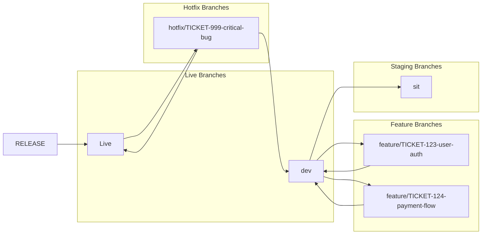

# Version Control & Git Practices Overview

**Target Audience**: All Developers  
**Last Updated**: 2025-06-10 by @parseen254  
**Review Cycle**: Quarterly

## Quick Navigation

### By Topic
- [Git Workflow](#git-workflow) - Branching strategy and daily workflow
- [Commit Standards](#commit-standards) - Message format and conventions
- [Pull Request Process](#pull-request-process) - Review and merge procedures
- [Tools & Automation](#tools--automation) - Git hooks and helpers

### By Role
- **Developers**: Commit standards, branching, PR creation
- **Tech Leads**: Review process, branch protection, quality gates
- **DevOps**: Automation, hooks, CI/CD integration

### Quick Start
- [Git Setup Guide](git-setup.md) - Initial configuration
- [Daily Workflow](git-workflow.md) - Common Git operations
- [Troubleshooting](git-troubleshooting.md) - Common issues and solutions

## Overview

This guide establishes consistent version control practices across all engineering teams, focusing on clear commit history, efficient collaboration, and automated quality checks.

## Current State Assessment

### Pain Points (Team Feedback)
- Inconsistent commit messages across teams
- Merge conflicts from long-running branches  
- PR reviews taking 2+ days
- Unclear commit history

### What's Working
- Feature branch workflow
- Required code reviews
- CI/CD integration

### Success Metrics
| Metric | Current | Target | Status |
|--------|---------|---------|---------|
| Commit Message Compliance | 40% | 95% | 🔴 Needs Improvement |
| PR Review Time | ~2 days | <1 day | 🔴 Needs Improvement |
| Branch Protection Coverage | 0% | 100% | 🟡 In Progress |

## Git Workflow

### Branching Strategy (GitFlow)



### Branch Naming Convention
```
feature/TICKET-123-short-description    # New features
bugfix/TICKET-456-fix-description       # Bug fixes
hotfix/TICKET-789-critical-issue        # Critical production fixes
support/maintenance-task                # Maintenance work
```

**Examples:**
- `feature/AUTH-101-add-jwt-validation`
- `bugfix/PAY-205-fix-payment-timeout`
- `hotfix/SEC-999-patch-security-vulnerability`

### Daily Workflow
```bash
# 1. Start your day - sync with latest changes
git checkout dev
git pull origin dev

# 2. Create feature branch
git checkout -b feature/TICKET-123-add-user-validation

# 3. Work on your changes
# ... make code changes ...

# 4. Commit frequently with good messages
git add .
git commit -m "feat(auth): add email validation for user registration"

# 5. Push branch for backup/collaboration
git push origin feature/TICKET-123-add-user-validation

# 6. End of day or feature complete - create PR
# Use GitHub/Azure DevOps interface with appropriate template from [PR Templates](../../templates/pull-requests) directory of this wiki repository
```

## Commit Standards

### Conventional Commits Format
```
<type>(<scope>): <description>

[optional body]

[optional footer(s)]
```

### Commit Types
| Type | Description | Example |
|------|-------------|---------|
| `feat` | New feature | `feat(auth): add OAuth2 login` |
| `fix` | Bug fix | `fix(payment): resolve timeout issue` |
| `docs` | Documentation | `docs(api): update authentication guide` |
| `style` | Code style/formatting | `style: fix indentation in user service` |
| `refactor` | Code refactoring | `refactor(db): optimize user queries` |
| `test` | Adding/updating tests | `test(auth): add unit tests for validation` |
| `chore` | Build/admin tasks | `chore: update dependencies` |
| `perf` | Performance improvements | `perf(api): optimize response caching` |

### Scope Guidelines
- **auth**: Authentication and authorization
- **api**: API endpoints and contracts
- **ui**: User interface components
- **db**: Database related changes
- **config**: Configuration changes
- **deploy**: Deployment related changes

### Good Commit Examples
```bash
# Feature addition
git commit -m "feat(auth): implement JWT token refresh mechanism

- Add token refresh endpoint
- Implement automatic token renewal
- Add tests for token expiration scenarios

Closes #AUTH-123"

# Bug fix
git commit -m "fix(payment): resolve race condition in payment processing

The payment processor was experiencing race conditions when multiple
requests were made simultaneously. Added proper locking mechanism
to ensure atomic operations.

Fixes #PAY-456"

# Documentation
git commit -m "docs(README): add setup instructions for development environment"
```

### Commit Message Rules
1. **Use imperative mood**: "Add feature" not "Added feature"
2. **Capitalize first letter**: "Fix bug" not "fix bug"
3. **No trailing period**: "Add feature" not "Add feature."
4. **Keep subject under 50 characters**
5. **Separate subject and body with blank line**
6. **Wrap body at 72 characters**
7. **Include ticket/issue references**

## Pull Request Process

### PR Creation Checklist
- [ ] Use appropriate PR template for change type
- [ ] Link to relevant ticket/issue
- [ ] Add meaningful title and description
- [ ] Assign appropriate reviewers (minimum 1)
- [ ] Add relevant labels
- [ ] Ensure CI checks pass
- [ ] Self-review completed

### PR Templates
Choose the appropriate template based on your change:
- [General PR Template](../../templates/pull-requests/general-pr.md)
- [Feature PR Template](../../templates/pull-requests/feature-pr.md)
- [Bug Fix PR Template](../../templates/pull-requests/bugfix-pr.md)
- [Hotfix PR Template](../../templates/pull-requests/hotfix-pr.md)

### Review Requirements
| Branch | Reviewers | Approvals | Additional Checks |
|--------|-----------|-----------|-------------------|
| `dev` | Team members | 0 | CI passing |
| `sit` | Senior developers | 1 | CI + manual testing |
| `live` | Tech lead + QA | 2 | Full test suite |

### Review Guidelines
**For Reviewers:**
- Review within 4 hours (same day for hotfixes)
- Focus on functionality, security, performance
- Check for code style and standards compliance
- Verify tests are adequate
- Provide constructive feedback

**For Authors:**
- Respond to feedback promptly
- Ask for clarification if needed
- Update code based on feedback
- Re-request review after changes

### Merge Strategy
- **Feature branches → dev**: Rebase and merge
- **dev → sit**: Rebase and merge
- **sit → live**: Merge Commit
- **Hotfix branches → live**: Merge Commit

## Tools & Automation

### Git Configuration
```bash
# Set up user information
git config --global user.name "Your Name"
git config --global user.email "your.email@company.com"

# Set up commit template
git config --global commit.template ~/.gitmessage

# Set up default editor
git config --global core.editor "code --wait"

# Set up merge tool
git config --global merge.tool vscode
```

### Commit Message Template
Create `~/.gitmessage`:
```
# <type>(<scope>): <subject>
#
# <body>
#
# <footer>

# Types: feat, fix, docs, style, refactor, test, chore, perf
# Scope: auth, api, ui, db, config, deploy, etc.
# Subject: imperative, present tense, no period, max 50 chars
# Body: explain what and why, wrap at 72 chars
# Footer: reference issues, breaking changes
```

### Git Hooks

#### Pre-commit Hook
```bash
#!/bin/sh
# .git/hooks/pre-commit

echo "Running pre-commit checks..."

# Run linting
npm run lint
if [ $? -ne 0 ]; then
  echo "❌ Linting failed. Please fix errors before committing."
  exit 1
fi

# Run unit tests
npm run test:unit
if [ $? -ne 0 ]; then
  echo "❌ Unit tests failed. Please fix tests before committing."
  exit 1
fi

echo "✅ Pre-commit checks passed!"
```

#### Commit Message Hook
```bash
#!/bin/sh
# .git/hooks/commit-msg

commit_regex='^(feat|fix|docs|style|refactor|test|chore|perf)(\(.+\))?: .{1,50}'

if ! grep -qE "$commit_regex" "$1"; then
  echo "❌ Invalid commit message format!"
  echo "Format: <type>(<scope>): <description>"
  echo "Types: feat, fix, docs, style, refactor, test, chore, perf"
  exit 1
fi
```

### Automated Tools

#### Commitizen (Node.js projects)
https://commitizen-tools.github.io/commitizen/
```bash
# Install commitizen
npm install -g commitizen cz-conventional-changelog

# Configure
echo '{ "path": "cz-conventional-changelog" }' > ~/.czrc

# Use instead of git commit
git cz
```

#### Husky (Git hooks made easy)
```bash
# Install husky
npm install --save-dev husky

# Add to package.json
{
  "husky": {
    "hooks": {
      "pre-commit": "npm run lint && npm run test:unit",
      "commit-msg": "commitlint -E HUSKY_GIT_PARAMS"
    }
  }
}
```

## Branch Protection Rules

### Repository Settings
**For `live` branch:**
- [ ] Require pull request reviews before merging
- [ ] Require status checks to pass before merging
- [ ] Require branches to be up to date before merging
- [ ] Require signed commits
- [ ] Include administrators in restrictions
- [ ] Allow force pushes: ❌
- [ ] Allow deletions: ❌

**For `sit` branch:**
- [ ] Require pull request reviews before merging
- [ ] Require status checks to pass before merging
- [ ] Include administrators in restrictions
- [ ] Allow force pushes: ❌

### Required Status Checks
- [ ] CI/Build pipeline
- [ ] Unit tests
- [ ] Code quality scan
- [ ] Security scan
- [ ] Integration tests (for live branch)

## Troubleshooting Common Issues

### Merge Conflicts
```bash
# When merge conflicts occur
git status  # See conflicted files
git diff    # See conflict details

# Edit files to resolve conflicts
# Remove conflict markers: <<<<<<<, =======, >>>>>>>

# Mark as resolved and continue
git add .
git commit -m "resolve merge conflicts"
```

### Large File Handling
```bash
# Use Git LFS for large files
git lfs install
git lfs track "*.zip"
git lfs track "*.jar"
git add .gitattributes
git commit -m "chore: add Git LFS tracking"
```

### Rewriting History (Use Carefully)
```bash
# Interactive rebase to clean up commits
git rebase -i HEAD~3

# Amend last commit message
git commit --amend -m "fix(auth): correct typo in validation message"

# Reset to previous commit (soft reset)
git reset --soft HEAD~1
```

## Related Documentation

- [Code Quality Standards](../code-quality/overview.md)
- [CI/CD Pipeline Integration](../ci-cd/overview.md)
- [Pull Request Templates](../../templates/pull-requests/)
- [Development Workflow Guide](../../guides/quick-start/new-developer.md)

## Team Feedback

### Recent Feedback (@parseen254 - 2025-06-10)
**Pain Points:**
- Need commit message automation
- PR templates too generic

**Suggestions:**
- Use Conventional Commits spec ✅ Implemented
- Stack-specific PR templates ✅ Created

### Submit Feedback
- **GitHub**: Create issue with "version-control" label
---
**Last Updated**: 2025-06-10  
**Next Review**: 2025-09-10
