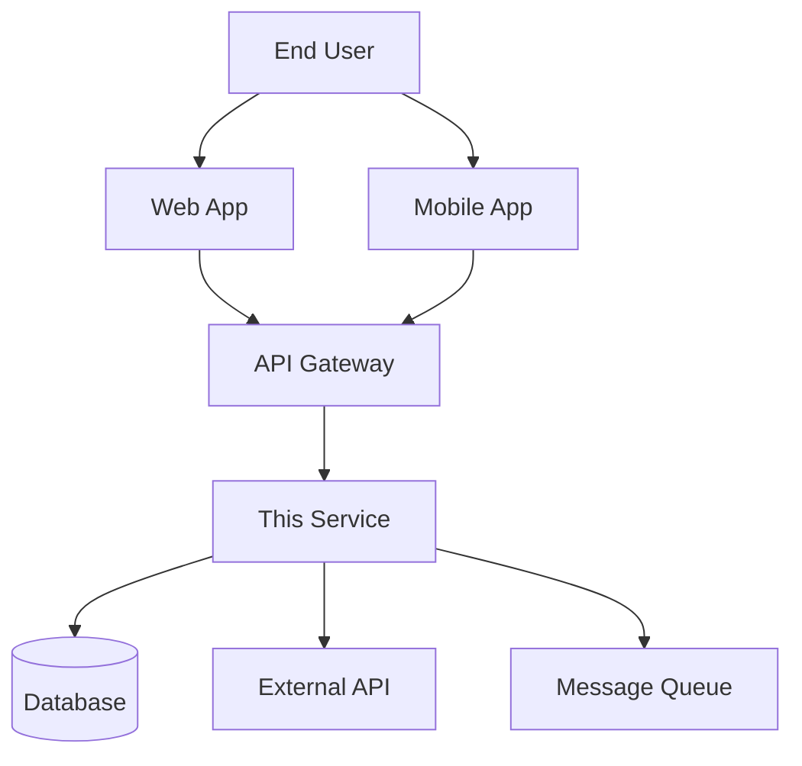

# Repository README Template

**Target Audience**: All Developers, New Team Members  
**Last Updated**: 2025-06-10 by System  
**Template Type**: Repository Documentation

<!-- Replace [PROJECT_NAME] with actual project name -->
# [PROJECT_NAME]

[](link-to-ci)
[](link-to-coverage)
[](LICENSE)

> One-line description of what this service/application does and its primary purpose.

## 📋 Overview

### What it does
- **Primary functionality**: Brief description of main features
- **Role in system**: How this service fits into the larger architecture
- **Business value**: Key business problems this solves

### Key Features
- ✅ **Feature 1**: Brief description and benefit
- ✅ **Feature 2**: Brief description and benefit  
- ✅ **Feature 3**: Brief description and benefit
- 🚧 **Feature 4**: In development
- 📋 **Feature 5**: Planned

### Technology Stack
- **Runtime**: [Node.js 18+ / .NET 8+ / Java 17+ / Flutter 3+]
- **Framework**: [Express / ASP.NET Core / Spring Boot / Flutter]
- **Database**: [PostgreSQL / MongoDB / SQL Server]
- **Cache**: [Redis / In-Memory]
- **Other**: [Additional technologies]

## 🚀 Quick Start

### Prerequisites
- **Runtime**: [Specific version requirements]
- **Database**: [Database setup requirements]
- **Tools**: [Required development tools]
- **External Services**: [Any external dependencies]

### Local Development Setup

#### 1. Clone and Navigate
```bash
git clone <repository-url>
cd <project-name>
```

#### 2. Install Dependencies
```bash
# Node.js
npm install

# .NET
dotnet restore

# Java/Maven
./mvnw install

# Java/Gradle
./gradlew build

# Flutter
flutter pub get
```

#### 3. Environment Configuration
```bash
# Copy environment template
cp .env.example .env

# Edit with your local values
nano .env
```

**Required Environment Variables:**
```env
# Database
DATABASE_URL=postgresql://localhost:5432/dbname
DATABASE_PASSWORD=your_password

# API Keys
API_KEY=your_api_key
JWT_SECRET=your_jwt_secret

# External Services
REDIS_URL=redis://localhost:6379
EXTERNAL_API_URL=https://api.example.com
```

#### 4. Start Dependencies (Docker)
```bash
# Start required services
docker-compose up -d postgres redis

# Or use provided script
./scripts/start-deps.sh
```

#### 5. Database Setup
```bash
# Run migrations
npm run db:migrate      # Node.js
dotnet ef database update  # .NET
./mvnw flyway:migrate   # Java
flutter packages pub run build_runner build  # Flutter
```

#### 6. Start Application
```bash
# Development mode
npm run dev             # Node.js
dotnet run             # .NET
./mvnw spring-boot:run # Java
flutter run            # Flutter

# Production mode
npm start              # Node.js
dotnet run --configuration Release  # .NET
java -jar target/app.jar  # Java
flutter run --release    # Flutter
```

### Verification
After setup, verify everything works:
- **Application**: http://localhost:3000
- **Health check**: http://localhost:3000/health
- **API documentation**: http://localhost:3000/swagger
- **Admin interface**: http://localhost:3000/admin (if applicable)
- **Database**: Check connection and sample data

## 🏗️ Architecture

### System Context


### Component Structure
```
src/
├── controllers/     # Request handling and routing
├── services/       # Business logic implementation
├── repositories/   # Data access layer
├── models/         # Data models and DTOs
├── middleware/     # Cross-cutting concerns
├── config/         # Configuration management
├── utils/          # Helper functions
└── tests/          # Test files
```

### Key Design Decisions
- **Framework Choice**: [Why this framework was selected]
- **Database Design**: [Database schema rationale]
- **Architecture Pattern**: [Pattern used and reasoning]
- **External Dependencies**: [Why these services were chosen]

## 📖 API Documentation

### Base URL
- **Development**: http://localhost:3000/api
- **Staging**: https://staging-api.example.com
- **Production**: https://api.example.com

### Authentication
```bash
# Get access token
curl -X POST /api/auth/login \
  -H "Content-Type: application/json" \
  -d '{"username":"user","password":"pass"}'

# Use token in requests
curl -H "Authorization: Bearer <token>" /api/protected
```

### Key Endpoints
| Method | Endpoint | Description |
|--------|----------|-------------|
| GET | `/api/health` | Health check |
| GET | `/api/users` | List users |
| POST | `/api/users` | Create user |
| GET | `/api/users/{id}` | Get user details |

**Full API Documentation**: [Swagger/OpenAPI URL]

## 🧪 Testing

### Running Tests
```bash
# All tests
npm test               # Node.js
dotnet test           # .NET
./mvnw test           # Java
flutter test          # Flutter

# Unit tests only
npm run test:unit
dotnet test --filter Category=Unit

# Integration tests
npm run test:integration
dotnet test --filter Category=Integration

# End-to-end tests
npm run test:e2e
```

### Test Structure
```
tests/
├── unit/           # Unit tests
├── integration/    # Integration tests
├── e2e/           # End-to-end tests
├── fixtures/      # Test data
└── helpers/       # Test utilities
```

### Coverage Requirements
- **Unit Tests**: >80% coverage required
- **Integration Tests**: Critical paths covered
- **E2E Tests**: Major user workflows

## 🚀 Deployment

### Environments
- **Development**: Auto-deploy from `develop` branch
- **Staging**: Auto-deploy from `release/*` branches
- **Production**: Manual deploy from `main` branch

### Build Process
```bash
# Build for production
npm run build         # Node.js
dotnet publish       # .NET
./mvnw package       # Java
flutter build        # Flutter
```

### Docker
```bash
# Build image
docker build -t project-name .

# Run container
docker run -p 3000:3000 project-name
```

### Environment Variables (Production)
See `.env.example` for all required variables. Key production considerations:
- Set secure `JWT_SECRET`
- Configure production database URLs
- Set appropriate log levels
- Configure external service credentials

## 🔧 Development

### Code Style
- **Linting**: ESLint / ReSharper / Checkstyle / Dart Analysis
- **Formatting**: Prettier / EditorConfig
- **Commits**: [Conventional Commits](https://conventionalcommits.org/)

### Git Workflow
1. Create feature branch: `git checkout -b feature/description`
2. Make changes with tests
3. Run quality checks: `npm run lint && npm test`
4. Submit pull request using template
5. Merge after approval and CI pass

### Quality Gates
- ✅ All tests pass
- ✅ Code coverage >80%
- ✅ No linting errors
- ✅ Security scan pass
- ✅ Peer review approved

## 📊 Monitoring

### Key Metrics
- **Availability**: 99.9% uptime target
- **Response Time**: <200ms average
- **Error Rate**: <1% of requests
- **Throughput**: 1000 req/sec capacity

### Logging
- **Development**: Console output
- **Production**: Structured JSON logs
- **Log Levels**: ERROR, WARN, INFO, DEBUG

### Health Checks
- **Endpoint**: `/health`
- **Dependencies**: Database, Redis, External APIs
- **Response**: JSON with component status

## 🆘 Troubleshooting

### Common Issues

#### Application Won't Start
```bash
# Check dependencies
npm list              # Node.js
dotnet list package   # .NET

# Verify environment
echo $DATABASE_URL
```

#### Database Connection Issues
```bash
# Test database connection
npm run db:test       # Node.js
dotnet ef database update --dry-run  # .NET
```

#### Performance Issues
- Check database query performance
- Monitor memory usage
- Review external API timeouts
- Analyze error logs

### Getting Help
- **Team Chat**: #team-[project-name] on Slack
- **Documentation**: [Link to detailed docs]
- **Issues**: Create GitHub issue with bug template
- **On-call**: Contact @devops-team for production issues

## 📚 Additional Resources

### Documentation
- [API Documentation](docs/api.md)
- [Database Schema](docs/database.md)
- [Deployment Guide](docs/deployment.md)
- [Architecture Decisions](docs/adr/)

### Related Repositories
- [Frontend Repository](link)
- [Shared Libraries](link)
- [Infrastructure](link)

## 🤝 Contributing

1. Read our [Contributing Guidelines](CONTRIBUTING.md)
2. Check [Code of Conduct](CODE_OF_CONDUCT.md)
3. Review [Development Setup](#-quick-start)
4. Submit issues and pull requests

## 📄 License

This project is licensed under the [MIT License](LICENSE) - see the LICENSE file for details.

---

**Maintainers**: @team-lead @senior-dev  
**Created**: [Date]  
**Last Updated**: [Date]
