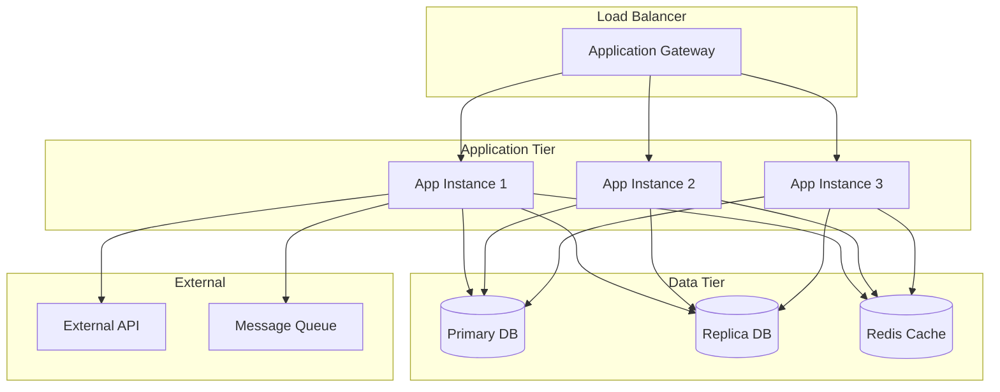

# Runbook Template

**Target Audience**: DevOps Engineers, On-Call Engineers  
**Last Updated**: 2025-06-10 by System  
**Template Type**: Operational Runbook

# [SERVICE_NAME] Runbook

## Service Overview
**Service Name**: [SERVICE_NAME]  
**Environment**: [Production/Staging/Development]  
**Owner Team**: [@team-name]  
**On-Call Contact**: [@oncall-engineer]  

### Service Description
Brief description of what this service does and its role in the system.

### Service Dependencies
- **Database**: PostgreSQL cluster (primary/replica)
- **Cache**: Redis cluster
- **External APIs**: Payment API, Email service
- **Message Queue**: RabbitMQ
- **File Storage**: AWS S3

### Business Impact
- **Users Affected**: [Number and type of users]
- **Revenue Impact**: [If applicable]
- **SLA**: 99.9% uptime, <200ms response time

## Architecture Overview

### Service Architecture


### Infrastructure Details
- **Compute**: 3x Azure VMs (Standard_D4s_v3)
- **Database**: Azure Database for PostgreSQL (GP_Gen5_4)
- **Cache**: Azure Cache for Redis (Standard C2)
- **Load Balancer**: Azure Application Gateway
- **Monitoring**: Application Insights, Log Analytics

## Monitoring & Alerting

### Key Metrics
| Metric | Normal Range | Warning | Critical | Alert |
|--------|--------------|---------|----------|-------|
| Response Time | <200ms | >500ms | >1000ms | PagerDuty |
| Error Rate | <1% | >5% | >10% | PagerDuty |
| CPU Usage | <70% | >80% | >90% | Slack |
| Memory Usage | <80% | >85% | >95% | Slack |
| Database Connections | <80% | >85% | >95% | PagerDuty |

### Dashboards
- **Application**: [Grafana Dashboard URL]
- **Infrastructure**: [Azure Monitor Dashboard URL]
- **Business Metrics**: [Custom Dashboard URL]

### Log Locations
- **Application Logs**: Azure Log Analytics workspace
- **Access Logs**: Application Gateway logs
- **Database Logs**: PostgreSQL slow query log
- **Query**: `Kusto query examples`

## Health Checks

### Application Health Check
```bash
# Health endpoint
curl https://api.example.com/health

# Expected response
{
  "status": "healthy",
  "checks": {
    "database": "healthy",
    "redis": "healthy",
    "external_api": "healthy"
  },
  "timestamp": "2025-06-10T12:00:00Z"
}
```

### Infrastructure Health Check
```bash
# Check application instances
az vm list --resource-group myapp-prod --query "[].{Name:name,Status:provisioningState}"

# Check database
az postgres server show --resource-group myapp-prod --name myapp-db-prod

# Check Redis
az redis show --resource-group myapp-prod --name myapp-redis-prod
```

## Common Issues & Troubleshooting

### Issue 1: High Response Time

**Symptoms:**
- Response time >1000ms
- User complaints about slow performance
- Alert: "High Response Time" in PagerDuty

**Investigation Steps:**
1. Check application dashboard for performance metrics
2. Review slow query logs in database
3. Check Redis cache hit rate
4. Monitor external API response times

**Quick Fixes:**
```bash
# Restart application if memory leak suspected
kubectl rollout restart deployment/myapp

# Clear Redis cache if needed
redis-cli FLUSHALL

# Scale up application instances
kubectl scale deployment/myapp --replicas=5
```

**Root Cause Analysis:**
- Database performance issues
- Memory leaks in application
- External API timeouts
- High traffic load

### Issue 2: Database Connection Errors

**Symptoms:**
- Error messages: "Connection pool exhausted"
- 500 errors in application
- Database connection alerts

**Investigation Steps:**
1. Check database connection pool metrics
2. Review application logs for connection errors
3. Monitor database CPU and memory usage
4. Check for long-running queries

**Quick Fixes:**
```bash
# Check current connections
SELECT count(*) FROM pg_stat_activity;

# Kill long-running queries
SELECT pg_terminate_backend(pid) FROM pg_stat_activity 
WHERE state = 'active' AND query_start < NOW() - INTERVAL '1 hour';

# Restart application to reset connection pool
kubectl rollout restart deployment/myapp
```

### Issue 3: External API Failures

**Symptoms:**
- 503 errors from external API
- Timeout errors in logs
- Degraded functionality

**Investigation Steps:**
1. Check external API status page
2. Review network connectivity
3. Check API rate limits
4. Monitor circuit breaker status

**Quick Fixes:**
```bash
# Enable maintenance mode if needed
kubectl patch configmap/app-config -p '{"data":{"maintenance_mode":"true"}}'

# Check external API status
curl -I https://external-api.com/health

# Review circuit breaker configuration
kubectl get configmap/app-config -o yaml | grep circuit_breaker
```

## Incident Response

### Severity Levels
| Level | Description | Response Time | Escalation |
|-------|-------------|---------------|------------|
| P1 - Critical | Service down, major functionality broken | 15 minutes | Immediate |
| P2 - High | Degraded performance, some features affected | 1 hour | 30 minutes |
| P3 - Medium | Minor issues, workarounds available | 4 hours | 2 hours |
| P4 - Low | Cosmetic issues, non-critical bugs | Next business day | N/A |

### Incident Response Process
1. **Acknowledge**: Acknowledge the alert within SLA
2. **Assess**: Determine severity and impact
3. **Communicate**: Update stakeholders via status page
4. **Investigate**: Follow troubleshooting runbook
5. **Resolve**: Implement fix and verify resolution
6. **Post-mortem**: Conduct post-incident review

### Communication Templates

#### Initial Response
```
🚨 INCIDENT ALERT 🚨
Service: [SERVICE_NAME]
Severity: P[1-4]
Impact: [Brief description]
Start Time: [Timestamp]
Assigned: [@engineer]
Status: Investigating

Next update in 30 minutes.
```

#### Resolution
```
✅ INCIDENT RESOLVED ✅
Service: [SERVICE_NAME]
Duration: [X hours Y minutes]
Root Cause: [Brief description]
Resolution: [What was done]
Post-mortem: [Link or scheduled date]
```

## Deployment

### Deployment Process
1. **Pre-deployment**: Check health and backup database
2. **Deploy**: Use blue-green deployment strategy
3. **Verify**: Run smoke tests and health checks
4. **Monitor**: Watch metrics for 30 minutes post-deployment

### Deployment Commands
```bash
# Check current deployment status
kubectl get deployments

# Deploy new version
kubectl set image deployment/myapp container=myapp:v1.2.3

# Check rollout status
kubectl rollout status deployment/myapp

# Rollback if needed
kubectl rollout undo deployment/myapp
```

### Rollback Process
```bash
# Quick rollback to previous version
kubectl rollout undo deployment/myapp

# Rollback to specific version
kubectl rollout undo deployment/myapp --to-revision=2

# Verify rollback
kubectl get pods -l app=myapp
curl https://api.example.com/health
```

## Maintenance

### Regular Maintenance Tasks

#### Daily
- [ ] Check service health and metrics
- [ ] Review error logs for patterns
- [ ] Monitor resource usage trends

#### Weekly  
- [ ] Review slow query logs
- [ ] Check database backup status
- [ ] Update security patches if available
- [ ] Review capacity planning metrics

#### Monthly
- [ ] Database maintenance (VACUUM, REINDEX)
- [ ] Clean up old logs and data
- [ ] Review and update monitoring thresholds
- [ ] Capacity planning review

### Maintenance Windows
- **Scheduled**: Every Sunday 2:00-4:00 AM UTC
- **Emergency**: As needed with 4-hour notice
- **Communication**: Via email and status page

## Configuration

### Environment Variables
```bash
# Application configuration
DATABASE_URL=postgresql://...
REDIS_URL=redis://...
API_KEY=secret_key
LOG_LEVEL=info

# Performance tuning
MAX_CONNECTIONS=100
TIMEOUT_SECONDS=30
CACHE_TTL=3600
```

### Configuration Management
- **Source**: Azure Key Vault
- **Updates**: Via Kubernetes ConfigMaps/Secrets
- **Deployment**: Blue-green with configuration validation

## Security

### Security Monitoring
- **Log Analysis**: Monitor for suspicious patterns
- **Access Control**: Review service account permissions
- **Network Security**: Check firewall rules and NSGs
- **Vulnerability Scanning**: Weekly security scans

### Security Incident Response
1. **Detect**: Security alerts from monitoring
2. **Contain**: Isolate affected components
3. **Investigate**: Determine scope and impact
4. **Remediate**: Apply security patches/fixes
5. **Report**: Document and report to security team

## Contacts

### Team Contacts
- **Primary On-Call**: [@primary-oncall] (+1-555-0123)
- **Secondary On-Call**: [@secondary-oncall] (+1-555-0124)
- **Team Lead**: [@team-lead] (+1-555-0125)
- **Product Owner**: [@product-owner] (+1-555-0126)

### Escalation Path
1. **L1**: On-call engineer (0-30 minutes)
2. **L2**: Senior engineer (30-60 minutes)
3. **L3**: Engineering manager (1-2 hours)
4. **L4**: Director of Engineering (2+ hours)

### External Contacts
- **Cloud Provider Support**: [Support case portal]
- **Vendor Support**: [External vendor contact]
- **Network Operations**: [NOC contact]

## References

### Documentation Links
- **Service Architecture**: [Architecture documentation URL]
- **API Documentation**: [API docs URL]
- **Deployment Guide**: [Deployment documentation URL]
- **Security Guidelines**: [Security documentation URL]

### Tools and Access
- **Monitoring**: [Grafana/Azure Monitor URLs]
- **Logs**: [Log analysis tool URLs]
- **Deployment**: [CI/CD pipeline URLs]
- **Configuration**: [Configuration management URLs]

---

**Runbook Owner**: [@devops-team]  
**Last Updated**: 2025-06-10  
**Next Review**: 2025-07-10  
**Version**: 1.2.0
