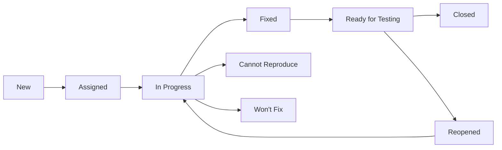

# Test Plan Template

**Target Audience**: QA Engineers, Developers, Product Owners  
**Last Updated**: 2025-06-10 by System  
**Template Type**: Comprehensive Test Planning

# Test Plan: [FEATURE/RELEASE NAME]

## Document Information
**Test Plan ID**: TP-[YYYYMMDD]-[SEQUENCE]  
**Version**: 1.0  
**Created By**: [@qa-engineer]  
**Reviewed By**: [@tech-lead]  
**Approved By**: [@product-owner]  
**Last Updated**: 2025-06-10  

## Executive Summary
**Project/Feature**: [Brief description of what is being tested]  
**Test Scope**: [High-level overview of testing scope]  
**Risk Level**: [ ] Low [ ] Medium [ ] High [ ] Critical  
**Estimated Effort**: [X] person-days  
**Target Completion**: [Date]  

## 1. Introduction

### 1.1 Purpose
This test plan defines the testing approach, scope, resources, and schedule for [feature/release name]. It serves as a guide for the testing team and stakeholders to ensure comprehensive quality validation.

### 1.2 Scope
**In Scope:**
- [ ] Functional testing of new features
- [ ] Integration testing with existing systems
- [ ] Performance testing under expected load
- [ ] Security testing for vulnerabilities
- [ ] User interface/experience testing
- [ ] API testing and validation
- [ ] Database testing and data integrity
- [ ] Cross-browser/platform compatibility

**Out of Scope:**
- [ ] Third-party integrations (if applicable)
- [ ] Legacy system functionality (unless impacted)
- [ ] Performance testing beyond normal load
- [ ] Security penetration testing (handled separately)

### 1.3 Objectives
1. **Quality Assurance**: Ensure the application meets functional requirements
2. **Risk Mitigation**: Identify and mitigate critical issues before release
3. **Performance Validation**: Confirm system performance meets SLAs
4. **Security Verification**: Validate security controls and data protection
5. **User Experience**: Ensure optimal user experience across platforms

## 2. Test Strategy

### 2.1 Testing Levels
| Level | Description | Responsibility | Coverage |
|-------|-------------|----------------|----------|
| **Unit Testing** | Individual component testing | Development Team | 80%+ code coverage |
| **Integration Testing** | Component interaction testing | Development Team | Critical paths |
| **System Testing** | End-to-end system validation | QA Team | All major scenarios |
| **Acceptance Testing** | Business requirement validation | Product Team | User stories |

### 2.2 Testing Types

#### 2.2.1 Functional Testing
- **Smoke Testing**: Basic functionality verification
- **Sanity Testing**: Narrow regression testing after fixes
- **Regression Testing**: Existing functionality validation
- **User Acceptance Testing**: Business requirement validation

#### 2.2.2 Non-Functional Testing
- **Performance Testing**: Load, stress, and volume testing
- **Security Testing**: Vulnerability and penetration testing
- **Usability Testing**: User experience and interface testing
- **Compatibility Testing**: Cross-browser and platform testing

#### 2.2.3 API Testing
- **Functional API Testing**: Endpoint behavior validation
- **Load Testing**: API performance under load
- **Security Testing**: Authentication and authorization
- **Contract Testing**: API contract compliance

### 2.3 Test Environment Strategy
| Environment | Purpose | Data | Access |
|-------------|---------|------|--------|
| **Development** | Developer testing | Synthetic | Development Team |
| **Testing/QA** | QA testing activities | Test data set | QA Team |
| **Staging** | Pre-production validation | Production-like | Limited access |
| **Production** | Live environment | Real data | Operations only |

## 3. Test Scope

### 3.1 Features to be Tested
| Feature | Priority | Test Type | Effort (hrs) | Assignee |
|---------|----------|-----------|--------------|----------|
| User Authentication | High | Functional, Security | 16 | [@qa-engineer-1] |
| User Management | High | Functional, API | 24 | [@qa-engineer-2] |
| Data Processing | Medium | Functional, Performance | 20 | [@qa-engineer-1] |
| Reporting Module | Medium | Functional, UI | 16 | [@qa-engineer-3] |
| Email Notifications | Low | Functional | 8 | [@qa-engineer-2] |

### 3.2 Test Scenarios Overview
**Total Test Scenarios**: [X]  
**Critical**: [X] scenarios  
**High**: [X] scenarios  
**Medium**: [X] scenarios  
**Low**: [X] scenarios  

### 3.3 Entry Criteria
- [ ] Test environment is available and configured
- [ ] Test data is prepared and loaded
- [ ] Application build is deployed and stable
- [ ] Test cases are reviewed and approved
- [ ] Required tools and access are available
- [ ] Unit testing is complete with 80%+ coverage
- [ ] Code review is complete
- [ ] Development testing is complete

### 3.4 Exit Criteria
- [ ] All critical and high priority test cases executed
- [ ] No critical or high severity defects remain open
- [ ] Test coverage meets minimum 95% for critical scenarios
- [ ] Performance benchmarks are met
- [ ] Security testing shows no critical vulnerabilities
- [ ] User acceptance criteria are satisfied
- [ ] Test execution report is completed

## 4. Test Approach

### 4.1 Test Design Techniques
- **Equivalence Partitioning**: Group similar inputs for efficient testing
- **Boundary Value Analysis**: Test edge cases and boundaries
- **Decision Table Testing**: Complex business logic scenarios
- **State Transition Testing**: Workflow and state change validation
- **Error Guessing**: Experience-based testing for potential issues

### 4.2 Test Data Strategy
```
Test Data Categories:
├── Valid Data
│   ├── Typical values
│   ├── Boundary values
│   └── Edge cases
├── Invalid Data
│   ├── Out of range values
│   ├── Wrong data types
│   └── Malformed inputs
└── Special Cases
    ├── Empty/null values
    ├── Special characters
    └── Large datasets
```

### 4.3 Test Automation Strategy
| Layer | Automation % | Tools | Ownership |
|-------|--------------|-------|-----------|
| **Unit Tests** | 95% | JUnit, NUnit, Jest | Development |
| **API Tests** | 80% | Postman, RestAssured | QA + Dev |
| **UI Tests** | 30% | Selenium, Cypress | QA |
| **Performance** | 90% | JMeter, K6 | DevOps + QA |

## 5. Test Scenarios

### 5.1 User Authentication Module

#### TC-AUTH-001: Valid User Login
**Priority**: Critical  
**Type**: Functional  

**Preconditions:**
- User account exists in system
- Application is accessible
- Valid credentials available

**Test Steps:**
1. Navigate to login page
2. Enter valid username: `testuser@example.com`
3. Enter valid password: `ValidPassword123!`
4. Click "Login" button
5. Verify successful login

**Expected Results:**
- User is redirected to dashboard
- Welcome message displayed
- Session is created
- Audit log entry created

**Test Data:**
```json
{
  "username": "testuser@example.com",
  "password": "ValidPassword123!",
  "expected_redirect": "/dashboard"
}
```

#### TC-AUTH-002: Invalid Credentials
**Priority**: High  
**Type**: Functional, Security  

**Test Steps:**
1. Navigate to login page
2. Enter invalid username: `invalid@example.com`
3. Enter invalid password: `wrongpassword`
4. Click "Login" button
5. Verify error handling

**Expected Results:**
- Error message: "Invalid username or password"
- No sensitive information disclosed
- Account lockout after 5 attempts
- Security event logged

### 5.2 API Testing Scenarios

#### TC-API-001: Get User Profile
**Priority**: High  
**Type**: API Functional  

**Request:**
```http
GET /api/v1/users/123
Authorization: Bearer {valid_token}
Content-Type: application/json
```

**Expected Response:**
```json
{
  "status": 200,
  "data": {
    "id": 123,
    "username": "testuser",
    "email": "testuser@example.com",
    "created_at": "2025-01-01T00:00:00Z"
  }
}
```

**Validation Points:**
- Response status code is 200
- Response time < 200ms
- All required fields present
- Data format matches schema
- Authentication required

### 5.3 Performance Test Scenarios

#### TC-PERF-001: Login Load Test
**Objective**: Validate login performance under normal load  
**Load Pattern**: 100 concurrent users over 5 minutes  
**Acceptance Criteria**:
- Response time: < 2 seconds (95th percentile)
- Throughput: > 50 requests/second
- Error rate: < 1%
- CPU usage: < 70%
- Memory usage: < 80%

**Test Configuration:**
```yaml
load_test:
  scenario: login_flow
  users: 100
  duration: 5m
  ramp_up: 30s
  assertions:
    - avg_response_time < 1000ms
    - p95_response_time < 2000ms
    - error_rate < 1%
```

## 6. Defect Management

### 6.1 Defect Classification
| Severity | Definition | Example | Resolution Time |
|----------|------------|---------|-----------------|
| **Critical** | System unusable, blocks testing | Application crash, data loss | 4 hours |
| **High** | Major functionality affected | Login failure, payment issues | 24 hours |
| **Medium** | Minor functionality issues | UI glitches, validation errors | 72 hours |
| **Low** | Cosmetic issues | Typos, alignment issues | Next release |

### 6.2 Defect Workflow


### 6.3 Defect Reporting Template
```markdown
**Defect ID**: BUG-[YYYYMMDD]-[SEQUENCE]
**Summary**: [Brief description]
**Severity**: [Critical/High/Medium/Low]
**Priority**: [P1/P2/P3/P4]
**Environment**: [Test/Staging/Production]
**Browser/Platform**: [Details]

**Steps to Reproduce**:
1. Step 1
2. Step 2
3. Step 3

**Expected Result**: [What should happen]
**Actual Result**: [What actually happened]
**Screenshots/Logs**: [Attachments]
**Workaround**: [If available]
```

## 7. Risk Analysis

### 7.1 Technical Risks
| Risk | Probability | Impact | Mitigation |
|------|-------------|---------|------------|
| Environment instability | Medium | High | Backup environment available |
| Test data corruption | Low | Medium | Automated data refresh process |
| Tool failures | Low | Low | Alternative tools identified |
| Performance degradation | Medium | High | Early performance testing |

### 7.2 Schedule Risks
| Risk | Probability | Impact | Mitigation |
|------|-------------|---------|------------|
| Late delivery from dev | High | High | Parallel testing approach |
| Resource unavailability | Medium | Medium | Cross-training team members |
| Scope creep | Medium | High | Change control process |
| Defect discovery late | Low | High | Early testing phases |

## 8. Resources

### 8.1 Team Structure
| Role | Name | Responsibility | Allocation |
|------|------|----------------|------------|
| **Test Manager** | [@test-manager] | Overall test planning and execution | 25% |
| **Senior QA Engineer** | [@senior-qa] | Test design and complex scenarios | 100% |
| **QA Engineer** | [@qa-engineer-1] | Functional testing execution | 100% |
| **QA Engineer** | [@qa-engineer-2] | API and integration testing | 100% |
| **Automation Engineer** | [@automation-engineer] | Test automation development | 50% |

### 8.2 Tools and Infrastructure
| Category | Tool | Purpose | License |
|----------|------|---------|---------|
| **Test Management** | Azure DevOps | Test case management, tracking | Enterprise |
| **API Testing** | Postman/Newman | API validation and automation | Team |
| **UI Automation** | Selenium WebDriver | Browser automation | Open Source |
| **Performance** | JMeter | Load and performance testing | Open Source |
| **Defect Tracking** | Jira | Defect lifecycle management | Enterprise |

### 8.3 Test Environment Requirements
```yaml
environments:
  testing:
    servers:
      app_server: "2 CPU, 8GB RAM"
      db_server: "4 CPU, 16GB RAM"
      cache_server: "2 CPU, 4GB RAM"
    network:
      bandwidth: "100 Mbps"
      latency: "< 10ms"
    data:
      volume: "1000 users, 10000 transactions"
      refresh_frequency: "daily"
```

## 9. Schedule

### 9.1 Test Phases Timeline
| Phase | Start Date | End Date | Duration | Dependencies |
|-------|------------|----------|----------|--------------|
| **Test Planning** | 2025-06-01 | 2025-06-05 | 5 days | Requirements complete |
| **Test Design** | 2025-06-06 | 2025-06-12 | 7 days | Test plan approved |
| **Test Environment Setup** | 2025-06-13 | 2025-06-15 | 3 days | Infrastructure ready |
| **Test Execution** | 2025-06-16 | 2025-06-30 | 15 days | Build available |
| **Defect Resolution** | 2025-06-16 | 2025-07-05 | 20 days | Ongoing |
| **Test Closure** | 2025-07-06 | 2025-07-08 | 3 days | All issues resolved |

### 9.2 Milestones
- **M1**: Test plan approval (2025-06-05)
- **M2**: Test cases review complete (2025-06-12)
- **M3**: Test environment ready (2025-06-15)
- **M4**: Smoke testing complete (2025-06-17)
- **M5**: Functional testing complete (2025-06-25)
- **M6**: Regression testing complete (2025-06-30)
- **M7**: Go/No-go decision (2025-07-05)

## 10. Communication Plan

### 10.1 Reporting Schedule
| Report | Frequency | Recipients | Content |
|--------|-----------|------------|---------|
| **Daily Status** | Daily | Team Members | Progress, blockers, next steps |
| **Weekly Summary** | Weekly | Stakeholders | Metrics, risks, timeline |
| **Test Execution Report** | End of phase | Management | Results, defects, recommendations |
| **Final Test Report** | End of testing | All stakeholders | Complete summary and sign-off |

### 10.2 Communication Channels
- **Daily Standups**: 9:00 AM via Teams
- **Weekly Reviews**: Fridays 2:00 PM
- **Issue Escalation**: Slack #testing-alerts
- **Documentation**: Confluence wiki
- **Defect Tracking**: Jira dashboards

## 11. Success Criteria

### 11.1 Quality Metrics
| Metric | Target | Measurement |
|--------|--------|-------------|
| **Test Coverage** | ≥ 95% | Critical scenarios covered |
| **Defect Density** | ≤ 2 defects/KLOC | Total defects/code size |
| **Test Execution Rate** | ≥ 90% | Tests executed/total tests |
| **Pass Rate** | ≥ 95% | Passed tests/executed tests |
| **Defect Leakage** | ≤ 5% | Production defects/total defects |

### 11.2 Performance Benchmarks
| Scenario | Target | Measurement |
|----------|--------|-------------|
| **Page Load Time** | < 3 seconds | 95th percentile |
| **API Response Time** | < 200ms | Average response |
| **Database Query** | < 100ms | Complex queries |
| **Concurrent Users** | 1000 users | Without degradation |

## 12. Approval

### 12.1 Sign-off
| Role | Name | Signature | Date |
|------|------|-----------|------|
| **Test Manager** | [@test-manager] | | |
| **Development Lead** | [@dev-lead] | | |
| **Product Owner** | [@product-owner] | | |
| **Project Manager** | [@project-manager] | | |

### 12.2 Review History
| Version | Date | Author | Changes |
|---------|------|--------|---------|
| 1.0 | 2025-06-10 | [@qa-engineer] | Initial version |
| | | | |

---

**Document Owner**: [@test-manager]  
**Last Updated**: 2025-06-10  
**Next Review**: Before each major release
